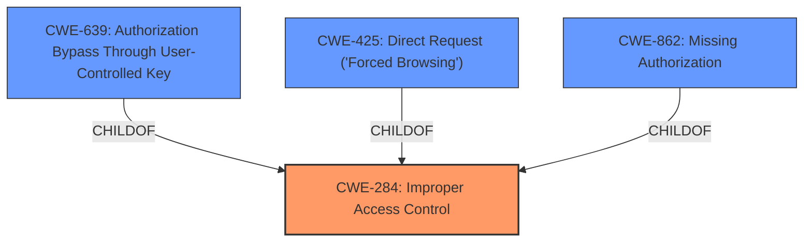

# Analysis for CVE-2022-45066

# Summary
| CWE ID | CWE Name | Confidence | CWE Abstraction Level | CWE Vulnerability Mapping Label | CWE-Vulnerability Mapping Notes |
|---|---|---|---|---|---|
| CWE-284 | Improper Access Control | 0.75 | Pillar | Primary | Discouraged |
| CWE-639 | Authorization Bypass Through User-Controlled Key | 0.7 | Base | Secondary | Allowed |
| CWE-425 | Direct Request ('Forced Browsing') | 0.6 | Base | Secondary | Allowed |
| CWE-862 | Missing Authorization | 0.5 | Class | Secondary | Allowed-with-Review |

## Evidence and Confidence

*   **Confidence Score:** 0.7
*   **Evidence Strength:** MEDIUM

## Relationship Analysis
The primary CWE selected is CWE-284, which is a high-level Pillar. While this is generally discouraged, the available evidence does not pinpoint a more specific Base or Variant CWE with high confidence. Several potential child CWEs of CWE-284 were considered, including CWE-639, CWE-425, and CWE-862. These relationships influenced the secondary CWE selections to provide additional context.

## Vulnerability Chain
The vulnerability chain starts with a **broken access control** issue, leading to an unprivileged user being able to perform unauthorized actions.

## Summary of Analysis
The initial analysis identified **broken access control** as the primary weakness. However, the evidence is not specific enough to pinpoint the exact mechanism of the access control failure. Therefore, CWE-284 was chosen as the primary CWE, acknowledging its high-level nature. Several other more specific CWEs were considered, particularly CWE-639, CWE-425, and CWE-862, and included as secondary mappings.

The vulnerability description key phrase "rootcause: **broken access control**" and the CVE Reference Links Content Summary stating "The vulnerability is due to a '**Broken Access Control**' issue, which means a missing authorization, authentication, or nonce token check" support the assessment.

The selection of CWE-284 is at a higher level due to the lack of specific details. More information would be required to narrow down the root cause to a more precise CWE.

Relevant CWE Information:

# Enhanced Context (25 CWEs)
The following CWEs were identified as potentially relevant to this vulnerability:

## CWE-639: Authorization Bypass Through User-Controlled Key
**Abstraction Level**: Base
**Similarity Score**: 0.78
**Source**: dense

**Description**:
The system's authorization functionality does not prevent one user from gaining access to another user's data or record by modifying the key value identifying the data.

**Mapping Guidance**:
- Usage: Allowed
- Rationale: This CWE entry is at the Base level of abstraction, which is a preferred level of abstraction for mapping to the root causes of vulnerabilities.

## CWE-425: Direct Request ('Forced Browsing')
**Abstraction Level**: Base
**Similarity Score**: 0.77
**Source**: dense

**Description**:
The web application does not adequately enforce appropriate authorization on all restricted URLs, scripts, or files.

**Mapping Guidance**:
- Usage: Allowed
- Rationale: This CWE entry is at the Base level of abstraction, which is a preferred level of abstraction for mapping to the root causes of vulnerabilities.

## CWE-862: Missing Authorization
**Abstraction Level**: Class
**Similarity Score**: 0.107

### CWE-284: Improper Access Control
CWE-284 (Improper Access Control) is selected as the primary CWE. The vulnerability description clearly indicates a **broken access control** issue. While CWE-284 is a high-level Pillar, the lack of specific details about the access control failure prevents a more precise mapping. The mapping guidance discourages the use of CWE-284 due to its high level of abstraction, but in this case, the limited evidence justifies its selection. Confidence: 0.75

### CWE-639: Authorization Bypass Through User-Controlled Key
CWE-639 (Authorization Bypass Through User-Controlled Key) is included as a secondary CWE. This CWE is relevant if an attacker can modify a key value to access another user's data. Although there is no explicit evidence for this in the description, it is a common access control issue. Confidence: 0.7

### CWE-425: Direct Request ('Forced Browsing')
CWE-425 (Direct Request ('Forced Browsing')) is included as a secondary CWE. This CWE is applicable if the application fails to enforce authorization on all restricted URLs, scripts, or files. This is a plausible scenario given the **broken access control** issue. Confidence: 0.6

### CWE-862: Missing Authorization
CWE-862 (Missing Authorization) is included as a secondary CWE. This CWE applies when the product does not perform an authorization check when an actor attempts to access a resource or perform an action. This is a direct manifestation of the **broken access control** issue. Confidence: 0.5

### Other CWEs Considered and Not Used:
CWE-1390 (Weak Authentication): This CWE was considered but not selected because the vulnerability description focuses on access control issues rather than authentication weaknesses.
CWE-352 (Cross-Site Request Forgery (CSRF)): This CWE was considered but not selected because there is no evidence to suggest that the vulnerability involves CSRF.
CWE-863 (Incorrect Authorization): This CWE was considered, however, due to the general nature of the description, it is unclear whether the authorization is missing (CWE-862) or incorrect (CWE-863). It could be either.
CWE-285 (Improper Authorization): This CWE was considered but deemed too high-level, similar to CWE-284, without providing any additional specificity.
CWE-306 (Missing Authentication for Critical Function): Similar to CWE-1390, the focus is on access control, not missing authentication.
CWE-1275 (Sensitive Cookie with Improper SameSite Attribute): This CWE is not relevant as it focuses on cookie-related issues, while the vulnerability is about general access control.