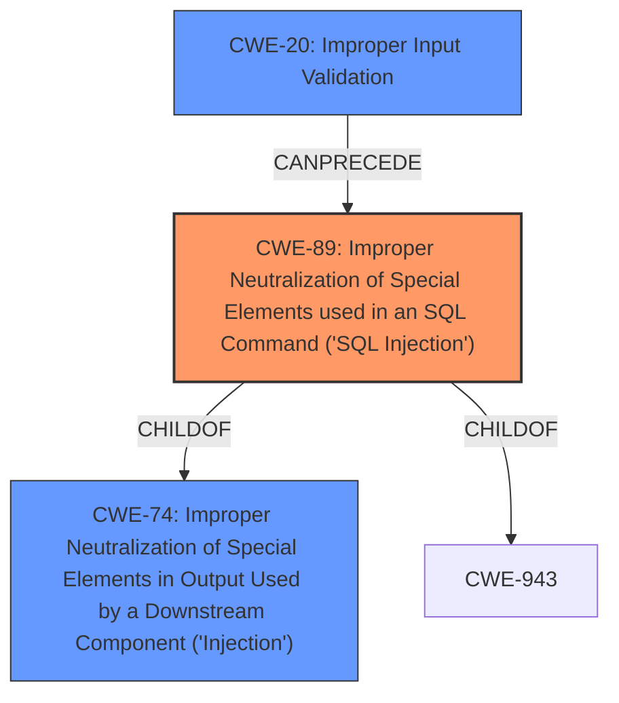

# Analysis Report for CVE-2022-45089

# Vulnerability Analysis Report: CVE-2022-45089

## Description


## Analysis (with Relationship Data)

# Summary
| CWE ID | CWE Name | Confidence | CWE Abstraction Level | CWE Vulnerability Mapping Label | CWE-Vulnerability Mapping Notes |
|---|---|---|---|---|---|
| CWE-89 | Improper Neutralization of Special Elements used in an SQL Command ('SQL Injection') | 1.0 | Base | Allowed | Primary CWE |
| CWE-20 | Improper Input Validation | 0.6 | Class | Discouraged | Secondary Candidate |

## Evidence and Confidence

*   **Confidence Score:** 0.9
*   **Evidence Strength:** HIGH

## Relationship Analysis
The primary CWE, CWE-89 [Improper Neutralization of Special Elements used in an SQL Command ('SQL Injection')], is a base-level CWE that is a child of CWE-74 [Improper Neutralization of Special Elements in Output Used by a Downstream Component ('Injection')] and CWE-943. CWE-20 [Improper Input Validation] can precede CWE-89, indicating a potential chain where improper input validation leads to SQL injection. Choosing CWE-89 provides a more specific identification of the vulnerability than CWE-20.



## Vulnerability Chain
The vulnerability chain starts with **Improper Input Validation**, which then leads to the **SQL Injection** vulnerability. The chain highlights how failing to validate input allows attackers to inject malicious SQL commands.
  - **Root Cause:** **Improper Input Validation**
  - **Weakness:** **SQL Injection**

## Summary of Analysis
The vulnerability description clearly states an **Improper Input Validation** vulnerability leading to **SQL Injection** in the Smartpower Web product.

The primary CWE match from similar CVE descriptions and the retriever results is CWE-89 [Improper Neutralization of Special Elements used in an SQL Command ('SQL Injection')]. This aligns directly with the stated weakness.

CWE-20 [Improper Input Validation] is also listed but is discouraged as it's a class-level CWE. CWE-89 is a more specific, base-level CWE, making it a better fit.

The evidence from the "Vulnerability Description Key Phrases" section supports this selection:
- **rootcause:** **Improper Input Validation**
- **weakness:** **sql injection**

The "CWE for similar CVE Descriptions" section reinforces this decision, listing CWE-89 as the Primary CWE Match and the top CWE.

Therefore, the selected CWEs are at the optimal level of specificity, with CWE-89 accurately representing the SQL injection vulnerability and CWE-20 representing the root cause of the vulnerability. My assessment is primarily based on the provided evidence, and the graph relationships confirm the connection between improper input validation and SQL injection.


## CWE Relationship Analysis

Current CWEs represent these abstraction levels: .


### Vulnerability Chain Analysis

**Chain starting from CWE-89:**
- 89 (Improper Neutralization of Special Elements used in an SQL Command ('SQL Injection')) - ROOT


**Chain starting from CWE-943:**
- 943 (Improper Neutralization of Special Elements in Data Query Logic) - ROOT


### CWE Relationship Diagram

```mermaid
graph TD
    classDef primary fill:#f96,stroke:#333,stroke-width:2px
    classDef secondary fill:#69f,stroke:#333
    classDef tertiary fill:#9e9,stroke:#333
```


*Report generated on 2025-03-30 16:47:10*
