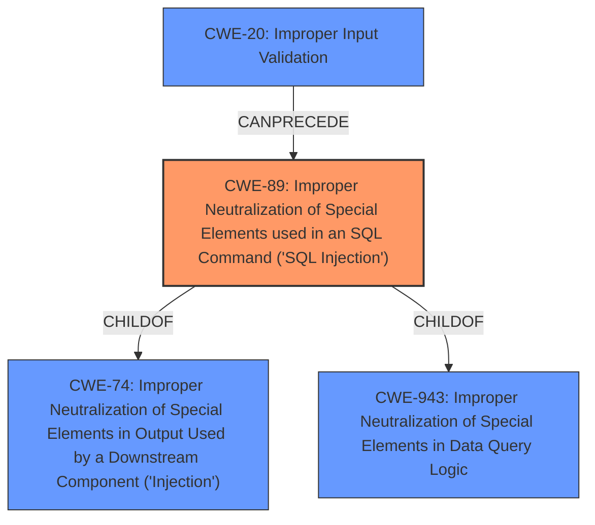

# Enhanced Analysis for CVE-2022-45090

# Summary

| CWE ID | CWE Name | Confidence | CWE Abstraction Level | CWE Vulnerability Mapping Label | CWE-Vulnerability Mapping Notes |
|---|---|---|---|---|---|
| CWE-89 | Improper Neutralization of Special Elements used in an SQL Command ('SQL Injection') | 1.0 | Base | Allowed | Primary CWE |
| CWE-20 | Improper Input Validation | 0.7 | Class | Discouraged | Secondary Candidate |

## Evidence and Confidence

*   **Confidence Score:** 0.9
*   **Evidence Strength:** HIGH

## Relationship Analysis
The primary relationship is that CWE-89 [Improper Neutralization of Special Elements used in an SQL Command ('SQL Injection')] is a child of CWE-74 [Improper Neutralization of Special Elements in Output Used by a Downstream Component ('Injection')] and CWE-943 [Improper Neutralization of Special Elements in Data Query Logic]. CWE-20 [Improper Input Validation] can precede CWE-89, meaning that **improper input validation** can lead to **SQL injection**.



## Vulnerability Chain
The vulnerability chain starts with **improper input validation** (CWE-20), which allows an attacker to inject malicious SQL code. The software then fails to neutralize special elements in the input, leading to **SQL Injection** (CWE-89), which can then lead to the modification of SQL queries.

## Summary of Analysis
The vulnerability description clearly states that the issue is an **Improper Input Validation** vulnerability that allows **SQL Injection**. The primary CWE match from similar CVE descriptions is CWE-89 [Improper Neutralization of Special Elements used in an SQL Command ('SQL Injection')]. The retriever results also list CWE-89 as the top combined result.

The vulnerability description provides strong evidence of both **Improper Input Validation** and **SQL Injection**, making CWE-89 the most appropriate primary CWE. While **Improper Input Validation** is mentioned, CWE-20 [Improper Input Validation] is a class-level CWE and is discouraged from being used directly when a more specific weakness is known. Since **SQL Injection** is the direct result of the **improper input validation**, CWE-89 is more specific and appropriate.

Relevant CWE Information:
- CWE-89: This CWE is a Base level weakness that perfectly describes the vulnerability, where the software constructs an SQL command using externally-influenced input but does not neutralize special elements. The MITRE mapping guidance allows its usage.
- CWE-20: While **improper input validation** is mentioned in the description, this CWE is a Class level and is discouraged. The description explicitly states that the vulnerability allows **SQL Injection**, so CWE-89 is more appropriate.

Based on the evidence and the CWE specifications, CWE-89 is the primary CWE, with a confidence level of 1.0. CWE-20 is a secondary candidate.


## CWE Relationship Analysis

Current CWEs represent these abstraction levels: .


### Vulnerability Chain Analysis

**Chain starting from CWE-89:**
- 89 (Improper Neutralization of Special Elements used in an SQL Command ('SQL Injection')) - ROOT


**Chain starting from CWE-943:**
- 943 (Improper Neutralization of Special Elements in Data Query Logic) - ROOT


### CWE Relationship Diagram

```mermaid
graph TD
    classDef primary fill:#f96,stroke:#333,stroke-width:2px
    classDef secondary fill:#69f,stroke:#333
    classDef tertiary fill:#9e9,stroke:#333
```