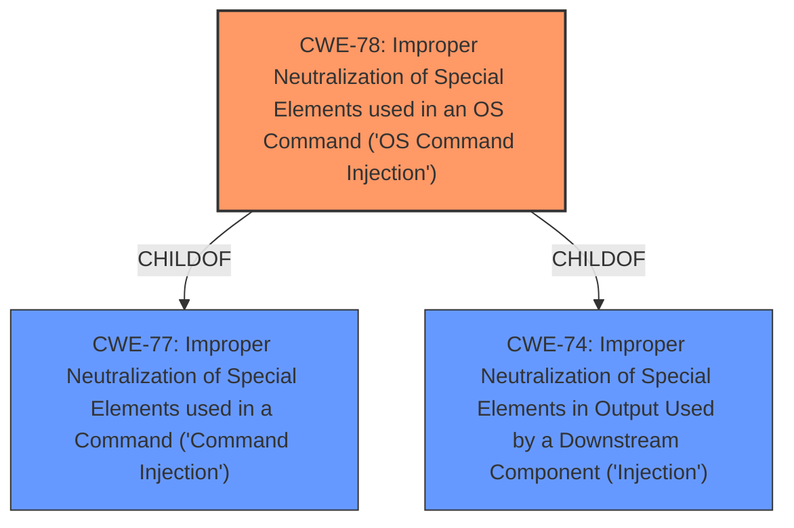

# Analysis Report for CVE-2022-45095

# Vulnerability Analysis Report: CVE-2022-45095

## Description


## Analysis (with Relationship Data)

# Summary

| CWE ID | CWE Name | Confidence | CWE Abstraction Level | CWE Vulnerability Mapping Label | CWE-Vulnerability Mapping Notes |
|---|---|---|---|---|---|
| CWE-78 | Improper Neutralization of Special Elements used in an OS Command ('OS Command Injection') | 1.0 | Base | Allowed | Primary CWE |

## Evidence and Confidence

*   **Confidence Score:** 1.0
*   **Evidence Strength:** HIGH

## Relationship Analysis
The primary relationship influencing the selection was the ChildOf relationship between CWE-78 and CWE-77. While the vulnerability description mentions "command injection," the specific context of executing OS commands makes CWE-78 a more precise fit than CWE-77. CWE-78 is a Base level CWE, which is the preferred level.



## Vulnerability Chain
The chain of events is as follows:

1.  **Root Cause:** **Improper Neutralization of Special Elements used in an OS Command ('OS Command Injection') (CWE-78)** - The application fails to properly sanitize user input, allowing an attacker to inject arbitrary OS commands.
2.  **Impact:** Arbitrary command execution, denial of service, information disclosure, and data deletion.

## Summary of Analysis
The vulnerability description clearly indicates a **command injection** vulnerability. The CVE Reference Links Content Summary confirms this, stating the "Root cause of vulnerability" is "Command injection vulnerability" and the "Weaknesses/vulnerabilities" is "Command injection". The **attack vector** is "Local shell access" by "An authenticated user with access to the local shell and the privilege to gather logs from the cluster."

The Retriever Results list CWE-77 (Improper Neutralization of Special Elements used in a Command ('Command Injection')) and CWE-78 (Improper Neutralization of Special Elements used in an OS Command ('OS Command Injection')) as top candidates.

CWE-78 is more appropriate than CWE-77, since the vulnerability allows execution of OS commands. The description for CWE-78 explicitly mentions constructing an OS command using externally-influenced input, which aligns perfectly with the vulnerability. The "Usage: Allowed" mapping guidance for CWE-78 further supports this selection. CWE-77 is broader and could apply to other command languages.

CWE-74 (Improper Neutralization of Special Elements in Output Used by a Downstream Component ('Injection')) is a parent of CWE-78 and is too general. It's also discouraged.

CWE-269 (Improper Privilege Management) and CWE-732 (Incorrect Permission Assignment for Critical Resource) were considered but deemed less relevant. While the vulnerability requires an authenticated user with specific privileges, the core weakness is the **command injection** itself, not the privilege management.

CWE-20 (Improper Input Validation) is also too general and discouraged with a suggested alternative of CWE-78.

CWE-94 (Improper Control of Generation of Code ('Code Injection')) was considered, but the vulnerability is specifically about injecting commands, not generating code.

Therefore, the primary CWE is CWE-78, as it directly addresses the **improper neutralization** of special elements used in an OS command, leading to **command injection**. The evidence strongly supports this classification, with a confidence level of 1.0.


## CWE Relationship Analysis

Current CWEs represent these abstraction levels: .


### Vulnerability Chain Analysis

**Chain starting from CWE-20:**
- 20 (Improper Input Validation) - ROOT


**Chain starting from CWE-78:**
- 78 (Improper Neutralization of Special Elements used in an OS Command ('OS Command Injection')) - ROOT


### CWE Relationship Diagram

```mermaid
graph TD
    classDef primary fill:#f96,stroke:#333,stroke-width:2px
    classDef secondary fill:#69f,stroke:#333
    classDef tertiary fill:#9e9,stroke:#333
```


*Report generated on 2025-03-31 09:07:11*
