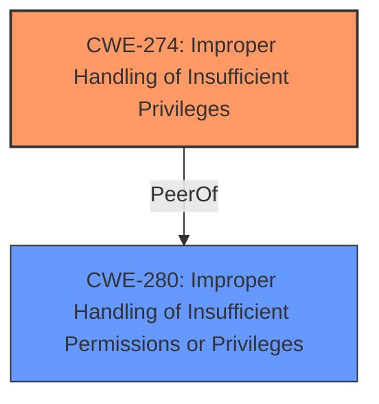

# Analysis Report for CVE-2022-45101

# Vulnerability Analysis Report: CVE-2022-45101

## Description


## Analysis (with Relationship Data)

# Summary
| CWE ID | CWE Name | Confidence | CWE Abstraction Level | CWE Vulnerability Mapping Label | CWE-Vulnerability Mapping Notes |
|---|---|---|---|---|---|
| CWE-274 | Improper Handling of Insufficient Privileges | 1.0 | Base | Primary | Allowed, but Discouraged because it could be deprecated. |
| CWE-280 | Improper Handling of Insufficient Permissions or Privileges | 0.7 | Base | Secondary | Allowed as a closely related alternative. |

## Evidence and Confidence

*   **Confidence Score:** 0.9
*   **Evidence Strength:** HIGH

## Relationship Analysis
The primary relationship that impacted the decision was the close similarity between CWE-274 and CWE-280. Both relate to privilege/permission handling, and the documentation suggests they might be merged in the future. While CWE-274 is slightly favored due to the explicit mention of "Improper Handling of Insufficient Privileges" in both the vulnerability description and CVE summary, CWE-280 remains a strong alternative.



## Vulnerability Chain
The chain of events is as follows:
1.  **Root Cause:** **Improper Handling of Insufficient Privileges** (CWE-274) in the NFS component.
2.  **Impact:** Information disclosure and remote execution.

There is no missing link given the current evidence.

## Summary of Analysis
The initial assessment strongly pointed towards CWE-274, "Improper Handling of Insufficient Privileges," due to its direct match with the **root cause** described in the vulnerability. The vulnerability description explicitly states "**Improper Handling of Insufficient Privileges** vulnerability in NFS." The CVE Reference Links Content Summary also confirms this, stating, "Root cause: **Improper Handling of Insufficient Privileges** vulnerability in NFS" and "Weaknesses: [**Improper Handling of Insufficient Privileges**]".

While CWE-274 is 'Discouraged' for usage because it might be deprecated in the future, the retriever results and the explicit appearance in the vulnerability description makes it the most accurate choice. CWE-280 is considered as a close alternative given the fact that both are very similar.

The final decision is based on the available evidence and the retriever results with a confidence score of 0.9. The selected CWEs are at the optimal level of specificity (Base).

Relevant CWE Information:

# Enhanced Context (25 CWEs)
The following CWEs were identified as potentially relevant to this vulnerability:

## CWE-274: Improper Handling of Insufficient Privileges
**Abstraction Level**: Base
**Similarity Score**: 0.77
**Source**: dense

**Description**:
The product does not handle or incorrectly handles when it has insufficient privileges to perform an operation, leading to resultant weaknesses.

**Mapping Guidance**:
- Usage: Discouraged
- Rationale: This CWE entry could be deprecated in a future version of CWE.

## CWE-280: Improper Handling of Insufficient Permissions or Privileges 
**Abstraction Level**: Base
**Similarity Score**: 0.76
**Source**: dense

**Description**:
The product does not handle or incorrectly handles when it has insufficient privileges to access resources or functionality as specified by their permissions. This may cause it to follow unexpected code paths that may leave the product in an invalid state.

**Mapping Guidance**:
- Usage: Allowed
- Rationale: This CWE entry is at the Base level of abstraction, which is a preferred level of abstraction for mapping to the root causes of vulnerabilities.


## CWE Relationship Analysis

Current CWEs represent these abstraction levels: .


### Vulnerability Chain Analysis

**Chain starting from CWE-274:**
- 274 (Improper Handling of Insufficient Privileges) - ROOT


**Chain starting from CWE-280:**
- 280 (Improper Handling of Insufficient Permissions or Privileges ) - ROOT


### CWE Relationship Diagram

```mermaid
graph TD
    classDef primary fill:#f96,stroke:#333,stroke-width:2px
    classDef secondary fill:#69f,stroke:#333
    classDef tertiary fill:#9e9,stroke:#333
```


*Report generated on 2025-03-31 05:15:32*
