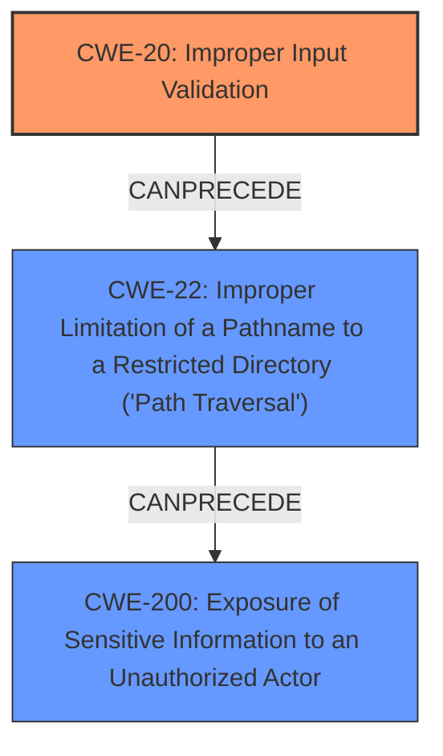

# Raw Analyzer Response for CVE-2022-45103

# Summary
| CWE ID | CWE Name | Confidence | CWE Abstraction Level | CWE Vulnerability Mapping Label | CWE-Vulnerability Mapping Notes |
|---|---|---|---|---|---|
| CWE-20 | Improper Input Validation | 0.9 | Class | Primary | Discouraged Usage |
| CWE-22 | Improper Limitation of a Pathname to a Restricted Directory ('Path Traversal') | 0.8 | Base | Secondary | Allowed Usage |
| CWE-200 | Exposure of Sensitive Information to an Unauthorized Actor | 0.7 | Class | Secondary | Discouraged Usage |

## Evidence and Confidence

*   **Confidence Score:** 0.8
*   **Evidence Strength:** HIGH

## Relationship Analysis
The primary weakness is **Improper Input Validation (CWE-20)**, which allows an attacker to control the file path. This can then lead to **Path Traversal (CWE-22)**, where the attacker is able to access files outside of the intended directory. The end result of this is **Exposure of Sensitive Information (CWE-200)**.

## Vulnerability Chain
The vulnerability chain starts with **Improper Input Validation (CWE-20)** in the vApp Manager’s *Download Logs* feature. This allows an attacker to manipulate the file path. Due to **Improper Limitation of a Pathname to a Restricted Directory ('Path Traversal') (CWE-22)**, the attacker can then read arbitrary files on the system, leading to **Exposure of Sensitive Information to an Unauthorized Actor (CWE-200)**.

## Summary of Analysis
The initial assessment identified **Improper Input Validation (CWE-20)** as the primary weakness because the root cause is the **improper input validation** in the *Download Logs* feature. The summary of the CVE reference links content directly states this as the root cause: "Improper Input Validation in vApp Manager’s *Download Logs* feature." This leads to a chain of weaknesses where an attacker can then traverse the file system and ultimately read arbitrary files. This is **Exposure of Sensitive Information to an Unauthorized Actor (CWE-200)**.

**CWE-20** is at the Class level of abstraction. The mapping guidance recommends considering more specific children, such as CWE-1284, CWE-1285, CWE-1286, CWE-1287, CWE-1288, or CWE-1289. However, without more information about the specific type of input validation that is missing, CWE-20 is the most appropriate.

**CWE-22** is included because the attacker is able to read arbitrary files due to path traversal. This is a direct result of the **improper input validation**.

**CWE-200** is the resulting impact of the vulnerability, as the attacker is able to read sensitive information from the file system. The vulnerability description states "A low privileged remote attacker could potentially exploit this vulnerability, leading to read arbitrary files on the underlying file system."

The final selection of CWEs provides a clear picture of the vulnerability, starting with the root cause and ending with the impact.

Relevant CWE Information:

# Enhanced Context (25 CWEs)

## CWE-653: Improper Isolation or Compartmentalization
**Abstraction Level**: Class
**Similarity Score**: 0.76
**Source**: dense
This CWE was not selected because the vulnerability is more directly related to input validation and path traversal, rather than a lack of isolation.

## CWE-1220: Insufficient Granularity of Access Control
**Abstraction Level**: Base
**Similarity Score**: 0.76
**Source**: dense
This CWE was not selected because the vulnerability is more directly related to input validation and path traversal, rather than the granularity of access control.

## CWE-274: Improper Handling of Insufficient Privileges
**Abstraction Level**: Base
**Similarity Score**: 0.75
**Source**: dense
This CWE was not selected because the vulnerability is caused by improper input validation and path traversal, not the handling of insufficient privileges.

## CWE-668: Exposure of Resource to Wrong Sphere
**Abstraction Level**: Class
**Similarity Score**: 0.75
**Source**: dense
This CWE was not selected because, while the vulnerability does lead to information exposure, the root cause is improper input validation and path traversal. **CWE-200** already covers the information exposure aspect.

## CWE-280: Improper Handling of Insufficient Permissions or Privileges 
**Abstraction Level**: Base
**Similarity Score**: 0.75
**Source**: dense
This CWE was not selected because the vulnerability is caused by improper input validation and path traversal, not the handling of insufficient permissions or privileges.

## CWE-807: Reliance on Untrusted Inputs in a Security Decision
**Abstraction Level**: Base
**Similarity Score**: 0.75
**Source**: dense
This CWE is similar to **CWE-20**, but **CWE-20** is more general and applicable to this vulnerability.

## CWE-664: Improper Control of a Resource Through its Lifetime
**Abstraction Level**: Pillar
**Similarity Score**: 0.75
**Source**: dense
This CWE is too high-level and does not accurately describe the vulnerability.

## CWE-552: Files or Directories Accessible to External Parties
**Abstraction Level**: Base
**Similarity Score**: 0.74
**Source**: dense
This CWE is similar to **CWE-200**, but **CWE-200** is more general and applicable to this vulnerability.

## CWE-691: Insufficient Control Flow Management
**Abstraction Level**: Pillar
**Similarity Score**: 0.74
**Source**: dense
This CWE is too high-level and does not accurately describe the vulnerability.

## CWE-73: External Control of File Name or Path
**Abstraction Level**: Base
**Similarity Score**: 0.74
**Source**: dense
This CWE is closely related to **CWE-22**, but **CWE-22** is more specific to path traversal vulnerabilities. The external control of the file name is a contributing factor, but the **improper limitation of the pathname** is the more direct cause of the vulnerability.

## CWE-200: Exposure of Sensitive Information to an Unauthorized Actor
**Abstraction Level**: Class
**Similarity Score**: 8254.56
**Source**: sparse
This CWE was selected as a secondary weakness because the vulnerability results in the exposure of sensitive information.

## CWE-863: Incorrect Authorization
**Abstraction Level**: Class
**Similarity Score**: 8099.98
**Source**: sparse
This CWE was not selected because the vulnerability is more directly related to input validation and path traversal, rather than incorrect authorization.

## CWE-22: Improper Limitation of a Pathname to a Restricted Directory ('Path Traversal')
**Abstraction Level**: Base
**Similarity Score**: 8073.01
**Source**: sparse
This CWE was selected as a secondary weakness because the **improper input validation** allows an attacker to traverse the file system.

## CWE-639: Authorization Bypass Through User-Controlled Key
**Abstraction Level**: Base
**Similarity Score**: 8046.93
**Source**: sparse
This CWE was not selected because the vulnerability is more directly related to input validation and path traversal, rather than authorization bypass.

## CWE-119: Improper Restriction of Operations within the Bounds of a Memory Buffer
**Abstraction Level**: Class
**Similarity Score**: 7951.73
**Source**: sparse
This CWE was not selected because the vulnerability is more directly related to input validation and path traversal, rather than memory buffer issues.

## CWE-471: Modification of Assumed-Immutable Data (MAID)
**Abstraction Level**: base
**Similarity Score**: 4.33
**Source**: graph
This CWE was not selected because it is not relevant to the vulnerability.

## CWE-434: Unrestricted Upload of File with Dangerous Type
**Abstraction Level**: base
**Similarity Score**: 4.33
**Source**: graph
This CWE was not selected because it is not relevant to the vulnerability.

## CWE-22: Improper Limitation of a Pathname to a Restricted Directory ('Path Traversal')
**Abstraction Level**: base
**Similarity Score**: 4.33
**Source**: graph
This CWE was selected as a secondary weakness because the **improper input validation** allows an attacker to