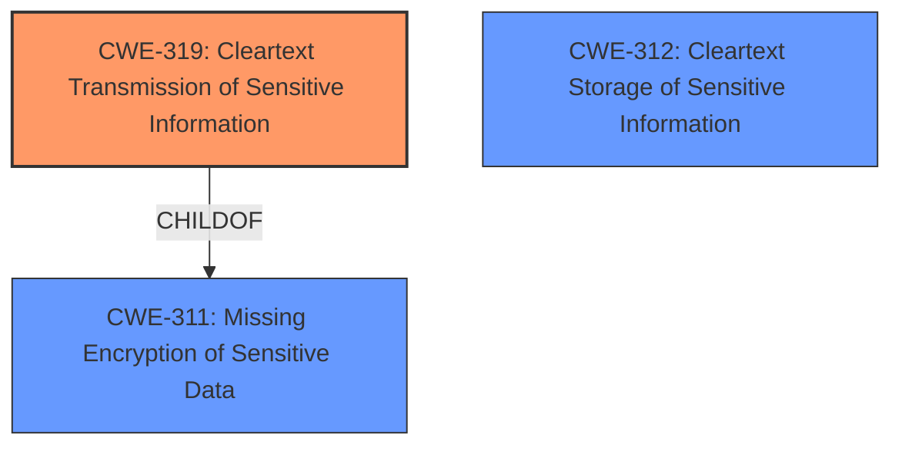

# Analysis for CVE-2022-45124

# Summary
| CWE ID  | CWE Name                                                     | Confidence | CWE Abstraction Level | CWE Vulnerability Mapping Label | CWE-Vulnerability Mapping Notes |
| :-------- | :----------------------------------------------------------- | :--------- | :---------------------- | :------------------------------ | :-------------------------------- |
| CWE-319 | Cleartext Transmission of Sensitive Information              | 1          | Base                    | Primary                         | Allowed                           |
| CWE-312 | Cleartext Storage of Sensitive Information                 | 0.7        | Base                    | Secondary                       | Allowed                           |

## Evidence and Confidence

*   **Confidence Score:** 1
*   **Evidence Strength:** HIGH

## Relationship Analysis
The primary CWE is CWE-319 **Cleartext Transmission of Sensitive Information**, which falls under the higher-level class CWE-311 **Missing Encryption of Sensitive Data**. CWE-312 **Cleartext Storage of Sensitive Information** is related because the vulnerability involves the sensitive information being transmitted without encryption, which could also imply that it's stored without encryption.

## Vulnerability Chain
The vulnerability chain starts with the protocol using a mixture of ciphering and compression but ultimately failing to protect the username and password, leading to the transmission of decipherable sensitive information across the network. This allows an attacker to sniff the network traffic and recover the plaintext credentials.

## Summary of Analysis
The analysis is based on the vulnerability description and the provided CVE Reference Links Content Summary. The core issue is that the authentication packet contains all the necessary information to recover the username and password, effectively transmitting sensitive information in a way that can be intercepted and deciphered.

Evidence from the CVE Reference Links Content Summary:

*   "The protocol used to communicate with XDBServer uses a mixture of ciphering and compression, which prevents plaintext strings from being sent directly. However, all the necessary information is included in the authentication packet to recover the username and password."
*   "An attacker can recover plaintext usernames and passwords by sniffing network traffic containing authentication packets."

The relationship analysis shows that CWE-319 is a specific type of CWE-311, and that CWE-312 is also closely related.

The selected CWEs are at the optimal level of specificity because they directly address the **root cause** and the immediate impact of the vulnerability. The protocol's failure to properly protect the credentials during transmission (CWE-319) leads to the information disclosure.

Relevant CWE Information:

# Enhanced Context (25 CWEs)
The following CWEs were identified as potentially relevant to this vulnerability:

## CWE-312: Cleartext Storage of Sensitive Information
**Abstraction Level**: Base
**Similarity Score**: 0.79
**Source**: dense

**Description**:
The product stores sensitive information in cleartext within a resource that might be accessible to another control sphere.

**Mapping Guidance**:
- Usage: Allowed
- Rationale: This CWE entry is at the Base level of abstraction, which is a preferred level of abstraction for mapping to the root causes of vulnerabilities.

## CWE-319: Cleartext Transmission of Sensitive Information
**Abstraction Level**: Base
**Similarity Score**: 0.77
**Source**: dense

**Description**:
The product transmits sensitive or security-critical data in cleartext in a communication channel that can be sniffed by unauthorized actors.

**Mapping Guidance**:
- Usage: Allowed
- Rationale: This CWE entry is at the Base level of abstraction, which is a preferred level of abstraction for mapping to the root causes of vulnerabilities.

## CWE-798: Use of Hard-coded Credentials
**Abstraction Level**: Base
**Similarity Score**: 0.75
**Source**: dense

**Description**:
The product contains hard-coded credentials, such as a password or cryptographic key.

**Mapping Guidance**:
- Usage: Allowed
- Rationale: This CWE entry is at the Base level of abstraction, which is a preferred level of abstraction for mapping to the root causes of vulnerabilities.

### Detailed Analysis of Selected CWEs:

*   **CWE-319 Cleartext Transmission of Sensitive Information**:
    *   **Match:** The vulnerability description explicitly states that the authentication packet contains enough information to recover the username and password, which means that the sensitive information is being transmitted in a form that is not properly protected and can be sniffed by an attacker.
    *   **Security Implications:** An attacker can recover plaintext usernames and passwords, potentially leading to unauthorized access to the system.
    *   **Relationships:** This is a specific case of CWE-311 Missing Encryption of Sensitive Data.
    *   **Mapping Guidance:** The usage is ALLOWED and at the Base level of abstraction.
*   **CWE-312 Cleartext Storage of Sensitive Information**:
    *   **Match:** While the primary issue is the transmission, the fact that the information can be so easily recovered suggests that the information might also be stored without proper encryption.
    *   **Security Implications:** If the credentials are also stored in cleartext, it would further exacerbate the vulnerability.
    *   **Relationships:** This is related to CWE-319 because if data is transmitted in cleartext, it might also be stored in cleartext.
    *   **Mapping Guidance:** The usage is ALLOWED and at the Base level of abstraction.
*   **CWE-798 Use of Hard-coded Credentials**:
    *   This CWE was considered, but not selected as a primary or secondary because there is no evidence to suggest the credentials are hard-coded.

I am confident in this assessment based on the provided evidence and the CWE specifications.