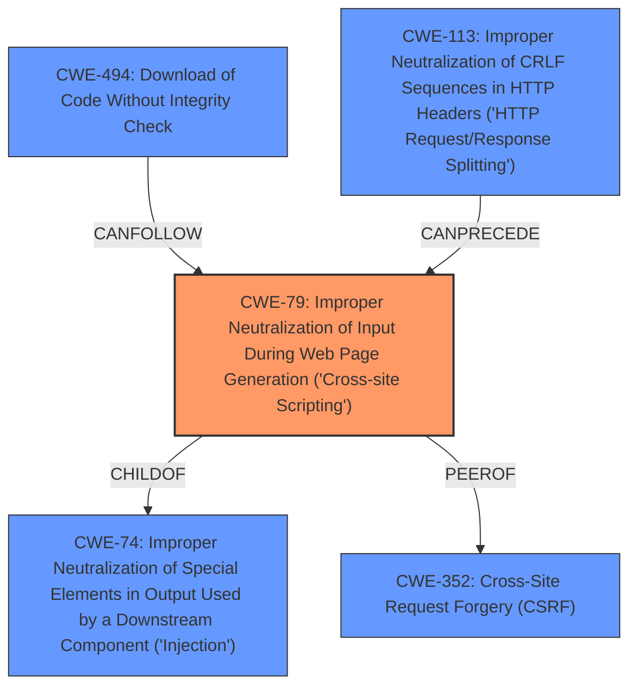

# Raw Analyzer Response for CVE-2022-4523

# Summary
| CWE ID | CWE Name | Confidence | CWE Abstraction Level | CWE Vulnerability Mapping Label | CWE-Vulnerability Mapping Notes |
|---|---|---|---|---|---|
| CWE-79 | Improper Neutralization of Input During Web Page Generation ('Cross-site Scripting') | 1.0 | Base | Allowed | Primary CWE |

## Evidence and Confidence

*   **Confidence Score:** 1.0
*   **Evidence Strength:** HIGH

## Relationship Analysis
The primary relationship influencing the CWE selection is the direct match of the vulnerability description to **CWE-79** (Improper Neutralization of Input During Web Page Generation ('Cross-site Scripting')). The analysis of the CVE Reference Links Content Summary confirms the **root cause** as the lack of proper sanitization of user-provided input, directly leading to the XSS vulnerability.
The **CWE-79** is a Base level CWE which is the preferred level of abstraction.

## Vulnerability Chain
The vulnerability chain starts with the **root cause**: the lack of proper sanitization of user input. This leads directly to the **weakness**: Cross-Site Scripting (XSS). The exploitation of this weakness can then result in various impacts, such as session hijacking, data theft, malware distribution, defacement, and phishing.

## Summary of Analysis
The initial analysis of the vulnerability description identified the **weakness** as Cross-Site Scripting (XSS). The CVE Reference Links Content Summary provides direct evidence supporting this classification: "The root cause of the vulnerability was the lack of proper sanitization of user-provided input before displaying it on web pages" and "The primary weakness was the presence of Cross-Site Scripting (XSS) vulnerabilities."

**CWE-79** (Improper Neutralization of Input During Web Page Generation ('Cross-site Scripting')) is the best fit because it directly addresses the identified weakness and its root cause. The MITRE mapping guidance for CWE-79 allows its usage, stating that it is at the Base level of abstraction, which is preferred.

The graph relationships show that **CWE-79** is a child of **CWE-74** (Improper Neutralization of Special Elements in Output Used by a Downstream Component ('Injection')), which is a more general class of injection vulnerabilities. However, the specific context of web page generation and XSS makes **CWE-79** a more precise and appropriate choice.

The selected CWE is at the optimal level of specificity because it directly represents the vulnerability's core issue: the failure to neutralize user input before generating a web page, leading to XSS. The evidence from the CVE Reference Links Content Summary confirms this assessment.

Relevant CWE Information:

# Enhanced Context (25 CWEs)
The following CWEs were identified as potentially relevant to this vulnerability:

## CWE-184: Incomplete List of Disallowed Inputs
**Abstraction Level**: Base
**Similarity Score**: 0.78
**Source**: dense

**Description**:
The product implements a protection mechanism that relies on a list of inputs (or properties of inputs) that are not allowed by policy or otherwise require other action to neutralize before additional processing takes place, but the list is incomplete.

**Mapping Guidance**:
- Usage: Allowed
- Rationale: This CWE entry is at the Base level of abstraction, which is a preferred level of abstraction for mapping to the root causes of vulnerabilities.

**Why it was not selected**: This CWE relates to incomplete lists of disallowed inputs. Although input sanitization was missing, there is no evidence of an attempt at allowlisting or denylisting, making this CWE less relevant than **CWE-79**.

## CWE-1289: Improper Validation of Unsafe Equivalence in Input
**Abstraction Level**: Base
**Similarity Score**: 0.78
**Source**: dense

**Description**:
The product receives an input value that is used as a resource identifier or other type of reference, but it does not validate or incorrectly validates that the input is equivalent to a potentially-unsafe value.

**Mapping Guidance**:
- Usage: Allowed
- Rationale: This CWE entry is at the Base level of abstraction, which is a preferred level of abstraction for mapping to the root causes of vulnerabilities.

**Why it was not selected**: This CWE relates to improper validation of equivalence in input. There's no information provided about equivalence checks, making this CWE not as appropriate as **CWE-79**.

## CWE-434: Unrestricted Upload of File with Dangerous Type
**Abstraction Level**: Base
**Similarity Score**: 0.76
**Source**: dense

**Description**:
The product allows the upload or transfer of dangerous file types that are automatically processed within its environment.

**Mapping Guidance**:
- Usage: Allowed
- Rationale: This CWE entry is at the Base level of abstraction, which is a preferred level of abstraction for mapping to the root causes of vulnerabilities.

**Why it was not selected**: This CWE relates to unrestricted file uploads, which is not the scenario described in the vulnerability. The vulnerability is focused on XSS, not file uploads, making it unrelated.

## CWE-80: Improper Neutralization of Script-Related HTML Tags in a Web Page (Basic XSS)
**Abstraction Level**: Variant
**Similarity Score**: 0.76
**Source**: dense

**Description**:
The product receives input from an upstream component, but it does not neutralize or incorrectly neutralizes special characters such as "<", ">", and "&" that could be interpreted as web-scripting elements when they are sent to a downstream component that processes web pages.

**Mapping Guidance**:
- Usage: Allowed
- Rationale: This CWE entry is at the Variant level of abstraction, which is a preferred level of abstraction for mapping to the root causes of vulnerabilities.

**Why it was not selected**: **CWE-80** is a variant of **CWE-79**, specifically focusing on script-related HTML tags. While relevant, **CWE-79** is broader and captures the general XSS vulnerability more accurately.

## CWE-183: Permissive List of Allowed Inputs
**Abstraction Level**: Base
**Similarity Score**: 0.76
**Source**: dense

**Description**:
The product implements a protection mechanism that relies on a list of inputs (or properties of inputs) that are explicitly allowed by policy because the inputs are assumed to be safe, but the list is too permissive - that is, it allows an input that is unsafe, leading to resultant weaknesses.

**Mapping Guidance**:
- Usage: Allowed
- Rationale: This CWE entry is at the Base level of abstraction, which is a preferred level of abstraction for mapping to the root causes of vulnerabilities.

**Why it was not selected**: This CWE relates to permissive allowlists. No evidence shows that an allowlist was used, making it less applicable than **CWE-79**.

## CWE-74: Improper Neutralization of Special Elements in Output Used by a Downstream Component ('Injection')
**Abstraction Level**: Class
**Similarity Score**: 0.76
**Source**: dense

**Description**:
The product constructs all or part of a command, data structure, or record using externally-influenced input from an upstream component, but it does not neutralize or incorrectly neutralizes special elements that could modify how it is parsed or interpreted when it is sent to a downstream component.

**Mapping Guidance**:
- Usage: Discouraged
- Rationale: CWE-74 is high-level and often misused when lower-level weaknesses are more appropriate.

**Why it was not selected**: **CWE-74** is a class-level CWE for injection vulnerabilities. While XSS is a type of injection, **CWE-79** is a more specific and appropriate base-level CWE for this vulnerability.

## CWE-807: Reliance on Untrusted Inputs in a Security Decision
**Abstraction Level**: Base
**Similarity Score**: 0.75
**Source**: dense

**Description**:
The product uses a protection mechanism that relies on the existence or values of an input, but the input can be modified by an untrusted actor in a way that