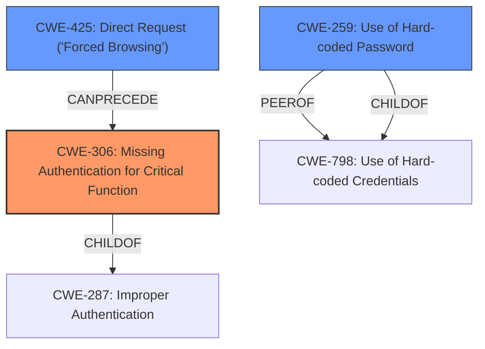

# Analysis Report for CVE-2022-45276

# Vulnerability Analysis Report: CVE-2022-45276

## Description


## Analysis (with Relationship Data)

# Summary
| CWE ID | CWE Name | Confidence | CWE Abstraction Level | CWE Vulnerability Mapping Label | CWE-Vulnerability Mapping Notes |
|---|---|---|---|---|---|
| CWE-306 | Missing Authentication for Critical Function | 1.0 | Base | Allowed | Primary CWE |
| CWE-425 | Direct Request ('Forced Browsing') | 0.8 | Base | Allowed | Secondary Candidate |
| CWE-259 | Use of Hard-coded Password | 0.6 | Variant | Allowed | Secondary Candidate |

## Evidence and Confidence

*   **Confidence Score:** 0.9
*   **Evidence Strength:** HIGH

## Relationship Analysis
The primary relationship influencing the CWE selection is the hierarchical relationship between CWE-287 (Improper Authentication) and its children, specifically CWE-306 (Missing Authentication for Critical Function). CWE-306 is a more specific case of CWE-287, where authentication is completely missing for a critical function. CWE-425 (Direct Request) is related as a potential attack vector. CWE-259 (Use of Hard-coded Password) was considered due to password implications but deemed less relevant as the primary issue is the lack of authentication rather than the nature of the password itself.



## Vulnerability Chain
The vulnerability chain starts with the **lack of proper authentication** (**CWE-306**) for accessing the `/index/user/user_edit.html` component, which allows an **unauthenticated attacker** to directly request (**CWE-425**) and retrieve sensitive user information, including MD5-hashed passwords. While the passwords are MD5-hashed, the vulnerability does not directly stem from the hashing algorithm itself or the storage of the password (e.g. **CWE-259**, **CWE-798**), but from the **missing authentication** that enables the retrieval of these passwords in the first place. The final impact is the potential for account compromise and data breach.

## Summary of Analysis
The primary CWE is CWE-306 (Missing Authentication for Critical Function) because the root cause of the vulnerability is the **lack of authentication** checks for a critical function, namely accessing the `user_edit.html` page which exposes sensitive user data. This is explicitly stated in the CVE Reference Links Content Summary: "The vulnerability stems from the **lack of proper authentication checks** when accessing the `user_edit.html` page." The direct impact is that an unauthenticated user can retrieve usernames and MD5-hashed passwords.

CWE-425 (Direct Request ('Forced Browsing')) is a secondary candidate because the vulnerability can be exploited by directly accessing the vulnerable URL. This aligns with the description of CWE-425: "The web application does not adequately enforce appropriate authorization on all restricted URLs, scripts, or files." This is supported by the CVE Reference Links Content Summary: "Attack vectors: - Direct access to the vulnerable URL: `http://xxx.com/index/user/user_edit.html`".

CWE-259 (Use of Hard-coded Password) was considered because MD5-hashed passwords are being exposed, but the core issue isn't about a hardcoded password. The weakness is that any password at all, no matter how strong, can be obtained without authentication.

The selected CWEs are at the optimal level of specificity. CWE-306 is a Base-level CWE, which is preferred for mapping root causes. It accurately reflects the core issue of missing authentication. CWE-425 is also a Base-level CWE, and it accurately reflects how an attacker reaches the vulnerable code. CWE-259 is a Variant, but less appropriate because the root cause is not about using a hardcoded password.


## CWE Relationship Analysis

Current CWEs represent these abstraction levels: .


### Vulnerability Chain Analysis

**Chain starting from CWE-425:**
- 425 (Direct Request ('Forced Browsing')) - ROOT


**Chain starting from CWE-259:**
- 259 (Use of Hard-coded Password) - ROOT


### CWE Relationship Diagram

```mermaid
graph TD
    classDef primary fill:#f96,stroke:#333,stroke-width:2px
    classDef secondary fill:#69f,stroke:#333
    classDef tertiary fill:#9e9,stroke:#333
```


*Report generated on 2025-03-31 00:13:11*
