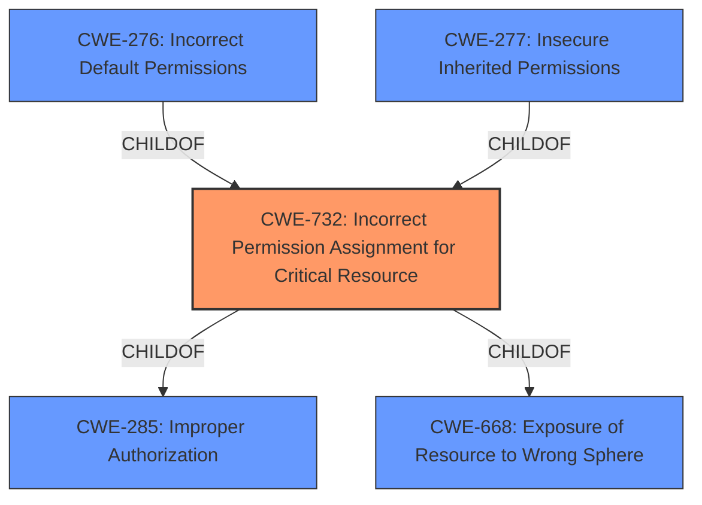

# Analysis Report for CVE-2022-45301

# Vulnerability Analysis Report: CVE-2022-45301

## Description


## Analysis (with Relationship Data)

# Summary
| CWE ID | CWE Name | Confidence | CWE Abstraction Level | CWE Vulnerability Mapping Label | CWE-Vulnerability Mapping Notes |
|---|---|---|---|---|---|
| **CWE-732** | Incorrect Permission Assignment for Critical Resource | 1.0 | Class | Allowed-with-Review | Primary CWE: The vulnerability description clearly indicates **insecure permissions** assigned to the `C:\tools\ruby31` directory, granting unintended write access to the "Authenticated Users" group. |
| CWE-276 | Incorrect Default Permissions | 0.7 | Base | Allowed | Secondary Candidate: While CWE-732 is the primary mapping, CWE-276 could be considered as it relates to the permissions being set incorrectly during the package installation process. |
| CWE-277 | Insecure Inherited Permissions | 0.6 | Variant | Allowed | Secondary Candidate: Also, it is possible that the insecure permissions were inherited. |

## Evidence and Confidence

*   **Confidence Score:** 1.0
*   **Evidence Strength:** HIGH

## Relationship Analysis
The primary CWE is CWE-732, which is a Class-level weakness. CWE-732 is a child of both CWE-285 (Improper Authorization) and CWE-668 (Exposure of Resource to Wrong Sphere). I considered CWE-276 (Incorrect Default Permissions) and CWE-277 (Insecure Inherited Permissions) which are related to CWE-732 but decided they were less descriptive of the **root cause** than CWE-732.



## Vulnerability Chain
The vulnerability chain consists of the following:
1.  **Root Cause**: **Insecure permissions** assigned to the `C:\tools\ruby31` directory during the creation of the Chocolatey Ruby package.
2.  **Weakness**: Authenticated users gain unintended write access to the Ruby installation directory.
3.  **Impact**: Potential for malicious users to modify or replace Ruby binaries, leading to arbitrary code execution or system compromise.

## Summary of Analysis
The primary CWE mapping is CWE-732 (Incorrect Permission Assignment for Critical Resource). This is based on the vulnerability description stating **insecure permissions** in the Chocolatey Ruby package, granting write access to the `C:\tools\ruby31` directory for all users in the Authenticated Users group. This directly aligns with the CWE-732 description: "The product specifies permissions for a security-critical resource in a way that allows that resource to be read or modified by unintended actors." The evidence is the "Vulnerability Description" itself, where it mentions the **insecure permissions**.

The retriever results also indicate CWE-732 as the top candidate. While the mapping guidance suggests "Allowed-with-Review" due to potential misuse, the description accurately reflects the **root cause** of the vulnerability, making it the most appropriate choice.

CWE-276 (Incorrect Default Permissions) and CWE-277 (Insecure Inherited Permissions) were considered as secondary candidates. However, CWE-732 is more encompassing as it directly addresses the consequence of **incorrectly assigned permissions**, regardless of whether they were defaults or inherited.

The selected CWE (CWE-732) is at the Class level, which is the most specific level applicable based on the available information. Further analysis of the package creation process could reveal if the permissions were incorrectly set by default (CWE-276) or inherited (CWE-277), but without this information, CWE-732 provides the best representation of the vulnerability.

Relevant CWE Information:
INSERT


## CWE Relationship Analysis

Current CWEs represent these abstraction levels: .


### Vulnerability Chain Analysis

**Chain starting from CWE-277:**
- 277 (Insecure Inherited Permissions) - ROOT


**Chain starting from CWE-276:**
- 276 (Incorrect Default Permissions) - ROOT


### CWE Relationship Diagram

```mermaid
graph TD
    classDef primary fill:#f96,stroke:#333,stroke-width:2px
    classDef secondary fill:#69f,stroke:#333
    classDef tertiary fill:#9e9,stroke:#333
```


*Report generated on 2025-03-30 15:19:43*
