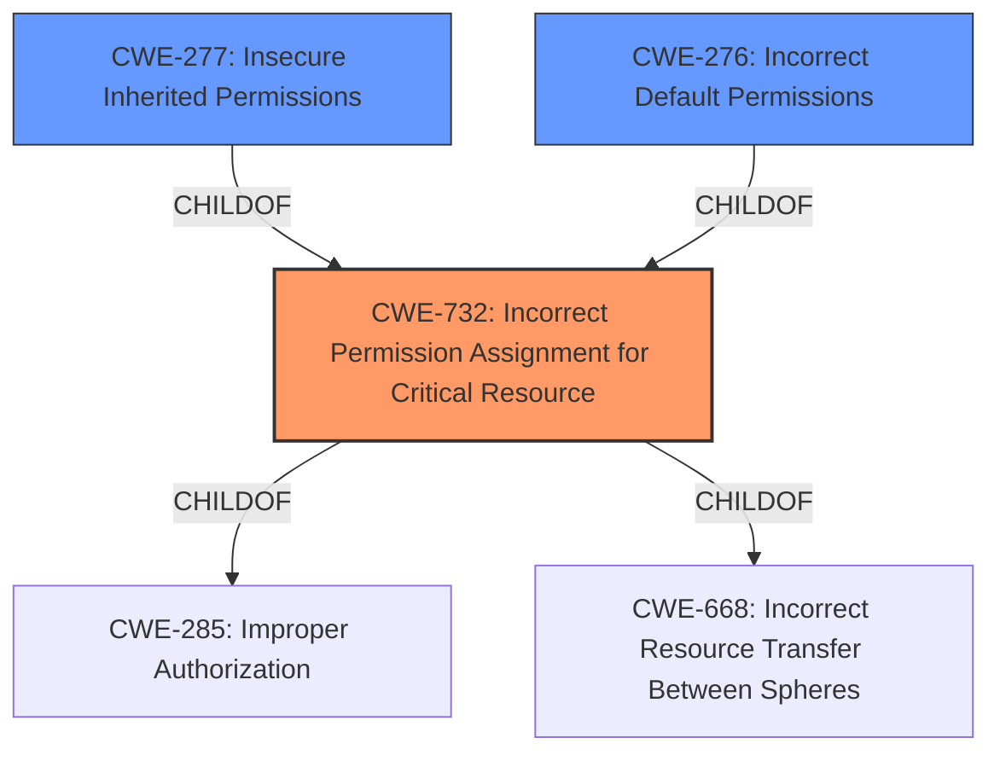

# Enhanced Analysis for CVE-2022-45305

# Summary
| CWE ID | CWE Name | Confidence | CWE Abstraction Level | CWE Vulnerability Mapping Label | CWE-Vulnerability Mapping Notes |
|---|---|---|---|---|---|
| CWE-732 | Incorrect Permission Assignment for Critical Resource | 1.0 | Class | Allowed-with-Review | Primary CWE |
| CWE-277 | Insecure Inherited Permissions | 0.7 | Variant | Allowed | Secondary Candidate |
| CWE-276 | Incorrect Default Permissions | 0.6 | Base | Allowed | Secondary Candidate |

## Evidence and Confidence

*   **Confidence Score:** 0.8
*   **Evidence Strength:** HIGH

## Relationship Analysis
The primary CWE, CWE-732, is a Class-level CWE with child relationships to CWE-285 (Improper Authorization) and CWE-668 (Incorrect Resource Transfer Between Spheres). While CWE-732 directly addresses the **incorrect permission assignment**, the description also suggests the permissions are inherited, so CWE-277 (Insecure Inherited Permissions) is a possible variant. CWE-276, Incorrect Default Permissions, is also related as the issue relates to the installed permissions.



## Vulnerability Chain
The vulnerability chain starts with the **insecure permissions** assigned to the Python3 installation folder, which allows users in the Authenticated Users group to write to the folder and its files. This leads to potential compromise of the Python3 installation, potentially allowing for arbitrary code execution or other malicious activities.

## Summary of Analysis
The initial analysis identified CWE-732 as the most relevant CWE, given the **incorrect permission assignment** that allows unintended actors (users in the Authenticated Users group) to modify critical resources (the Python3 installation folder and files).

The vulnerability description explicitly states "**Insecure permissions** in Chocolatey Python3 package v3.11.0 and below grants all users in the Authenticated Users group write privileges for the subfolder C:\Python311 and all files located in that folder." This statement directly supports the classification of CWE-732.

The retriever results also list CWE-732 as the top candidate.

CWE-277 (Insecure Inherited Permissions) was considered because the description mentions the permissions are applied to a subfolder, suggesting they might be inherited. However, the primary issue is the incorrect assignment itself, making CWE-732 more appropriate. CWE-276 (Incorrect Default Permissions) also is related to installed permissions.

The selected CWEs are at the optimal level of specificity because CWE-732 directly addresses the core weakness of incorrect permission assignment, while CWE-277 and CWE-276 are related but less direct.

Relevant CWE Information:

# Enhanced Context (25 CWEs)

## CWE-732: Incorrect Permission Assignment for Critical Resource
**Abstraction:** Class
**Status:** Draft

### Description
The product specifies permissions for a security-critical resource in a way that allows that resource to be read or modified by unintended actors.

### Extended Description
When a resource is given a permission setting that provides access to a wider range of actors than required, it could lead to the exposure of sensitive information, or the modification of that resource by unintended parties. This is especially dangerous when the resource is related to program configuration, execution, or sensitive user data. For example, consider a misconfigured storage account for the cloud that can be read or written by a public or anonymous user.

### Relationships
ChildOf -> CWE-285
ChildOf -> CWE-668

### Mapping Guidance
**Usage:** Allowed-with-Review
**Rationale:** While the name itself indicates an assignment of permissions for resources, this is often misused for vulnerabilities in which "permissions" are not checked, which is an "authorization" weakness (CWE-285 or descendants) within CWE's model [REF-1287].
**Comments:** Closely analyze the specific mistake that is allowing the resource to be exposed, and perform a CWE mapping for that mistake.

## CWE-277: Insecure Inherited Permissions
**Abstraction:** Variant
**Status:** Draft

### Description
A product defines a set of insecure permissions that are inherited by objects that are created by the program.

### Relationships
ChildOf -> CWE-732

### Mapping Guidance
**Usage:** Allowed

## CWE-276: Incorrect Default Permissions
**Abstraction:** Base
**Status:** Draft

### Description
During installation, installed file permissions are set to allow anyone to modify those files.

### Relationships
ChildOf -> CWE-732

### Mapping Guidance
**Usage:** Allowed


## CWE Relationship Analysis

Current CWEs represent these abstraction levels: .


### Vulnerability Chain Analysis

**Chain starting from CWE-277:**
- 277 (Insecure Inherited Permissions) - ROOT


**Chain starting from CWE-276:**
- 276 (Incorrect Default Permissions) - ROOT


### CWE Relationship Diagram

```mermaid
graph TD
    classDef primary fill:#f96,stroke:#333,stroke-width:2px
    classDef secondary fill:#69f,stroke:#333
    classDef tertiary fill:#9e9,stroke:#333
```