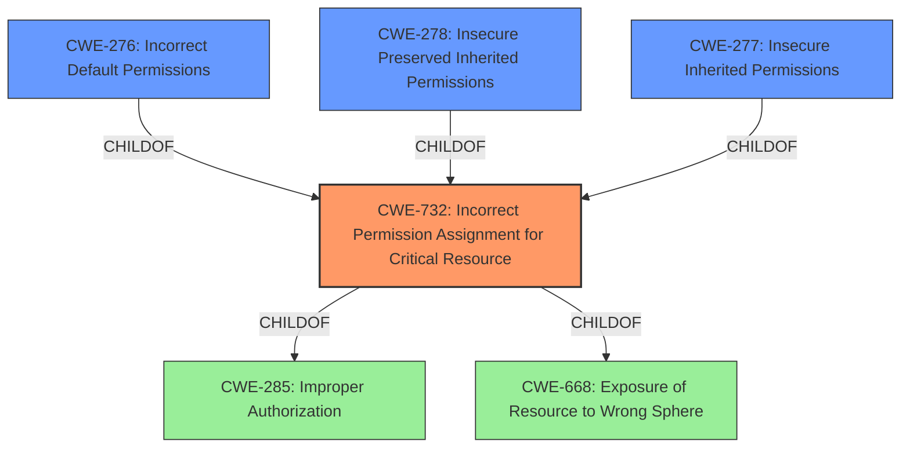

# Raw Analyzer Response for CVE-2022-45306

# Summary
| CWE ID | CWE Name | Confidence | CWE Abstraction Level | CWE Vulnerability Mapping Label | CWE-Vulnerability Mapping Notes |
|---|---|---|---|---|---|
| CWE-732 | Incorrect Permission Assignment for Critical Resource | 0.9 | Class | Allowed-with-Review | Primary CWE |
| CWE-276 | Incorrect Default Permissions | 0.7 | Base | Allowed | Secondary Candidate |
| CWE-278 | Insecure Preserved Inherited Permissions | 0.6 | Variant | Allowed | Secondary Candidate |
| CWE-277 | Insecure Inherited Permissions | 0.6 | Variant | Allowed | Secondary Candidate |

## Evidence and Confidence

*   **Confidence Score:** 0.9
*   **Evidence Strength:** HIGH

## Relationship Analysis
The primary CWE selected is CWE-732, which falls under both CWE-285 (Improper Authorization) and CWE-668 (Exposure of Resource to Wrong Sphere). Several related CWEs were considered, including CWE-276 (Incorrect Default Permissions), CWE-278 (Insecure Preserved Inherited Permissions), and CWE-277 (Insecure Inherited Permissions). These are all related to how permissions are initially set or inherited, which aligns with the vulnerability description concerning **insecure permissions**. The hierarchical relationships helped to narrow down the specific type of permission issue.

## Vulnerability Chain
The vulnerability chain starts with the **insecure permissions** being set on the Chocolatey Azure-Pipelines-Agent package. This leads to the impact of granting write privileges to all users in the Authenticated Users group for the C:\agent subfolder and its files. This is a direct cause-and-effect relationship where the **incorrect permissions** directly enable unauthorized write access.

## Summary of Analysis
The initial analysis focused on identifying the root cause of the vulnerability, which is the **insecure permissions** on the specified folder. The vulnerability description clearly states that "Insecure permissions in Chocolatey Azure-Pipelines-Agent package v2.211.1 and below grants all users in the Authenticated Users group write privileges for the subfolder C\agent and all files located in that folder."

CWE-732 (Incorrect Permission Assignment for Critical Resource) was selected as the primary CWE because it directly addresses the core issue of specifying permissions in a way that allows unintended actors to modify critical resources. Although CWE-732 is a class, the evidence supports this level of abstraction. The mapping guidance for CWE-732 suggests reviewing the specific mistake allowing the resource to be exposed.

CWE-276 (Incorrect Default Permissions) was considered as a secondary candidate since it pertains to permissions set during installation; however, the description doesn't explicitly state that the permissions were set incorrectly during installation, so it is not as strong a fit.

CWE-278 (Insecure Preserved Inherited Permissions) and CWE-277 (Insecure Inherited Permissions) were also considered, as they focus on how permissions are inherited. The evidence doesn't explicitly mention inheritance, so these are weaker mappings than CWE-732.

The relationship analysis supports the selection of CWE-732, as it is a child of CWE-285 (Improper Authorization) and CWE-668 (Exposure of Resource to Wrong Sphere), indicating that it is a specific type of authorization and resource exposure issue. The decision to use CWE-732 is based on the direct evidence of **insecure permissions** leading to unauthorized write access.