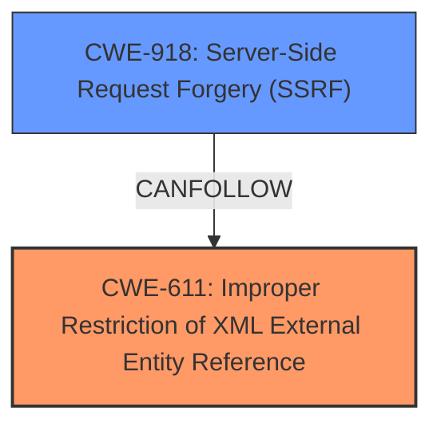

# Enhanced Analysis for CVE-2022-45326

# Summary
| CWE ID | CWE Name | Confidence | CWE Abstraction Level | CWE Vulnerability Mapping Label | CWE-Vulnerability Mapping Notes |
|---|---|---|---|---|---|
| CWE-611 | Improper Restriction of XML External Entity Reference | 1.0 | Base | Allowed | Primary CWE |
| CWE-918 | Server-Side Request Forgery (SSRF) | 0.8 | Base | Allowed | Secondary CWE |

## Evidence and Confidence

*   **Confidence Score:** 0.9
*   **Evidence Strength:** HIGH

## Relationship Analysis
The primary relationship impacting the decision is the close association between CWE-611 and CWE-918. CWE-611 (**XML external entity (XXE) injection**) can lead to CWE-918 (Server-Side Request Forgery (SSRF)). The graph does not clearly show this relationship, but the description of the vulnerability in the CVE indicates this progression. Both are at the Base abstraction level.



## Vulnerability Chain
The vulnerability chain starts with the **XML external entity (XXE) injection** (CWE-611), which is the root cause. This then leads to the ability to conduct server-side request forgery (SSRF) attacks (CWE-918).

## Summary of Analysis
The initial analysis identified CWE-611 as the primary weakness, given the explicit mention of "**XML external entity (XXE) injection**" in the vulnerability description. This is supported by the "**rootcause:** **XML external entity (XXE) injection**" key phrase.

The vulnerability description also mentions "server-side request forgery (SSRF) attacks," indicating that CWE-918 is also relevant. The CWE-918 description states: "The web server receives a URL or similar request from an upstream component and retrieves the contents of this URL, but it does not sufficiently ensure that the request is being sent to the expected destination." This aligns with the impact of the vulnerability, where the XXE injection allows the attacker to make the server send requests to unintended destinations.

Both CWE-611 and CWE-918 are at the Base level of abstraction, which is the preferred level.

Relevant CWE Information:

# Enhanced Context (25 CWEs)

## CWE-611: Improper Restriction of XML External Entity Reference
**Abstraction Level**: Base
**Similarity Score**: 0.80 (dense), 6386.63 (sparse)
**Source**: dense, sparse

**Description**:
The product processes an XML document that can contain XML entities with URIs that resolve to documents outside of the intended sphere of control, causing the product to embed incorrect documents into its output.

**Mapping Guidance**:
- Usage: Allowed
- Rationale: This CWE entry is at the Base level of abstraction, which is a preferred level of abstraction for mapping to the root causes of vulnerabilities.

This CWE directly matches the "**XML external entity (XXE) injection**" vulnerability. The description of CWE-611 aligns perfectly with the root cause of the vulnerability.

## CWE-918: Server-Side Request Forgery (SSRF)
**Abstraction Level**: Base
**Similarity Score**: 0.161 (dense), 5752.15 (sparse)
**Source**: sparse

**Description**:
The web server receives a URL or similar request from an upstream component and retrieves the contents of this URL, but it does not sufficiently ensure that the request is being sent to the expected destination.

**Mapping Guidance**:
- Usage: Allowed
- Rationale: This CWE entry is at the Base level of abstraction, which is a preferred level of abstraction for mapping to the root causes of vulnerabilities.

This CWE matches the impact of the vulnerability, specifically the "server-side request forgery (SSRF) attacks."

## CWE-91: XML Injection (aka Blind XPath Injection)
**Abstraction Level**: Base
**Similarity Score**: 0.637
**Source**: dense

**Description**:
The product does not properly neutralize special elements that are used in XML, allowing attackers to modify the syntax, content, or commands of the XML before it is processed by an end system.

While this CWE is related to XML injection, it is less specific than CWE-611 for this particular vulnerability. CWE-611 focuses specifically on external entities, which is the root cause in this case. Therefore, CWE-91 is not as appropriate.

## CWE-134: Use of Externally-Controlled Format String
**Abstraction Level**: Base
**Similarity Score**: 0.135 (dense), 2.93 (graph)
**Source**: dense, graph

**Description**:
The product uses a function that accepts a format string as an argument, but the format string originates from an external source.

This CWE is not applicable because the vulnerability is not related to format string usage.

## CWE-89: Improper Neutralization of Special Elements used in an SQL Command ('SQL Injection')
**Abstraction Level**: Base
**Similarity Score**: 0.138
**Source**: sparse

**Description**:
The product constructs all or part of an SQL command using externally-influenced input from an upstream component, but it does not neutralize or incorrectly neutralizes special elements that could modify the intended SQL command when it is sent to a downstream component.

This CWE is not applicable because the vulnerability is not related to SQL injection.

I am confident in assigning CWE-611 as the primary CWE because the vulnerability description explicitly mentions "**XML external entity (XXE) injection**". CWE-918 is a secondary CWE since the vulnerability leads to "server-side request forgery (SSRF) attacks".


## CWE Relationship Analysis

Current CWEs represent these abstraction levels: .


### Vulnerability Chain Analysis

**Chain starting from CWE-89:**
- 89 (Improper Neutralization of Special Elements used in an SQL Command ('SQL Injection')) - ROOT


**Chain starting from CWE-918:**
- 918 (Server-Side Request Forgery (SSRF)) - ROOT


### CWE Relationship Diagram

```mermaid
graph TD
    classDef primary fill:#f96,stroke:#333,stroke-width:2px
    classDef secondary fill:#69f,stroke:#333
    classDef tertiary fill:#9e9,stroke:#333
```