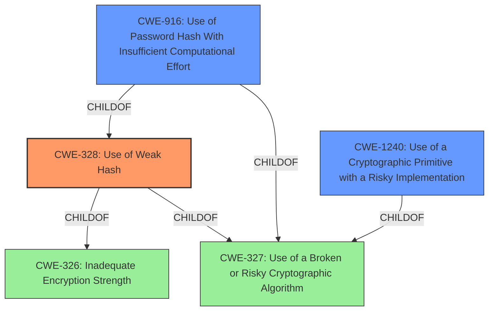

# Enhanced Analysis for CVE-2022-45379

# Summary
| CWE ID  | CWE Name                                                       | Confidence | CWE Abstraction Level | CWE Vulnerability Mapping Label | CWE-Vulnerability Mapping Notes |
| :-------- | :------------------------------------------------------------- | :--------- | :-------------------- | :------------------------------ | :------------------------------ |
| CWE-328   | Use of Weak Hash                                               | 1          | Base                  | Primary                         | Allowed                         |
| CWE-916   | Use of Password Hash With Insufficient Computational Effort | 0.7        | Base                  | Secondary                       | Allowed                         |
| CWE-1240  | Use of a Cryptographic Primitive with a Risky Implementation | 0.7        | Base                  | Secondary                       | Allowed                         |

## Evidence and Confidence

*   **Confidence Score:** 0.9
*   **Evidence Strength:** HIGH

## Relationship Analysis
The primary relationship influencing the CWE selection is the hierarchical relationship, specifically the ChildOf relationships for CWE-328 and CWE-916, both being children of CWE-326 (Inadequate Encryption Strength) and CWE-327 (Use of a Broken or Risky Cryptographic Algorithm). The analysis focuses on identifying the most specific **rootcause** within this hierarchy. Additionally, the peer relationship between CWE-502 (Deserialization of Untrusted Data) and CWE-915 (Improperly Controlled Modification of Dynamically-Determined Object Attributes) was considered but deemed less relevant as the vulnerability's **rootcause** is directly related to the use of a weak hashing algorithm rather than issues related to deserialization or object attribute modification. The abstraction levels guided the selection towards Base and Variant level CWEs for more precise classification.



## Vulnerability Chain
The vulnerability chain starts with the **rootcause**: storing approvals as SHA-1 hashes, which leads to the weakness of susceptibility to collision attacks, and ultimately impacts the system's security by allowing attackers to bypass script approval mechanisms.

## Summary of Analysis
The initial analysis focused on the **rootcause** of the vulnerability: "**approvals stored as the SHA-1 hash of the script**". The CVE Reference Links Content Summary states, "The Script Security Plugin stored whole-script approvals using SHA-1 hashes, which is no longer considered cryptographically secure."

Based on the provided evidence, CWE-328 (Use of Weak Hash) is the most appropriate primary CWE. The description of CWE-328 perfectly matches the vulnerability: "The product uses an algorithm that produces a digest (output value) that does not meet security expectations for a hash function that allows an adversary to reasonably determine the original input (preimage attack), find another input that can produce the same hash (2nd preimage attack), or find multiple inputs that evaluate to the same hash (birthday attack)." SHA-1 is a known weak hash algorithm susceptible to collision attacks, directly aligning with CWE-328. The Mapping Guidance for CWE-328 recommends its usage as it is at the Base level of abstraction.

CWE-916 (Use of Password Hash With Insufficient Computational Effort) and CWE-1240 (Use of a Cryptographic Primitive with a Risky Implementation) were also considered since they address hashing, but with different nuances. CWE-916 focuses on password hashing specifically, while CWE-1240 addresses the use of risky cryptographic primitives. While SHA-1's weakness can be linked to insufficient computational effort and risky implementation, CWE-328 more precisely captures the core issue of using a weak hash algorithm for script approvals.

CWE-759 (Use of a One-Way Hash without a Salt) was not selected because the description doesn't mention the lack of salt.

The graph relationships show that CWE-328, CWE-916, and CWE-1240 are related to broader cryptographic weaknesses, which influenced the consideration of these related CWEs. However, the direct evidence supports the primary selection of CWE-328 as it precisely identifies the use of a weak hash algorithm.

The selected CWEs are at the optimal level of specificity as they directly address the identified weaknesses. CWE-328 accurately captures the use of a weak hash, while CWE-916 and CWE-1240 provide additional context related to password hashing and risky cryptographic implementations.


## CWE Relationship Analysis

Current CWEs represent these abstraction levels: .


### Vulnerability Chain Analysis

**Chain starting from CWE-916:**
- 916 (Use of Password Hash With Insufficient Computational Effort) - ROOT


**Chain starting from CWE-327:**
- 327 (Use of a Broken or Risky Cryptographic Algorithm) - ROOT


### CWE Relationship Diagram

```mermaid
graph TD
    classDef primary fill:#f96,stroke:#333,stroke-width:2px
    classDef secondary fill:#69f,stroke:#333
    classDef tertiary fill:#9e9,stroke:#333
```