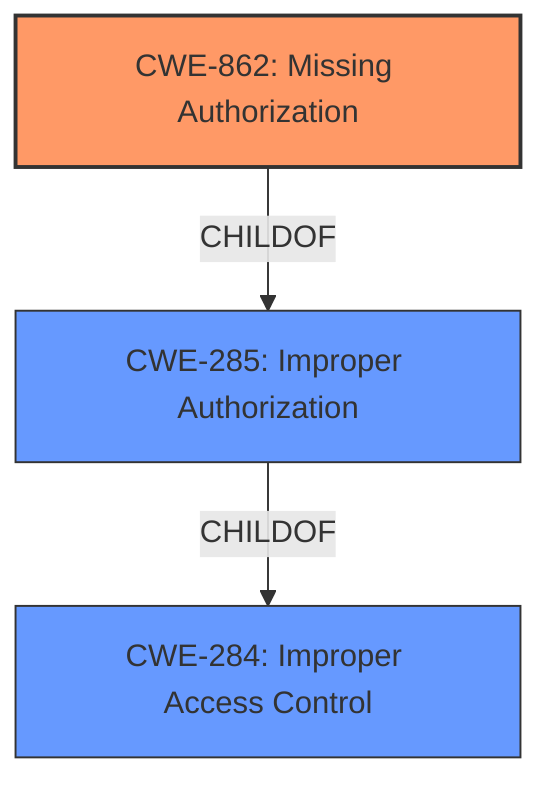

# Raw Analyzer Response for CVE-2022-45390

# Summary
| CWE ID  | CWE Name                      | Confidence | CWE Abstraction Level | CWE Vulnerability Mapping Label | CWE-Vulnerability Mapping Notes |
|---------|-------------------------------|------------|-----------------------|---------------------------------|---------------------------------|
| CWE-862 | Missing Authorization         | 1          | Class                 | Primary                           | Allowed-with-Review            |

## Evidence and Confidence

*   **Confidence Score:** 1
*   **Evidence Strength:** HIGH

## Relationship Analysis
The primary relationship impacting the decision is the parent-child relationship between CWE-285 (Improper Authorization) and CWE-862 (Missing Authorization). CWE-862 is a more specific child of CWE-285, making it a better fit when authorization is completely missing. The retriever results also highlighted CWE-862 as the top candidate. Other relationships, such as those involving authentication (CWE-306) or credential storage (CWE-256, CWE-522), were considered but deemed less relevant as the core issue is the absence of an authorization check.

## Vulnerability Chain
The vulnerability chain is straightforward:
1.  **Root Cause:** **Missing permission check** (CWE-862) on an HTTP endpoint.
2.  **Impact:** Attackers with Overall/Read permission can enumerate the IDs of credentials stored in Jenkins.

## Summary of Analysis
The initial assessment, based on the vulnerability description and the retriever results, strongly suggests CWE-862 as the primary weakness. The vulnerability description key phrases highlight the "**missing permission check**" as the root cause, aligning perfectly with CWE-862's definition. The "CVE Reference Links Content Summary" confirms that the loader.io Plugin **does not perform a permission check** in an HTTP endpoint, further solidifying the selection of CWE-862.

The graph relationships, particularly the parent-child relationship between CWE-285 and CWE-862, were also considered. While CWE-285 (Improper Authorization) could be a potential candidate, CWE-862 is more specific because the authorization check is entirely missing, not just incorrectly implemented.

The selection of CWE-862 is at the optimal level of specificity because it directly addresses the **missing permission check** that allows attackers to enumerate credentials IDs. This is a clear and concise representation of the vulnerability's root cause.

Relevant CWE Information:

# Enhanced Context (25 CWEs)
The following CWEs were identified as potentially relevant to this vulnerability:

## CWE-668: Exposure of Resource to Wrong Sphere
**Abstraction Level**: Class
**Similarity Score**: 0.75
**Source**: dense
**Description**:
The product exposes a resource to the wrong control sphere, providing unintended actors with inappropriate access to the resource.
**Mapping Guidance**:
- Usage: Discouraged

*Reason for not selecting*: CWE-668 is a higher-level class and doesn't specifically address the **missing authorization**. The more specific CWE-862 is a better fit.

## CWE-280: Improper Handling of Insufficient Permissions or Privileges 
**Abstraction Level**: Base
**Similarity Score**: 0.75
**Source**: dense
**Description**:
The product does not handle or incorrectly handles when it has insufficient privileges to access resources or functionality as specified by their permissions. This may cause it to follow unexpected code paths that may leave the product in an invalid state.
**Mapping Guidance**:
- Usage: Allowed

*Reason for not selecting*: The main issue is not the product incorrectly handling insufficient privileges, but rather the **complete absence of a permission check**.

## CWE-754: Improper Check for Unusual or Exceptional Conditions
**Abstraction Level**: Class
**Similarity Score**: 0.74
**Source**: dense
**Description**:
The product does not check or incorrectly checks for unusual or exceptional conditions that are not expected to occur frequently during day to day operation of the product.
**Mapping Guidance**:
- Usage: Allowed-with-Review

*Reason for not selecting*: This CWE is too broad and doesn't directly relate to the **missing authorization** vulnerability.

## CWE-538: Insertion of Sensitive Information into Externally-Accessible File or Directory
**Abstraction Level**: Base
**Similarity Score**: 0.74
**Source**: dense
**Description**:
The product places sensitive information into files or directories that are accessible to actors who are allowed to have access to the files, but not to the sensitive information.
**Mapping Guidance**:
- Usage: Allowed

*Reason for not selecting*: The vulnerability is not about placing sensitive information in accessible locations, but about the **lack of authorization** to access the information in the first place.

## CWE-807: Reliance on Untrusted Inputs in a Security Decision
**Abstraction Level**: Base
**Similarity Score**: 0.74
**Source**: dense
**Description**:
The product uses a protection mechanism that relies on the existence or values of an input, but the input can be modified by an untrusted actor in a way that bypasses the protection mechanism.
**Mapping Guidance**:
- Usage: Allowed

*Reason for not selecting*: This vulnerability is not about relying on untrusted inputs but about the **absence of an authorization check**.

## CWE-345: Insufficient Verification of Data Authenticity
**Abstraction Level**: Class
**Similarity Score**: 0.74
**Source**: dense
**Description**:
The product does not sufficiently verify the origin or authenticity of data, in a way that causes it to accept invalid data.
**Mapping Guidance**:
- Usage: Discouraged

*Reason for not selecting*: The root cause is the **lack of authorization**, not insufficient data verification.

## CWE-274: Improper Handling of Insufficient Privileges
**Abstraction Level**: Base
**Similarity Score**: 0.74
**Source**: dense
**Description**:
The product does not handle or incorrectly handles when it has insufficient privileges to perform an operation, leading to resultant weaknesses.
**Mapping Guidance**:
- Usage: Discouraged

*Reason for not selecting*: Similar to CWE-280, the core issue is not the handling of insufficient privileges, but the **absence of a permission check** altogether.

## CWE-1390: Weak Authentication
**Abstraction Level**: Class
**Similarity Score**: 0.74
**Source**: dense
**Description**:
The product uses an authentication mechanism to restrict access to specific users or identities, but the mechanism does not sufficiently prove that the claimed identity is correct.
**Mapping Guidance**:
- Usage: Allowed-with-Review

*Reason for not selecting*: The problem is not with authentication, but with the **missing authorization check** after a user is authenticated.

## CWE-203: Observable Discrepancy
**Abstraction Level**: Base
**Similarity Score**: 0.74
**Source**: dense
**Description**:
The product behaves differently or sends different responses under different circumstances in a way that is observable to an unauthorized actor, which exposes security-relevant information about the state of the product, such as whether a particular operation was successful or not.
**Mapping Guidance**:
- Usage: Allowed

*Reason for not selecting*: This CWE is about observable discrepancies, not about the **missing permission check**.

## CWE-552: Files or Directories Accessible to External Parties
**Abstraction Level**: Base
**Similarity Score**: 0.73
**Source**: dense
**Description**:
The product makes files or directories accessible to unauthorized actors, even though they should not be.
**Mapping Guidance**:
- Usage: Allowed

*Reason for not selecting*: The issue isn't that the files are directly accessible, but that an HTTP endpoint that exposes information about those files lacks proper authorization checks.

## CWE-863: Incorrect Authorization
**Abstraction Level**: Class
**Similarity Score**: 4248.65
**Source**: sparse
**Description**:
The product performs an authorization check when an actor attempts to access a resource or perform an action, but it does not correctly perform the check.
**Mapping Guidance**:
- Usage: Allowed-with-Review

*Reason for not selecting*: CWE-863 describes a scenario where authorization is performed incorrectly. In this case, authorization is **missing** altogether, making CWE-862 a more accurate fit.

## CWE-285: Improper Authorization
**Abstraction Level**: Class
**Similarity Score**: 4191.79
**Source**: sparse
**Description**:
The product does not perform or incorrectly performs an authorization check when an actor attempts to access a resource or perform an action.
**Mapping Guidance**:
- Usage: Discouraged

*Reason for not selecting*: CWE