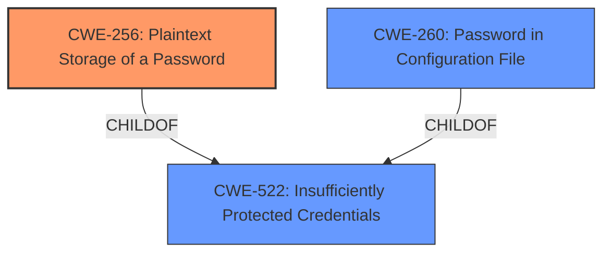

# Analysis for CVE-2022-45392

# Summary
| CWE ID | CWE Name | Confidence | CWE Abstraction Level | CWE Vulnerability Mapping Label | CWE-Vulnerability Mapping Notes |
|---|---|---|---|---|---|
| CWE-256 | Plaintext Storage of a Password | 1.0 | Base | Allowed | Primary CWE |
| CWE-522 | Insufficiently Protected Credentials | 0.7 | Class | Allowed-with-Review | Secondary Candidate |
| CWE-260 | Password in Configuration File | 0.6 | Base | Allowed | Secondary Candidate |

## Evidence and Confidence

*   **Confidence Score:** 0.9
*   **Evidence Strength:** HIGH

## Relationship Analysis
The primary CWE, CWE-256 [Plaintext Storage of a Password], is a Base level CWE that is a child of CWE-522 [Insufficiently Protected Credentials]. This parent-child relationship indicates that CWE-256 is a more specific instance of the broader class of insufficiently protected credentials. CWE-260 [Password in Configuration File] is also a child of CWE-522, and represents another possible base-level mapping.

## Vulnerability Chain
The vulnerability chain is straightforward: The **root cause** is the **unencrypted storage of passwords**, leading to the impact where attackers can view these passwords if they have appropriate access.

## Summary of Analysis
The initial analysis strongly points to CWE-256 [Plaintext Storage of a Password] as the primary weakness, due to the clear description of passwords being stored unencrypted.

The vulnerability description states that "Jenkins NS-ND Integration Performance Publisher Plugin 4.8.0.143 and earlier stores passwords **unencrypted** in job config.xml files on the Jenkins controller". The CVE Reference Links Content Summary further reinforces this, stating the **root cause** is that the "NS-ND Integration Performance Publisher Plugin stores passwords in job `config.xml` files **without encryption**."

The retriever results also list CWE-256 as the top combined result. CWE-256 is a base level CWE, which is preferred.

CWE-522 [Insufficiently Protected Credentials] is a Class level CWE, which is less specific, but still applicable as the parent of CWE-256. I am including it as a secondary candidate.

CWE-260 [Password in Configuration File] is a base level CWE, and is a child of CWE-522. I am including it as a secondary candidate since the passwords are stored in the job config.xml file.

Based on the evidence, relationship analysis, and mapping guidance, CWE-256 is the most specific and appropriate CWE for this vulnerability.

Relevant CWE Information:

# Enhanced Context (25 CWEs)

## CWE-312: Cleartext Storage of Sensitive Information
**Abstraction Level**: Base
**Similarity Score**: 0.79
**Source**: dense

**Description**:
The product stores sensitive information in cleartext within a resource that might be accessible to another control sphere.
**Rationale for not selecting**: CWE-312 is similar to CWE-256, but CWE-256 is specifically about passwords. The description mentions passwords specifically, so CWE-256 is a better fit.

## CWE-522: Insufficiently Protected Credentials
**Abstraction Level**: Class
**Similarity Score**: 0.78
**Source**: dense

**Description**:
The product transmits or stores authentication credentials, but it uses an insecure method that is susceptible to unauthorized interception and/or retrieval.
**Rationale for considering**: This is a parent of CWE-256 and is more general.

## CWE-319: Cleartext Transmission of Sensitive Information
**Abstraction Level**: Base
**Similarity Score**: 0.77
**Source**: dense

**Description**:
The product transmits sensitive or security-critical data in cleartext in a communication channel that can be sniffed by unauthorized actors.
**Rationale for not selecting**: This CWE focuses on transmission, not storage.

## CWE-807: Reliance on Untrusted Inputs in a Security Decision
**Abstraction Level**: Base
**Similarity Score**: 0.77
**Source**: dense

**Description**:
The product uses a protection mechanism that relies on the existence or values of an input, but the input can be modified by an untrusted actor in a way that bypasses the protection mechanism.
**Rationale for not selecting**: This CWE does not fit the vulnerability description.

## CWE-538: Insertion of Sensitive Information into Externally-Accessible File or Directory
**Abstraction Level**: Base
**Similarity Score**: 0.76
**Source**: dense

**Description**:
The product places sensitive information into files or directories that are accessible to actors who are allowed to have access to the files, but not to the sensitive information.
**Rationale for not selecting**: While the password is in a file, the primary issue is that it is stored in plaintext.

## CWE-1391: Use of Weak Credentials
**Abstraction Level**: Class
**Similarity Score**: 0.76
**Source**: dense

**Description**:
The product uses weak credentials (such as a default key or hard-coded password) that can be calculated, derived, reused, or guessed by an attacker.
**Rationale for not selecting**: This CWE is about weak credentials, but the vulnerability is about storing them in plaintext.

## CWE-303: Incorrect Implementation of Authentication Algorithm
**Abstraction Level**: Base
**Similarity Score**: 0.76
**Source**: dense

**Description**:
The requirements for the product dictate the use of an established authentication algorithm, but the implementation of the algorithm is incorrect.
**Rationale for not selecting**: This CWE does not fit the vulnerability description.

## CWE-798: Use of Hard-coded Credentials
**Abstraction Level**: Base
**Similarity Score**: 0.76
**Source**: dense

**Description**:
The product contains hard-coded credentials, such as a password or cryptographic key.
**Rationale for not selecting**: This CWE is about hard-coded credentials, but the vulnerability is about storing them in plaintext.

## CWE-212: Improper Removal of Sensitive Information Before Storage or Transfer
**Abstraction Level**: Base
**Similarity Score**: 0.76
**Source**: dense

**Description**:
The product stores, transfers, or shares a resource that contains sensitive information, but it does not properly remove that information before the product makes the resource available to unauthorized actors.
**Rationale for not selecting**: This CWE does not fit the vulnerability description.

## CWE-639: Authorization Bypass Through User-Controlled Key
**Abstraction Level**: Base
**Similarity Score**: 0.75
**Source**: dense

**Description**:
The system's authorization functionality does not prevent one user from gaining access to another user's data or record by modifying the key value identifying the data.
**Rationale for not selecting**: This CWE does not fit the vulnerability description.

## CWE-319: Cleartext Transmission of Sensitive Information
**Abstraction Level**: Base
**Similarity Score**: 4051.13
**Source**: sparse

**Description**:
The product transmits sensitive or security-critical data in cleartext in a communication channel that can be sniffed by unauthorized actors.
**Rationale for not selecting**: This CWE focuses on transmission, not storage.

## CWE-256: Plaintext Storage of a Password
**Abstraction Level**: Base
**Similarity Score**: 4029.35
**Source**: sparse

**Description**:
Storing a password in plaintext may result in a system compromise.
**Rationale for selecting**: This is the primary CWE.

## CWE-522: Insufficiently Protected Credentials
**Abstraction Level**: Class
**Similarity Score**: 3986.72
**Source**: sparse

**Description**:
The product transmits or stores authentication credentials, but it uses an insecure method that is susceptible to unauthorized interception and/or retrieval.
**Rationale for considering**: This is a parent of CWE-256 and is more general.

## CWE-863: Incorrect Authorization
**Abstraction Level**: Class
**Similarity Score**: 3968.97
**Source**: sparse

**Description**:
The product performs an authorization check when an actor attempts to access a resource or perform an action, but it does not correctly perform the check.
**Rationale for not selecting**: This CWE does not fit the vulnerability description.

## CWE-285: Improper Authorization
**Abstraction Level**: Class
**Similarity Score**: 3870.24
**Source**: sparse

**Description**:
The