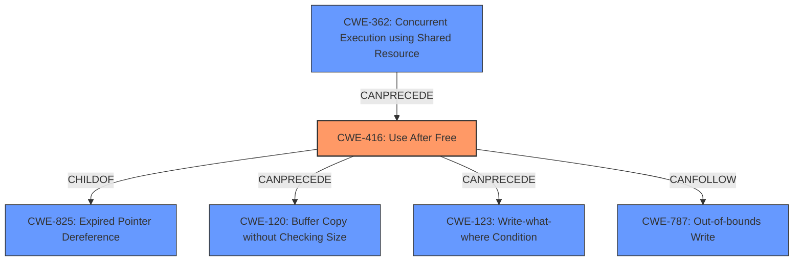

# Analysis for CVE-2022-45406

# Summary
| CWE ID  | CWE Name                                                                                                   | Confidence | CWE Abstraction Level | CWE Vulnerability Mapping Label | CWE-Vulnerability Mapping Notes |
| ------- | ---------------------------------------------------------------------------------------------------------- | ---------- | ----------------------- | ------------------------------- | --------------------------------- |
| CWE-416 | Use After Free                                                                                             | 1.0        | Variant                 | Allowed                         | Primary CWE                       |
| CWE-787 | Out-of-bounds Write                                                                                        | 0.6        | Base                    | Allowed                         | Secondary Candidate              |
| CWE-362 | Concurrent Execution using Shared Resource with Improper Synchronization ('Race Condition') | 0.5        | Class                   | Allowed-with-Review            | Secondary Candidate              |

## Evidence and Confidence

*   **Confidence Score:** 0.8
*   **Evidence Strength:** HIGH

## Relationship Analysis
The primary relationship that impacted the decision was the parent-child relationship between CWE-825 (Expired Pointer Dereference) and CWE-416 (Use After Free), where CWE-416 is a more specific variant. The "CanPrecede" relationship of CWE-416 to CWE-120 (Buffer Copy without Checking Size) and CWE-123 (Write-what-where Condition) suggests possible attack vectors following the UAF. The relationship between CWE-362 and CWE-416 indicates a possible concurrent execution scenario leading to UAF. The abstraction levels were important in selecting CWE-416 at the Variant level for its specificity and CWE-787 at the Base level because the write is a consequence of the memory corruption from the UAF.

## Vulnerability Chain
The vulnerability chain starts with an **out-of-memory condition when creating a JavaScript global**, which leads to a JavaScript realm being deleted while references to it still exist. This results in a **use-after-free**, which can then lead to a potentially exploitable crash.

Root Cause: Out-of-memory condition
Weakness: **Use-after-free**
Impact: Potentially exploitable crash

## Summary of Analysis
The initial assessment strongly pointed towards CWE-416 (**Use After Free**) as the primary weakness, supported by the vulnerability description stating "This could lead to a **use-after-free** causing a potentially exploitable crash." The CVE Reference Links Content Summary further reinforced this, explicitly stating, "The core vulnerability is a **use-after-free**."

The graph relationships and retriever results also supported this, with CWE-416 having the highest relevance score and being a Variant, aligning with the goal of selecting the most specific CWE.

The decision is based on the provided evidence and the analysis of CWE relationships, leading to the selection of CWE-416 as the primary weakness due to its direct match with the vulnerability description and supporting evidence. While other CWEs like CWE-787 (**Out-of-bounds Write**) and CWE-362 (Concurrent Execution using Shared Resource) were considered, they were deemed secondary as they represent potential consequences or contributing factors rather than the root cause of the vulnerability. The selected CWEs are at the optimal level of specificity, with CWE-416 being a Variant and CWE-787 being a Base.

Relevant CWE Information:

# Enhanced Context (25 CWEs)
The following CWEs were identified as potentially relevant to this vulnerability:

## CWE-125: Out-of-bounds Read
**Abstraction Level**: Base
**Similarity Score**: 0.78
**Source**: dense

**Description**:
The product reads data past the end, or before the beginning, of the intended buffer.

**Mapping Guidance**:
- Usage: Allowed
- Rationale: This CWE entry is at the Base level of abstraction, which is a preferred level of abstraction for mapping to the root causes of vulnerabilities.

## CWE-131: Incorrect Calculation of Buffer Size
**Abstraction Level**: Base
**Similarity Score**: 0.78
**Source**: dense

**Description**:
The product does not correctly calculate the size to be used when allocating a buffer, which could lead to a buffer overflow.

**Mapping Guidance**:
- Usage: Allowed
- Rationale: This CWE entry is at the Base level of abstraction, which is a preferred level of abstraction for mapping to the root causes of vulnerabilities.

## CWE-366: Race Condition within a Thread
**Abstraction Level**: Base
**Similarity Score**: 0.78
**Source**: dense

**Description**:
If two threads of execution use a resource simultaneously, there exists the possibility that resources may be used while invalid, in turn making the state of execution undefined.

**Mapping Guidance**:
- Usage: Allowed
- Rationale: This CWE entry is at the Base level of abstraction, which is a preferred level of abstraction for mapping to the root causes of vulnerabilities.

## CWE-124: Buffer Underwrite ('Buffer Underflow')
**Abstraction Level**: Base
**Similarity Score**: 0.78
**Source**: dense

**Description**:
The product writes to a buffer using an index or pointer that references a memory location prior to the beginning of the buffer.

**Mapping Guidance**:
- Usage: Allowed
- Rationale: This CWE entry is at the Base level of abstraction, which is a preferred level of abstraction for mapping to the root causes of vulnerabilities.

## CWE-823: Use of Out-of-range Pointer Offset
**Abstraction Level**: Base
**Similarity Score**: 0.77
**Source**: dense

**Description**:
The product performs pointer arithmetic on a valid pointer, but it uses an offset that can point outside of the intended range of valid memory locations for the resulting pointer.

**Mapping Guidance**:
- Usage: Allowed
- Rationale: This CWE entry is at the Base level of abstraction, which is a preferred level of abstraction for mapping to the root causes of vulnerabilities.

## CWE-191: Integer Underflow (Wrap or Wraparound)
**Abstraction Level**: Base
**Similarity Score**: 0.77
**Source**: dense

**Description**:
The product subtracts one value from another, such that the result is less than the minimum allowable integer value, which produces a value that is not equal to the correct result.

**Mapping Guidance**:
- Usage: Allowed
- Rationale: This CWE entry is at the Base level of abstraction, which is a preferred level of abstraction for mapping to the root causes of vulnerabilities.

## CWE-805: Buffer Access with Incorrect Length Value
**Abstraction Level**: Base
**Similarity Score**: 0.77
**Source**: dense

**Description**:
The product uses a sequential operation to read or write a buffer, but it uses an incorrect length value that causes it to access memory that is outside of the bounds of the buffer.

**Mapping Guidance**:
- Usage: Allowed
- Rationale: This CWE entry is at the Base level of abstraction, which is a preferred level of abstraction for mapping to the root causes of vulnerabilities.

## CWE-126: Buffer Over-read
**Abstraction Level**: Variant
**Similarity Score**: 0.77
**Source**: dense

**Description**:
The product reads from a buffer using buffer access mechanisms such as indexes or pointers that reference memory locations after the targeted buffer.

**Mapping Guidance**:
- Usage: Allowed
- Rationale: This CWE entry is at the Variant level of abstraction, which is a preferred level of abstraction for mapping to the root causes of vulnerabilities.

## CWE-476: NULL Pointer Dereference
**Abstraction Level**: Base
**Similarity Score**: 0.77
**Source**: dense

**Description**:
The product dereferences a pointer that it expects to be valid but is NULL.

**Mapping Guidance**:
- Usage: Allowed
- Rationale: This CWE entry is at the Base level of abstraction, which is a preferred level of abstraction for mapping to the root causes of vulnerabilities.

## CWE-404: Improper Resource Shutdown or Release