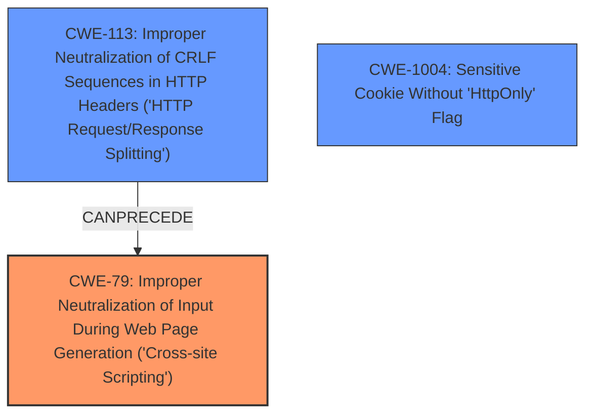

# Analysis Report for CVE-2022-45411

# Vulnerability Analysis Report: CVE-2022-45411

## Description


## Analysis (with Relationship Data)

# Summary
| CWE ID | CWE Name | Confidence | CWE Abstraction Level | CWE Vulnerability Mapping Label | CWE-Vulnerability Mapping Notes |
|---|---|---|---|---|---|
| CWE-79 | Improper Neutralization of Input During Web Page Generation ('Cross-site Scripting') | 0.9 | Base | Allowed | Primary CWE. The vulnerability description mentions that **Cross-Site Tracing** allows an **XSS attack** to access authorization headers and cookies. |
| CWE-113 | Improper Neutralization of CRLF Sequences in HTTP Headers ('HTTP Request/Response Splitting') | 0.7 | Variant | Allowed | Secondary CWE. The vulnerability allows bypassing CORS restrictions using non-standard HTTP method override headers which enables Cross-Site Tracing. |
| CWE-1004 | Sensitive Cookie Without 'HttpOnly' Flag | 0.6 | Variant | Allowed | Secondary CWE. The impact of the vulnerability includes access to authorization headers and cookies (including those with HTTPOnly flags) which is normally inaccessible. |

## Evidence and Confidence

*   **Confidence Score:** 0.8
*   **Evidence Strength:** HIGH

## Relationship Analysis
The primary CWE is CWE-79, which is a base-level CWE and a child of CWE-74. CWE-113 is related to CWE-79 through a chain relationship, as indicated by CanPrecede -> CWE-79. CWE-1004 relates to the impact of accessing sensitive cookies. The abstraction levels also influenced the selection of CWEs. CWE-79, CWE-113 and CWE-1004 are at the Base and Variant levels, which are the preferred levels of abstraction for mapping to the root causes of vulnerabilities.



## Vulnerability Chain
The vulnerability chain starts with the improper neutralization of input (CWE-113), leading to the possibility of Cross-Site Tracing and ultimately enabling Cross-Site Scripting (CWE-79) to access sensitive cookies (CWE-1004).
- Root Cause: Improper Neutralization of CRLF Sequences in HTTP Headers (CWE-113)
- Weakness: Cross-Site Scripting (CWE-79)
- Impact: Access to Sensitive Cookie Without 'HttpOnly' Flag (CWE-1004)

## Summary of Analysis
The initial analysis considered the retriever results, which suggested CWE-79, CWE-113 and CWE-1004 as potential candidates. The vulnerability description and CVE Reference Links Content Summary provide sufficient evidence to support these mappings. The final selection is based on a combination of the retriever results, the vulnerability details, and the relationships between the CWEs. The selected CWEs are at the optimal level of specificity, providing a clear representation of the vulnerability.

The assessment relies heavily on the "CVE Reference Links Content Summary" which provides detailed information about the root cause, weaknesses, and impact of the vulnerability. For example, the summary states that "The vulnerability stems from the ability to bypass Cross-Origin Resource Sharing (CORS) restrictions using non-standard HTTP method override headers" supporting the selection of CWE-113. Additionally, the mention of "Access to Sensitive Headers" and "bypass the security measure of HTTPOnly cookies" supports the inclusion of CWE-1004. Finally, the overarching theme of **Cross-Site Tracing** leading to an **XSS attack** directly supports the selection of CWE-79.

Relevant CWE Information:

# Enhanced Context (25 CWEs)
The following CWEs were identified as potentially relevant to this vulnerability:

## CWE-113: Improper Neutralization of CRLF Sequences in HTTP Headers ('HTTP Request/Response Splitting')
**Technical Explanation:** The vulnerability description mentions the use of non-standard headers like `X-Http-Method-Override` to bypass CORS restrictions. This is a clear indication of improper neutralization of CRLF sequences in HTTP headers, as these headers are being used to manipulate the HTTP request and response. The weakness aligns with the CWE's description, which states that the product does not neutralize CR and LF characters before the data is included in outgoing HTTP headers. This allows an attacker to control the second "split" message to mount attacks.
**Security Implications:** This weakness can lead to server-side request forgery, cross-site scripting, and cache poisoning attacks.
**Relationship Analysis:** CWE-113 is related to CWE-79 through a chain relationship.
**Mapping Guidance Analysis:** The mapping guidance for CWE-113 indicates that it is at the Variant level of abstraction, which is a preferred level for mapping to root causes.
**Mitigation Analysis:** The fix implemented in Firefox, Thunderbird, and other browsers involves blocking the use of the TRACE method through HTTP override headers. This aligns with the mitigation strategies for CWE-113, which involve proper neutralization of CRLF sequences in HTTP headers.

## CWE-79: Improper Neutralization of Input During Web Page Generation ('Cross-site Scripting')
**Technical Explanation:** The vulnerability description states that **Cross-Site Tracing** allows an **XSS attack** to access authorization headers and cookies. This aligns with the CWE-79 description, which states that the product does not neutralize user-controllable input before it is placed in output that is used as a web page.
**Security Implications:** This weakness can allow an attacker to transfer private information, send malicious requests, or perform phishing attacks.
**Relationship Analysis:** CWE-79 is a base-level CWE and is related to CWE-113 through a chain relationship.
**Mapping Guidance Analysis:** The mapping guidance for CWE-79 indicates that it is at the Base level of abstraction, which is a preferred level for mapping to root causes.
**Mitigation Analysis:** Mitigations for CWE-79 involve proper neutralization of user-controllable input before it is placed in output that is used as a web page.

## CWE-1004: Sensitive Cookie Without 'HttpOnly' Flag
**Technical Explanation:** The impact of the vulnerability includes access to authorization headers and cookies (including those with HTTPOnly flags) which is normally inaccessible. This aligns with CWE-1004 because the attacker is gaining unauthorized access to sensitive cookie data. The description of this CWE highlights that a missing HttpOnly flag increases the risk of XSS attacks.
**Security Implications:** If sensitive information is stored in cookies without the HttpOnly flag, attackers can steal these cookies and gain unauthorized access to user accounts or sensitive data.
**Relationship Analysis:** CWE-1004 is a child of CWE-732, Incorrect Permission Assignment for Critical Resource.
**Mapping Guidance Analysis:** The mapping guidance suggests this is a Variant level, which is appropriate.
**Mitigation Analysis:** Setting the HttpOnly flag on cookies is a standard mitigation technique to prevent client-side scripts from accessing sensitive cookie data.

## Other CWEs Considered but Not Used:
- CWE-20, Improper Input Validation: While input validation is important, the core issue is the improper handling of HTTP headers and the exploitation of TRACE, making CWE-79 and CWE-113 more specific and appropriate.
- CWE-352, Cross-Site Request Forgery (CSRF): Although related to web application vulnerabilities, CSRF is not the primary mechanism being exploited here. The focus is on bypassing CORS and exploiting TRACE, not on tricking a user into making unintended requests.
- CWE-613, Insufficient Session Expiration: This CWE is related to session management, which is not the primary issue in this vulnerability. The vulnerability focuses on exploiting the TRACE method and bypassing CORS restrictions.
- CWE-787, Out-of-bounds Write: This CWE is not relevant as the vulnerability doesn't involve memory corruption.
- CWE-434, Unrestricted Upload of File with Dangerous Type: This CWE is not relevant as the vulnerability doesn't involve file uploads.
- CWE-923, Improper Restriction of Communication Channel to Intended Endpoints: While this CWE is related to communication channels, it is not as specific as CWE-113 in describing the improper handling of HTTP headers.


## CWE Relationship Analysis

Current CWEs represent these abstraction levels: .


### Vulnerability Chain Analysis

**Chain starting from CWE-434:**
- 434 (Unrestricted Upload of File with Dangerous Type) - ROOT


**Chain starting from CWE-923:**
- 923 (Improper Restriction of Communication Channel to Intended Endpoints) - ROOT


### CWE Relationship Diagram

```mermaid
graph TD
    classDef primary fill:#f96,stroke:#333,stroke-width:2px
    classDef secondary fill:#69f,stroke:#333
    classDef tertiary fill:#9e9,stroke:#333
```


*Report generated on 2025-03-30 20:01:28*
