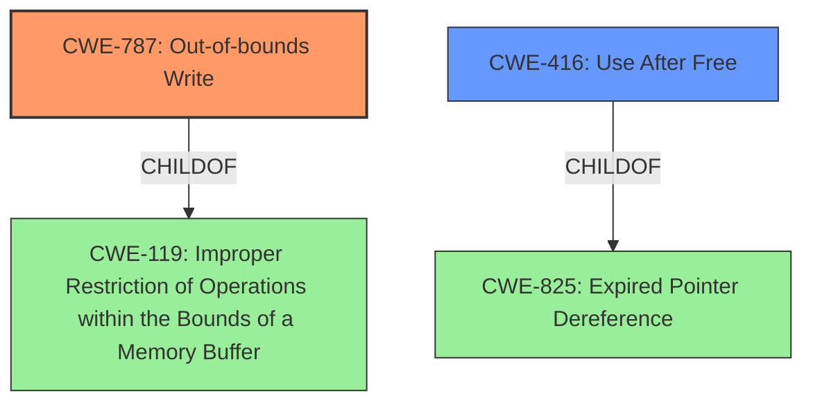

# Analysis Report for CVE-2022-45421

# Vulnerability Analysis Report: CVE-2022-45421

## Description


## Analysis (with Relationship Data)

# Summary
| CWE ID  | CWE Name                                                                 | Confidence | CWE Abstraction Level | CWE Vulnerability Mapping Label | CWE-Vulnerability Mapping Notes |
| :-------- | :----------------------------------------------------------------------- | :---------- | :--------------------- | :------------------------------ | :----------------------------- |
| CWE-787 | Out-of-bounds Write                                                     | 0.9         | Base                   | Primary                         | Allowed                        |
| CWE-416 | Use After Free                                                          | 0.7         | Variant                | Secondary                       | Allowed                        |

## Evidence and Confidence

*   **Confidence Score:** 0.8
*   **Evidence Strength:** HIGH

## Relationship Analysis
The primary weakness identified is CWE-787 (Out-of-bounds Write), which is a child of CWE-119 (Improper Restriction of Operations within the Bounds of a Memory Buffer). CWE-416 (Use After Free) is also present. The analysis prioritizes the more specific Base level CWE-787 as the primary issue, while acknowledging the presence of the Variant level CWE-416.



## Vulnerability Chain
The vulnerability chain starts with **memory safety bugs**, leading to **memory corruption**, specifically out-of-bounds write and use-after-free conditions. These weaknesses could potentially be exploited to run arbitrary code.
  - **Root Cause:** Memory safety bugs
  - **Weakness 1:** Out-of-bounds Write (CWE-787)
  - **Weakness 2:** Use After Free (CWE-416)
  - **Impact:** Arbitrary code execution

## Summary of Analysis
The analysis is based on the provided vulnerability description and the "CVE Reference Links Content Summary". The description explicitly mentions **memory safety bugs** and **memory corruption**. The CVE summary confirms the presence of "Memory safety bugs" leading to "Memory corruption" and "Use-after-free".

The retriever results suggest CWE-787 (Out-of-bounds Write) as a strong candidate, and CWE-416 (Use After Free) as another potential weakness. CWE-119 (Improper Restriction of Operations within the Bounds of a Memory Buffer) is also a high-ranking candidate.

Given the explicit mention of **memory corruption** and the details in the CVE summary, CWE-787 and CWE-416 are selected as the primary and secondary CWEs, respectively. CWE-787 is favored over CWE-119 because it is a more specific, base-level CWE, aligning with the preference for detailed classifications.

The final decision is based on:
  - Direct evidence of memory corruption from the vulnerability description and CVE summary.
  - High retriever scores for CWE-787 and CWE-416.
  - The hierarchical relationship, which positions CWE-787 as a child of CWE-119, making it a more precise classification.
  - The MITRE mapping guidance, which allows for the use of CWE-787 and CWE-416, both at preferred levels of abstraction.

Relevant CWE Information:

# Enhanced Context (25 CWEs)

## CWE-476: NULL Pointer Dereference
**Abstraction Level**: Base
**Similarity Score**: 0.78
**Source**: dense

**Description**:
The product dereferences a pointer that it expects to be valid but is NULL.
**NOT USED:** There is no evidence of dereferencing a NULL pointer.

## CWE-131: Incorrect Calculation of Buffer Size
**Abstraction Level**: Base
**Similarity Score**: 0.77
**Source**: dense

**Description**:
The product does not correctly calculate the size to be used when allocating a buffer, which could lead to a buffer overflow.
**NOT USED:** There is no specific mention of incorrect calculation of buffer size.

## CWE-226: Sensitive Information in Resource Not Removed Before Reuse
**Abstraction Level**: Base
**Similarity Score**: 0.77
**Source**: dense

**Description**:
The product releases a resource such as memory or a file so that it can be made available for reuse, but it does not clear or "zeroize" the information contained in the resource before the product performs a critical state transition or makes the resource available for reuse by other entities.
**NOT USED:** No specific evidence of this.

## CWE-404: Improper Resource Shutdown or Release
**Abstraction Level**: Class
**Similarity Score**: 0.77
**Source**: dense

**Description**:
The product does not release or incorrectly releases a resource before it is made available for re-use.
**NOT USED:** Not enough evidence.

## CWE-822: Untrusted Pointer Dereference
**Abstraction Level**: Base
**Similarity Score**: 0.76
**Source**: dense

**Description**:
The product obtains a value from an untrusted source, converts this value to a pointer, and dereferences the resulting pointer.
**NOT USED:** Not enough evidence.

## CWE-824: Access of Uninitialized Pointer
**Abstraction Level**: Base
**Similarity Score**: 0.76
**Source**: dense

**Description**:
The product accesses or uses a pointer that has not been initialized.
**NOT USED:** Not enough evidence.

## CWE-667: Improper Locking
**Abstraction Level**: Class
**Similarity Score**: 0.76
**Source**: dense

**Description**:
The product does not properly acquire or release a lock on a resource, leading to unexpected resource state changes and behaviors.
**NOT USED:** Not enough evidence.

## CWE-191: Integer Underflow (Wrap or Wraparound)
**Abstraction Level**: Base
**Similarity Score**: 0.76
**Source**: dense

**Description**:
The product subtracts one value from another, such that the result is less than the minimum allowable integer value, which produces a value that is not equal to the correct result.
**NOT USED:** Not enough evidence.

## CWE-681: Incorrect Conversion between Numeric Types
**Abstraction Level**: Base
**Similarity Score**: 0.76
**Source**: dense

**Description**:
When converting from one data type to another, such as long to integer, data can be omitted or translated in a way that produces unexpected values. If the resulting values are used in a sensitive context, then dangerous behaviors may occur.
**NOT USED:** Not enough evidence.

## CWE-843: Access of Resource Using Incompatible Type ('Type Confusion')
**Abstraction Level**: Base
**Similarity Score**: 0.76
**Source**: dense

**Description**:
The product allocates or initializes a resource such as a pointer, object, or variable using one type, but it later accesses that resource using a type that is incompatible with the original type.
**NOT USED:** Not enough evidence.

## CWE-787: Out-of-bounds Write
**Abstraction Level**: Base
**Similarity Score**: 5085.43
**Source**: sparse

**Description**:
The product writes data past the end, or before the beginning, of the intended buffer.
**USED:** "Memory corruption" aligns with out-of-bounds write.

## CWE-124: Buffer Underwrite ('Buffer Underflow')
**Abstraction Level**: Base
**Similarity Score**: 5031.20
**Source**: sparse

**Description**:
The product writes to a buffer using an index or pointer that references a memory location prior to the beginning of the buffer.
**NOT USED:** No specific evidence of this.

## CWE-125: Out-of-bounds Read
**Abstraction Level**: Base
**Similarity Score**: 5013.50
**Source**: sparse

**Description**:
The product reads data past the end, or before the beginning, of the intended buffer.
**NOT USED:** No specific evidence of this.

## CWE-119: Improper Restriction of Operations within the Bounds of a Memory Buffer
**Abstraction Level**: Class
**Similarity Score**: 4961.58
**Source**: sparse

**Description**:
The product performs operations on a memory buffer, but it reads from or writes to a memory location outside the buffer's intended boundary. This may result in read or write operations on unexpected memory locations that could be linked to other variables, data structures, or internal program data.
**NOT USED:** CWE-787 is more specific.


## CWE Relationship Analysis

Current CWEs represent these abstraction levels: .


### Vulnerability Chain Analysis

**Chain starting from CWE-131:**
- 131 (Incorrect Calculation of Buffer Size) - ROOT


**Chain starting from CWE-825:**
- 825 (Expired Pointer Dereference) - ROOT


### CWE Relationship Diagram

```mermaid
graph TD
    classDef primary fill:#f96,stroke:#333,stroke-width:2px
    classDef secondary fill:#69f,stroke:#333
    classDef tertiary fill:#9e9,stroke:#333
```


*Report generated on 2025-03-30 18:32:39*
