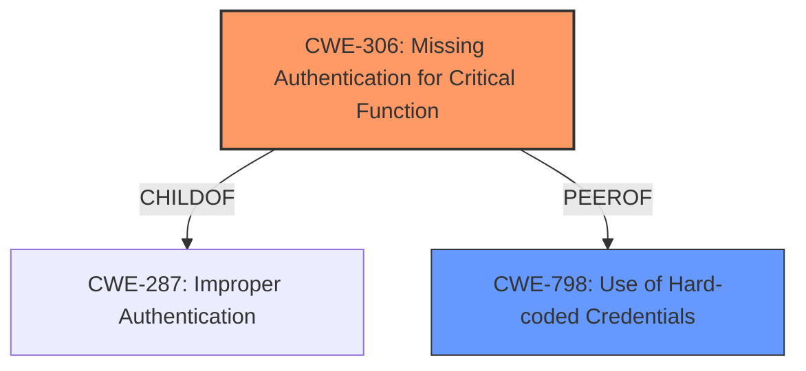

# Analysis Report for CVE-2022-45423

# Vulnerability Analysis Report: CVE-2022-45423

## Description


## Analysis (with Relationship Data)

# Summary
| CWE ID | CWE Name | Confidence | CWE Abstraction Level | CWE Vulnerability Mapping Label | CWE-Vulnerability Mapping Notes |
|---|---|---|---|---|---|
| CWE-306 | Missing Authentication for Critical Function | 0.8 | Base | Allowed | Primary CWE |
| CWE-798 | Use of Hard-coded Credentials | 0.5 | Base | Allowed | Secondary Candidate |

## Evidence and Confidence

*   **Confidence Score:** 0.8
*   **Evidence Strength:** MEDIUM

## Relationship Analysis
The primary relationship influencing the decision is the parent-child relationship between CWE-306 (Missing Authentication for Critical Function) and CWE-287 (Improper Authentication). CWE-306 is a more specific case of CWE-287, focusing on the absence of authentication for critical functions. The retriever results also highlighted relationships with CWE-798 (Use of Hard-coded Credentials). While the description mentions MQTT credentials, the core issue is that the request for these credentials is unauthenticated, thus CWE-306 is more relevant.



## Vulnerability Chain
The vulnerability chain starts with the **unauthenticated request of MQTT credentials** (CWE-306), leading to the potential exposure of encrypted MQTT credentials. The root cause is the missing authentication, and the impact is the ability to obtain credentials, albeit encrypted.

## Summary of Analysis
The initial analysis focused on the **unauthenticated request of MQTT credentials**. The vulnerability description explicitly states this as the primary issue. The retriever results suggested several potential CWEs, including CWE-306 (Missing Authentication for Critical Function) and CWE-798 (Use of Hard-coded Credentials).

The key evidence is the phrase "**unauthenticated request of MQTT credentials**". This directly aligns with CWE-306, which describes a situation where "The product does not perform any authentication for functionality that requires a provable user identity or consumes a significant amount of resources." Obtaining MQTT credentials would certainly qualify as a critical function.

CWE-798 was considered because the vulnerability involves MQTT credentials. However, the core issue isn't that the credentials are hard-coded; it's that an attacker can request them without authenticating. The provided information doesn't indicate if the credentials are hardcoded.

The selected CWE is at the optimal level of specificity. CWE-306 is a Base level CWE that accurately represents the weakness. A more generic CWE like CWE-287 (Improper Authentication) would be less precise.

Relevant CWE Information:

# Enhanced Context (25 CWEs)

## CWE-306: Missing Authentication for Critical Function
**Abstraction:** Base
**Similarity Score**: 2.47
**Source**: graph

**Description**:
CWE-306: Missing Authentication for Critical Function

**Mapping Guidance**:
- Usage: Allowed
- Rationale: This CWE entry is at the Base level of abstraction, which is a preferred level of abstraction for mapping to the root causes of vulnerabilities.

**Relationships**:
- PARENTOF -> CWE-322
- PARENTOF -> CWE-288
- CHILDOF -> CWE-287
- CHILDOF -> CWE-287
- CHILDOF -> CWE-306


## CWE Relationship Analysis

Current CWEs represent these abstraction levels: .


### Vulnerability Chain Analysis

**Chain starting from CWE-798:**
- 798 (Use of Hard-coded Credentials) - ROOT


**Chain starting from CWE-322:**
- 322 (Key Exchange without Entity Authentication) - ROOT


### CWE Relationship Diagram

```mermaid
graph TD
    classDef primary fill:#f96,stroke:#333,stroke-width:2px
    classDef secondary fill:#69f,stroke:#333
    classDef tertiary fill:#9e9,stroke:#333
```


*Report generated on 2025-03-31 07:59:11*
