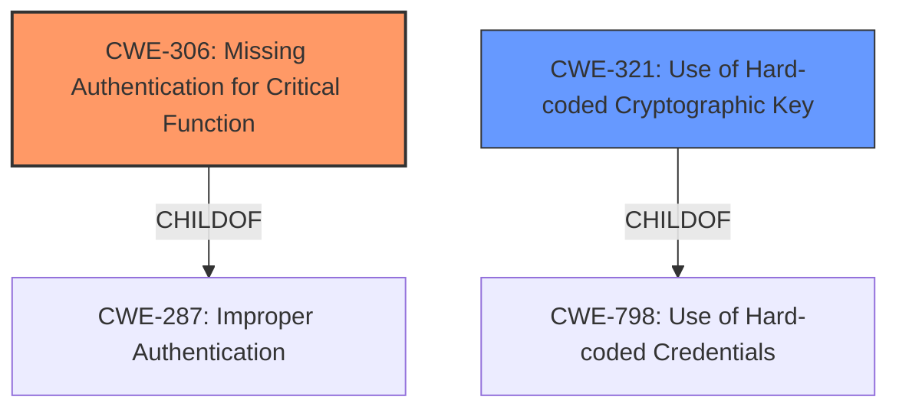

# Enhanced Analysis for CVE-2022-45424

# Summary
| CWE ID | CWE Name | Confidence | CWE Abstraction Level | CWE Vulnerability Mapping Label | CWE-Vulnerability Mapping Notes |
|---|---|---|---|---|---|
| CWE-306 | Missing Authentication for Critical Function | 0.9 | Base | ALLOWED | The product does not perform any authentication for functionality that requires a provable user identity or consumes a significant amount of resources. |
| CWE-321 | Use of Hard-coded Cryptographic Key | 0.6 | Variant | ALLOWED | The use of a hard-coded cryptographic key significantly increases the possibility that encrypted data may be recovered. |

## Evidence and Confidence

*   **Confidence Score:** 0.75
*   **Evidence Strength:** MEDIUM

## Relationship Analysis
The primary relationship that impacted my decision was the ChildOf relationship, particularly between CWE-306 and CWE-287 (Improper Authentication). While CWE-287 is a broader category, CWE-306 more accurately reflects the **missing authentication** aspect that leads to the **unauthenticated request of AES crypto key**.



## Vulnerability Chain
The vulnerability chain starts with a **missing authentication** check (CWE-306), which allows an attacker to make an **unauthenticated request** and obtain the AES crypto key, potentially leading to further compromise if this key is used for critical functionality. It is possible a hardcoded key is being used (CWE-321)

## Summary of Analysis
The initial analysis focused on the **unauthenticated request of AES crypto key**. The vulnerability description states that an attacker can obtain the AES crypto key by sending a specific crafted packet to the vulnerable interface. This strongly suggests a **missing authentication** check for a critical function, making CWE-306 the most appropriate primary CWE.

CWE-306's description matches the vulnerability: "The product does not perform any authentication for functionality that requires a provable user identity or consumes a significant amount of resources." The fact that an attacker can directly request the key without authentication aligns perfectly with this description.

While the vulnerability allows an attacker to obtain the AES crypto key, the description does not explicitly state whether the key is hard-coded, transmitted in cleartext, or generated using a weak algorithm. The retriever results suggested considering CWE-321 (Use of Hard-coded Cryptographic Key), however, I have a lower confidence in this due to the lack of explicit evidence in the description. It is included as a secondary candidate because the impact of the vulnerability would be higher if the key was also hardcoded.

I considered but did not select the following CWEs:

*   CWE-319: Cleartext Transmission of Sensitive Information: This CWE would be applicable if the key was transmitted in cleartext over a network. However, the description focuses on the **unauthenticated request**, not the transmission itself.
*   CWE-327: Use of a Broken or Risky Cryptographic Algorithm: This CWE would be relevant if the AES algorithm itself was weak. But the issue is not the algorithm, its how the key is being accessed.
*   CWE-1204: Generation of Weak Initialization Vector (IV): The vulnerability isn't about IV generation, but key access.

The selected CWEs are at the optimal level of specificity because they directly address the root cause (**missing authentication**) and a possible contributing factor (if a hardcoded key is used). More general CWEs like CWE-287 (Improper Authentication) would not capture the specific nature of the vulnerability as accurately.


## CWE Relationship Analysis

Current CWEs represent these abstraction levels: .


### Vulnerability Chain Analysis

**Chain starting from CWE-327:**
- 327 (Use of a Broken or Risky Cryptographic Algorithm) - ROOT


**Chain starting from CWE-1204:**
- 1204 (Generation of Weak Initialization Vector (IV)) - ROOT


### CWE Relationship Diagram

```mermaid
graph TD
    classDef primary fill:#f96,stroke:#333,stroke-width:2px
    classDef secondary fill:#69f,stroke:#333
    classDef tertiary fill:#9e9,stroke:#333
```