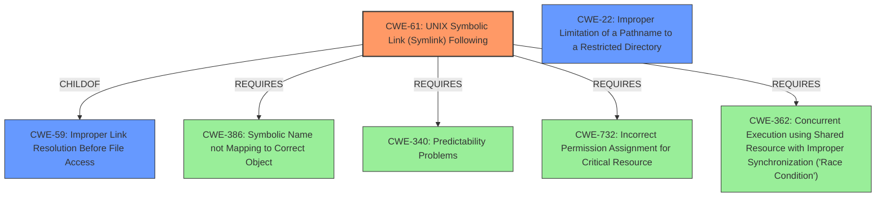

# Analysis for CVE-2022-45440

# Summary
| CWE ID | CWE Name | Confidence | CWE Abstraction Level | CWE Vulnerability Mapping Label | CWE-Vulnerability Mapping Notes |
|---|---|---|---|---|---|
| CWE-61 | UNIX Symbolic Link (Symlink) Following | 0.9 | Compound | Allowed | Primary CWE |
| CWE-59 | Improper Link Resolution Before File Access ('Link Following') | 0.7 | Base | Allowed | Secondary Candidate |
| CWE-22 | Improper Limitation of a Pathname to a Restricted Directory ('Path Traversal') | 0.5 | Base | Allowed | Secondary Candidate |

## Evidence and Confidence

*   **Confidence Score:** 0.9
*   **Evidence Strength:** HIGH

## Relationship Analysis
The primary CWE, CWE-61, is a compound weakness that requires multiple conditions to be met, including the presence of symbolic links (CWE-386), the ability to manipulate file paths (CWE-73), and a failure to properly validate the target of the symbolic link (CWE-59). It also requires proper permissions management (CWE-732). CWE-59 is a broader base weakness that describes the fundamental issue of not properly validating link targets. CWE-22 represents path traversal, which can be related but focuses more on manipulating the path itself rather than the resolution of symbolic links.

## Vulnerability Chain
The vulnerability chain involves the following steps:
1.  The attacker has local access and administrator privileges.
2.  The attacker creates a symbolic link on external storage that points to a sensitive location in the root file system.
3.  The FTP server processes symbolic links on external storage media without proper validation.
4.  The attacker logs into the FTP server.
5.  The FTP server follows the symbolic link, granting the attacker access to the root file system.

The **root cause** is the **improper handling of symbolic links** by the FTP server. This leads to the **impact** of gaining unauthorized access to the root file system.

## Summary of Analysis
The initial assessment pointed towards CWE-61 due to the explicit mention of symbolic links and the resulting access to unauthorized files. This aligns with the vulnerability description stating that the FTP server **processes symbolic links on external storage media**, allowing an attacker to **access the root file system**.

The retriever results also strongly suggest CWE-61 as the primary candidate. The "CVE Reference Links Content Summary" reinforces this by highlighting the **"Improper handling of symbolic links by the FTP server"** as the root cause and the ability to **"access files outside of the intended FTP directory"** as the impact.

While CWE-59 and CWE-22 were considered, they are less specific than CWE-61. CWE-59 is a more general "Improper Link Resolution" issue, and CWE-22 focuses on path traversal, which is not the primary mechanism being exploited in this case.

The final decision to select CWE-61 as the primary CWE is based on the specific evidence of symbolic link handling, the alignment with the CWE description, and the support from the retriever results. This selection is at the appropriate level of specificity, as it captures the core weakness being exploited in the vulnerability.

Relevant CWE Information:

# Enhanced Context (25 CWEs)

## CWE-59: Improper Link Resolution Before File Access ('Link Following')
**Abstraction Level**: Base
**Similarity Score**: 0.80
**Source**: dense

**Description**:
The product attempts to access a file based on the filename, but it does not properly prevent that filename from identifying a link or shortcut that resolves to an unintended resource.

**Mapping Guidance**:
- Usage: Allowed
- Rationale: This CWE entry is at the Base level of abstraction, which is a preferred level of abstraction for mapping to the root causes of vulnerabilities.
- **CWE-59 is considered because the vulnerability allows access to unintended resources due to improper handling of links.**

## CWE-274: Improper Handling of Insufficient Privileges
**Abstraction Level**: Base
**Similarity Score**: 0.78
**Source**: dense

**Description**:
The product does not handle or incorrectly handles when it has insufficient privileges to perform an operation, leading to resultant weaknesses.

**Mapping Guidance**:
- Usage: Discouraged
- Rationale: This CWE entry could be deprecated in a future version of CWE.
- **CWE-274 is not applicable because the attacker already has administrator privileges.**

## CWE-266: Incorrect Privilege Assignment
**Abstraction Level**: Base
**Similarity Score**: 0.78
**Source**: dense

**Description**:
A product incorrectly assigns a privilege to a particular actor, creating an unintended sphere of control for that actor.

**Mapping Guidance**:
- Usage: Allowed
- Rationale: This CWE entry is at the Base level of abstraction, which is a preferred level of abstraction for mapping to the root causes of vulnerabilities.
- **CWE-266 is not applicable because the issue is not about incorrect privilege assignment, but about improper handling of symbolic links.**

## CWE-41: Improper Resolution of Path Equivalence
**Abstraction Level**: Base
**Similarity Score**: 0.78
**Source**: dense

**Description**:
The product is vulnerable to file system contents disclosure through path equivalence. Path equivalence involves the use of special characters in file and directory names. The associated manipulations are intended to generate multiple names for the same object.

**Mapping Guidance**:
- Usage: Allowed
- Rationale: This CWE entry is at the Base level of abstraction, which is a preferred level of abstraction for mapping to the root causes of vulnerabilities.
- **CWE-41 is not applicable because the vulnerability is specifically about symbolic links, not general path equivalence issues.**

## CWE-280: Improper Handling of Insufficient Permissions or Privileges
**Abstraction Level**: Base
**Similarity Score**: 0.78
**Source**: dense

**Description**:
The product does not handle or incorrectly handles when it has insufficient privileges to access resources or functionality as specified by their permissions. This may cause it to follow unexpected code paths that may leave the product in an invalid state.

**Mapping Guidance**:
- Usage: Allowed
- Rationale: This CWE entry is at the Base level of abstraction, which is a preferred level of abstraction for mapping to the root causes of vulnerabilities.
- **CWE-280 is not applicable because the attacker already has sufficient privileges.**

## CWE-668: Exposure of Resource to Wrong Sphere
**Abstraction Level**: Class
**Similarity Score**: 0.77
**Source**: dense

**Description**:
The product exposes a resource to the wrong control sphere, providing unintended actors with inappropriate access to the resource.

**Mapping Guidance**:
- Usage: Discouraged
- Rationale: CWE-668 is high-level and is often misused as a catch-all when lower-level CWE IDs might be applicable. It is sometimes used for low-information vulnerability reports [REF-1287]. It is a level-1 Class (i.e., a child of a Pillar). It is not useful for trend analysis.
- **CWE-668 is not specific enough, as CWE-61 directly addresses the symbolic link issue.**

## CWE-23: Relative Path Traversal
**Abstraction Level**: Base
**Similarity Score**: 0.77
**Source**: dense

**Description**:
The product uses external input to construct a pathname that should be within a restricted directory, but it does not properly neutralize sequences such as ".." that can resolve to a location that is outside of that directory.

**Mapping Guidance**:
- Usage: Allowed
- Rationale: This CWE entry is at the Base level of abstraction, which is a preferred level of abstraction for mapping to the root causes of vulnerabilities.
- **CWE-23 is considered because the vulnerability leads to accessing files outside the intended