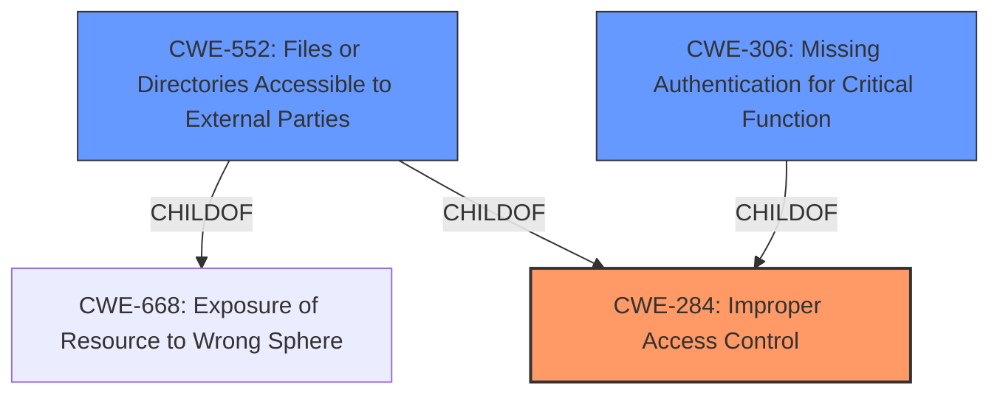

# Analysis Report for CVE-2022-45475

# Vulnerability Analysis Report: CVE-2022-45475

## Description


## Analysis (with Relationship Data)

# Summary

| CWE ID  | CWE Name                      | Confidence | CWE Abstraction Level | CWE Vulnerability Mapping Label | CWE-Vulnerability Mapping Notes |
| :-------- | :---------------------------- | :--------- | :-------------------- | :------------------------------ | :------------------------------ |
| CWE-284   | Improper Access Control       | 0.85       | Pillar                | Allowed                         | Primary CWE                     |
| CWE-552   | Files or Directories Accessible to External Parties | 0.75       | Base                 | Allowed                         | Secondary CWE                   |
| CWE-306   | Missing Authentication for Critical Function    | 0.65       | Base                | Allowed                         | Secondary CWE                   |

## Evidence and Confidence

*   **Confidence Score:** 0.75
*   **Evidence Strength:** MEDIUM

## Relationship Analysis

The primary CWE selected is CWE-284, which is a high-level Pillar. Due to the **broken access control**, the application allows an unauthenticated remote attacker to access internal files. While CWE-284 is a high-level classification, it accurately reflects the broad nature of the access control failure in this case.
CWE-552 (Files or Directories Accessible to External Parties) is a child of CWE-668 (Exposure of Resource to Wrong Sphere). It describes the specific scenario of unauthorized access to files and directories, which aligns with the vulnerability's impact.
CWE-306 (Missing Authentication for Critical Function) is a more specific Base CWE that indicates the core issue of the application failing to authenticate users before granting access to sensitive functionalities.



## Vulnerability Chain

The vulnerability chain starts with **broken access control**, which leads to the exposure of internal files to an unauthenticated remote attacker. This can be described as:

1.  **Root Cause:** **Broken Access Control** (CWE-284)
2.  **Weakness:** Missing Authentication for Critical Function (CWE-306)
3.  **Impact:** Files or Directories Accessible to External Parties (CWE-552)

## Summary of Analysis

Initially, the vulnerability description points to a **broken access control** issue that allows an unauthenticated attacker to access internal files. The retriever results and the provided context point to several potential CWEs, particularly those related to authorization and authentication.

The initial assessment considered the high-level CWE-284 (Improper Access Control) due to the broad nature of the description. However, to provide a more detailed analysis, child CWEs such as CWE-552 (Files or Directories Accessible to External Parties) and CWE-306 (Missing Authentication for Critical Function) were also considered.

The final decision was to classify this vulnerability as CWE-284 (Improper Access Control) as the primary CWE, as it accurately encapsulates the general **broken access control** issue. Additionally, CWE-552 and CWE-306 are included as secondary CWEs to provide more specific details about the vulnerability's impact and root cause. This decision is based on the vulnerability description and the retriever results, which both indicate that **broken access control** and missing authentication are key factors in this vulnerability.

Relevant CWE Information:

# Enhanced Context (25 CWEs)

## CWE-807: Reliance on Untrusted Inputs in a Security Decision
**Abstraction Level**: Base
**Similarity Score**: 0.76
**Source**: dense

**Description**:
The product uses a protection mechanism that relies on the existence or values of an input, but the input can be modified by an untrusted actor in a way that bypasses the protection mechanism.

**Mapping Guidance**:
- Usage: Allowed
- Rationale: This CWE entry is at the Base level of abstraction, which is a preferred level of abstraction for mapping to the root causes of vulnerabilities.

*This CWE was considered, but it does not accurately describe the root cause of the vulnerability, which is a **broken access control**.*

## CWE-639: Authorization Bypass Through User-Controlled Key
**Abstraction Level**: Base
**Similarity Score**: 0.75
**Source**: dense

**Description**:
The system's authorization functionality does not prevent one user from gaining access to another user's data or record by modifying the key value identifying the data.

**Mapping Guidance**:
- Usage: Allowed
- Rationale: This CWE entry is at the Base level of abstraction, which is a preferred level of abstraction for mapping to the root causes of vulnerabilities.

*This CWE was considered, but the vulnerability description does not contain enough detail to confirm that a user-controlled key is being used to bypass authorization. It is possible, but not explicitly stated.*

## CWE-274: Improper Handling of Insufficient Privileges
**Abstraction Level**: Base
**Similarity Score**: 0.75
**Source**: dense

**Description**:
The product does not handle or incorrectly handles when it has insufficient privileges to perform an operation, leading to resultant weaknesses.

**Mapping Guidance**:
- Usage: Discouraged
- Rationale: This CWE entry could be deprecated in a future version of CWE.

*This CWE was not selected because the vulnerability description does not focus on the product's handling of insufficient privileges.*

## CWE-280: Improper Handling of Insufficient Permissions or Privileges
**Abstraction Level**: Base
**Similarity Score**: 0.75
**Source**: dense

**Description**:
The product does not handle or incorrectly handles when it has insufficient privileges to access resources or functionality as specified by their permissions. This may cause it to follow unexpected code paths that may leave the product in an invalid state.

**Mapping Guidance**:
- Usage: Allowed
- Rationale: This CWE entry is at the Base level of abstraction, which is a preferred level of abstraction for mapping to the root causes of vulnerabilities.

*This CWE was not selected because it is too similar to CWE-274 and not specific enough to the vulnerability description.*

## CWE-1220: Insufficient Granularity of Access Control
**Abstraction Level**: Base
**Similarity Score**: 0.75
**Source**: dense

**Description**:
The product implements access controls via a policy or other feature with the intention to disable or restrict accesses (reads and/or writes) to assets in a system from untrusted agents. However, implemented access controls lack required granularity, which renders the control policy too broad because it allows accesses from unauthorized agents to the security-sensitive assets.

**Mapping Guidance**:
- Usage: Allowed
- Rationale: This CWE entry is at the Base level of abstraction, which is a preferred level of abstraction for mapping to the root causes of vulnerabilities.

*This CWE was considered, but the **broken access control** does not seem to be related to granularity, but more about missing checks.*

## CWE-303: Incorrect Implementation of Authentication Algorithm
**Abstraction Level**: Base
**Similarity Score**: 0.75
**Source**: dense

**Description**:
The requirements for the product dictate the use of an established authentication algorithm, but the implementation of the algorithm is incorrect.

**Mapping Guidance**:
- Usage: Allowed
- Rationale: This CWE entry is at the Base level of abstraction, which is a preferred level of abstraction for mapping to the root causes of vulnerabilities.

*This CWE was not selected because it relates to an incorrect implementation of an authentication algorithm, while the vulnerability relates to a **broken access control**.*

## CWE-1390: Weak Authentication
**Abstraction Level**: Class
**Similarity Score**: 0.75
**Source**: dense

**Description**:
The product uses an authentication mechanism to restrict access to specific users or identities, but the mechanism does not sufficiently prove that the claimed identity is correct.

**Mapping Guidance**:
- Usage: Allowed-with-Review
- Rationale: This CWE entry is a Class and might have Base-level children that would be more appropriate

*This CWE was considered, but the vulnerability description does not provide sufficient detail to determine if the authentication mechanism is weak or if it is simply missing.*

## CWE-552: Files or Directories Accessible to External Parties
**Abstraction Level**: Base
**Similarity Score**: 0.74
**Source**: dense

**Description**:
The product makes files or directories accessible to unauthorized actors, even though they should not be.

**Mapping Guidance**:
- Usage: Allowed
- Rationale: This CWE entry is at the Base level of abstraction, which is a preferred level of abstraction for mapping to the root causes of vulnerabilities.

*This CWE was selected as a secondary CWE because it describes the specific impact


## CWE Relationship Analysis

Current CWEs represent these abstraction levels: .


### Vulnerability Chain Analysis

**Chain starting from CWE-552:**
- 552 (Files or Directories Accessible to External Parties) - ROOT


**Chain starting from CWE-280:**
- 280 (Improper Handling of Insufficient Permissions or Privileges ) - ROOT


### CWE Relationship Diagram

```mermaid
graph TD
    classDef primary fill:#f96,stroke:#333,stroke-width:2px
    classDef secondary fill:#69f,stroke:#333
    classDef tertiary fill:#9e9,stroke:#333
```


*Report generated on 2025-03-30 21:46:17*
