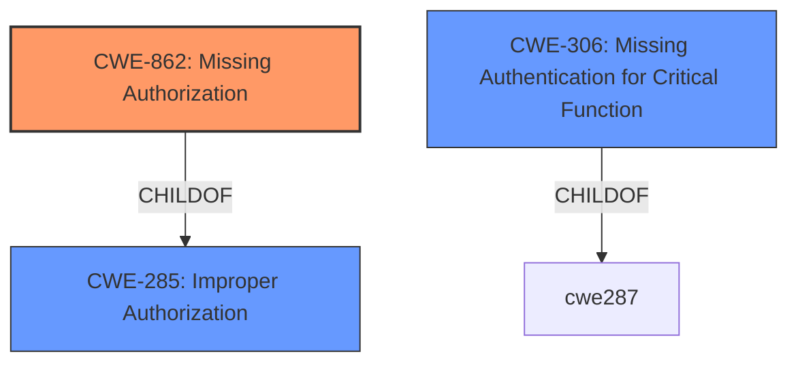

# Analysis Report for CVE-2022-4555

# Vulnerability Analysis Report: CVE-2022-4555

## Description


## Analysis (with Relationship Data)

# Summary
| CWE ID | CWE Name | Confidence | CWE Abstraction Level | CWE Vulnerability Mapping Label | CWE-Vulnerability Mapping Notes |
|---|---|---|---|---|---|
| CWE-862 | Missing Authorization | 1.0 | Class | Allowed-with-Review | Primary CWE |
| CWE-306 | Missing Authentication for Critical Function | 0.7 | Base | Allowed | Secondary Candidate |

## Evidence and Confidence

*   **Confidence Score:** 0.9
*   **Evidence Strength:** HIGH

## Relationship Analysis
The primary relationship influencing the selection is the ChildOf relationship where CWE-862 [CWE-862: Missing Authorization] is a child of CWE-285 [CWE-285: Improper Authorization]. While CWE-285 is a parent, CWE-862 is more specific and thus a better fit. CWE-306 [CWE-306: Missing Authentication for Critical Function] is also considered because authentication is absent for a critical function but authorization is a better fit because the core issue is the ability for unauthenticated users to deactivate arbitrary plugins due to a **missing capability check**.



## Vulnerability Chain
The vulnerability chain starts with the **missing capability check** in the `deactivate()` function, leading to the ability for unauthenticated attackers to deactivate arbitrary plugins, and ultimately compromising the site by deactivating security plugins.

## Summary of Analysis
The initial assessment strongly points towards CWE-862 [CWE-862: Missing Authorization] as the primary weakness due to the **missing capability check** on the `deactivate()` function. This aligns with the description of CWE-862, which specifies that "The product does not perform an authorization check when an actor attempts to access a resource or perform an action." The vulnerability description explicitly states that the WP Shamsi plugin is vulnerable to authorization bypass due to a **missing capability check**.

The CVE reference links content summary also supports this, stating that "The vulnerability stems from a missing capability check in the `deactivate()` function of the WP Shamsi plugin. The lack of proper authorization checks allows any user, even unauthenticated ones, to trigger the deactivation of plugins."

CWE-306 [CWE-306: Missing Authentication for Critical Function] was considered since the description mentions "unauthenticated attackers," but the root cause is the authorization bypass, making CWE-862 [CWE-862: Missing Authorization] a more accurate representation of the vulnerability.

The selected CWEs are at the optimal level of specificity, with CWE-862 [CWE-862: Missing Authorization] being a Class-level CWE and CWE-306 [CWE-306: Missing Authentication for Critical Function] being a Base-level CWE. Given the evidence, CWE-862 [CWE-862: Missing Authorization] accurately reflects the **missing authorization** issue, and CWE-306 [CWE-306: Missing Authentication for Critical Function] is a secondary factor.

Relevant CWE Information:
- CWE-862 [CWE-862: Missing Authorization]: The product does not perform an authorization check when an actor attempts to access a resource or perform an action.
- CWE-306 [CWE-306: Missing Authentication for Critical Function]: The product does not perform any authentication for functionality that requires a provable user identity or consumes a significant amount of resources.


## CWE Relationship Analysis

Current CWEs represent these abstraction levels: .


### Vulnerability Chain Analysis

**Chain starting from CWE-862:**
- 862 (Missing Authorization) - ROOT


**Chain starting from CWE-306:**
- 306 (Missing Authentication for Critical Function) - ROOT


### CWE Relationship Diagram

```mermaid
graph TD
    classDef primary fill:#f96,stroke:#333,stroke-width:2px
    classDef secondary fill:#69f,stroke:#333
    classDef tertiary fill:#9e9,stroke:#333
```


*Report generated on 2025-03-30 20:12:19*
