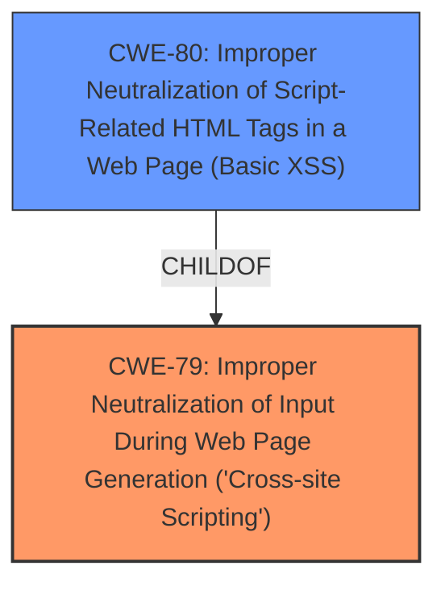

# Analysis Report for CVE-2022-4556

# Vulnerability Analysis Report: CVE-2022-4556

## Description


## Analysis (with Relationship Data)

# Summary
| CWE ID | CWE Name | Confidence | CWE Abstraction Level | CWE Vulnerability Mapping Label | CWE-Vulnerability Mapping Notes |
|---|---|---|---|---|---|
| CWE-79 | Improper Neutralization of Input During Web Page Generation ('Cross-site Scripting') | 1.0 | Base | Allowed | Primary CWE |

## Evidence and Confidence

*   **Confidence Score:** 1.0
*   **Evidence Strength:** HIGH

## Relationship Analysis
The primary relationship that influenced the decision was the ChildOf relationship between CWE-80 and CWE-79, where CWE-80 is a variant of CWE-79, focusing on script-related HTML tags. However, the vulnerability description specifically mentions **cross site scripting** due to the manipulation of the fullName argument, which aligns directly with the broad scope of CWE-79. Therefore, even though CWE-80 is more specific, CWE-79 captures the vulnerability more accurately.



## Vulnerability Chain
The vulnerability chain starts with the **improper handling of the `fullName` argument** in the `_migrateMailIdentities` function, leading to **cross site scripting**. The chain is:
1.  **Improper Input Handling**: The application **fails to properly neutralize** the `fullName` argument.
2.  **Cross-Site Scripting (CWE-79)**: This **failure** allows an attacker to inject malicious scripts into the web page.
3.  **Impact**: The injected script can then be executed in the victim's browser, leading to potential data theft or other malicious activities.

## Summary of Analysis
Initially, multiple CWEs were considered based on the retriever results, but after analyzing the vulnerability description and the CVE Reference Links content summary, it became clear that CWE-79 is the most appropriate. The vulnerability lies in the application's **failure to neutralize user-controllable input (`fullName`)**, allowing it to be placed in a web page without proper sanitization. This directly matches the description of CWE-79: "The product does not neutralize or incorrectly neutralizes user-controllable input before it is placed in output that is used as a web page that is served to other users." The CVE Reference Links Content Summary confirms this: "The root cause of the vulnerability is the **lack of proper sanitization of user-supplied input**, specifically the "fullName" field within mail identities, before it is used in the application. This allows for the possibility of injecting malicious HTML code."

The code fix further supports this assessment, where the `stringWithoutHTMLInjection:YES` method is added to sanitize the `fullName` field. This mitigation directly addresses the improper neutralization of input, reinforcing the choice of CWE-79.

The selection of CWE-79 is at the optimal level of specificity because it accurately describes the core weakness: the improper handling of user-supplied input leading to XSS. While CWE-80 (Improper Neutralization of Script-Related HTML Tags in a Web Page (Basic XSS)) is a variant of CWE-79, the description of the vulnerability and the provided evidence do not limit the scope to just script-related HTML tags. Therefore, the broader CWE-79 is more appropriate.

Relevant CWE Information:

# Enhanced Context (25 CWEs)

## CWE-451: User Interface (UI) Misrepresentation of Critical Information
**Abstraction Level**: Class
**Similarity Score**: 0.77
**Source**: dense

**Description**:
The user interface (UI) does not properly represent critical information to the user, allowing the information - or its source - to be obscured or spoofed. This is often a component in phishing attacks.

**Mapping Guidance**:
- Usage: Allowed-with-Review
- Rationale: This CWE entry is a Class and might have Base-level children that would be more appropriate

*Not selected:* This CWE is not relevant as the vulnerability is not related to misrepresentation of information in the UI, but rather the improper handling of input leading to XSS.

## CWE-74: Improper Neutralization of Special Elements in Output Used by a Downstream Component ('Injection')
**Abstraction Level**: Class
**Similarity Score**: 0.77
**Source**: dense

**Description**:
The product constructs all or part of a command, data structure, or record using externally-influenced input from an upstream component, but it does not neutralize or incorrectly neutralizes special elements that could modify how it is parsed or interpreted when it is sent to a downstream component.

**Mapping Guidance**:
- Usage: Discouraged
- Rationale: CWE-74 is high-level and often misused when lower-level weaknesses are more appropriate.

*Not selected:* CWE-74 is a class-level CWE, and the vulnerability is more specifically related to cross-site scripting (XSS), making CWE-79 a better fit.

## CWE-184: Incomplete List of Disallowed Inputs
**Abstraction Level**: Base
**Similarity Score**: 0.77
**Source**: dense

**Description**:
The product implements a protection mechanism that relies on a list of inputs (or properties of inputs) that are not allowed by policy or otherwise require other action to neutralize before additional processing takes place, but the list is incomplete.

**Mapping Guidance**:
- Usage: Allowed
- Rationale: This CWE entry is at the Base level of abstraction, which is a preferred level of abstraction for mapping to the root causes of vulnerabilities.

*Not selected:* While an incomplete list of disallowed inputs could lead to XSS, the primary issue here is the lack of any sanitization, not an incomplete list.

## CWE-41: Improper Resolution of Path Equivalence
**Abstraction Level**: Base
**Similarity Score**: 0.77
**Source**: dense

**Description**:
The product is vulnerable to file system contents disclosure through path equivalence. Path equivalence involves the use of special characters in file and directory names. The associated manipulations are intended to generate multiple names for the same object.

**Mapping Guidance**:
- Usage: Allowed
- Rationale: This CWE entry is at the Base level of abstraction, which is a preferred level of abstraction for mapping to the root causes of vulnerabilities.

*Not selected:* This CWE is not relevant as the vulnerability is not related to path equivalence or file system disclosure.

## CWE-1289: Improper Validation of Unsafe Equivalence in Input
**Abstraction Level**: Base
**Similarity Score**: 0.76
**Source**: dense

**Description**:
The product receives an input value that is used as a resource identifier or other type of reference, but it does not validate or incorrectly validates that the input is equivalent to a potentially-unsafe value.

**Mapping Guidance**:
- Usage: Allowed
- Rationale: This CWE entry is at the Base level of abstraction, which is a preferred level of abstraction for mapping to the root causes of vulnerabilities.

*Not selected:* This CWE is not relevant as the vulnerability is not about validating equivalence of inputs.

## CWE-80: Improper Neutralization of Script-Related HTML Tags in a Web Page (Basic XSS)
**Abstraction Level**: Variant
**Similarity Score**: 0.76
**Source**: dense

**Description**:
The product receives input from an upstream component, but it does not neutralize or incorrectly neutralizes special characters such as "<", ">", and "&" that could be interpreted as web-scripting elements when they are sent to a downstream component that processes web pages.

**Mapping Guidance**:
- Usage: Allowed
- Rationale: This CWE entry is at the Variant level of abstraction, which is a preferred level of abstraction for mapping to the root causes of vulnerabilities.

*Not selected:* While related to XSS, this is a more specific variant. Given the provided information, it's better to classify it as the broader CWE-79.

## CWE-23: Relative Path Traversal
**Abstraction Level**: Base
**Similarity Score**: 0.76
**Source**: dense

**Description**:
The product uses external input to construct a pathname that should be within a restricted directory, but it does not properly neutralize sequences such as ".." that can resolve to a location that is outside of that directory.

**Mapping Guidance**:
- Usage: Allowed
- Rationale: This CWE entry is at the Base level of abstraction, which is a preferred level of abstraction for mapping to the root causes of vulnerabilities.

*Not selected:* This CWE is not relevant as the vulnerability is not related to path traversal.

## CWE-610: Externally Controlled Reference to a Resource in Another Sphere
**Abstraction Level**: Class
**Similarity Score**: 0.76
**Source**: dense

**Description**:
The product uses an externally controlled name or reference that resolves to a resource that is outside of the intended control sphere.

**Mapping Guidance**:
- Usage: Discouraged
- Rationale: This CWE entry is a level-1


## CWE Relationship Analysis

Current CWEs represent these abstraction levels: .


### Vulnerability Chain Analysis

**Chain starting from CWE-80:**
- 80 (Improper Neutralization of Script-Related HTML Tags in a Web Page (Basic XSS)) - ROOT


**Chain starting from CWE-41:**
- 41 (Improper Resolution of Path Equivalence) - ROOT


### CWE Relationship Diagram

```mermaid
graph TD
    classDef primary fill:#f96,stroke:#333,stroke-width:2px
    classDef secondary fill:#69f,stroke:#333
    classDef tertiary fill:#9e9,stroke:#333
```


*Report generated on 2025-03-31 13:31:31*
