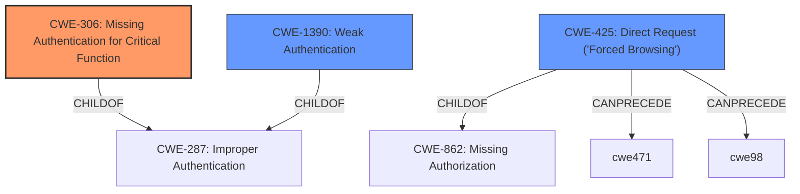

# Enhanced Analysis for CVE-2022-45724

# Summary
| CWE ID | CWE Name | Confidence | CWE Abstraction Level | CWE Vulnerability Mapping Label | CWE-Vulnerability Mapping Notes |
|---|---|---|---|---|---|
| CWE-306 | Missing Authentication for Critical Function | 0.9 | Base | Allowed | Primary CWE |
| CWE-1390 | Weak Authentication | 0.7 | Class | Allowed-with-Review | Secondary Candidate |
| CWE-425 | Direct Request ('Forced Browsing') | 0.6 | Base | Allowed | Secondary Candidate |

## Evidence and Confidence

*   **Confidence Score:** 0.8
*   **Evidence Strength:** HIGH

## Relationship Analysis
The primary CWE identified is CWE-306 **[Missing Authentication for Critical Function]**, a Base level CWE, which is a child of CWE-287 **[Improper Authentication]**. CWE-1390 **[Weak Authentication]** is a Class level CWE and is also a child of CWE-287 **[Improper Authentication]**. CWE-425 **[Direct Request ('Forced Browsing')]** is also considered as a secondary candidate.



## Vulnerability Chain
The vulnerability chain starts with **incorrect access control**, leading to a situation where unauthenticated requests can generate valid session IDs. This breaks the authentication mechanism because authentication is **missing** for the generation of the session ID, ultimately allowing an attacker to perform authenticated requests. The chain is: **Incorrect Access Control** -> CWE-306 **[Missing Authentication for Critical Function]** -> Authentication Bypass -> Authenticated Actions Performed by Attacker.

## Summary of Analysis
The initial analysis focused on the **incorrect access control** highlighted in the vulnerability description. The key finding is that the authentication framework **fails to properly authenticate** requests for session ID generation. This allows attackers to obtain valid session IDs without proper credentials, leading to unauthorized access.

The evidence for CWE-306 **[Missing Authentication for Critical Function]** is primarily based on the "CVE Reference Links Content Summary" which states: "The authentication framework has a flaw where, when a user is logged in, it generates new valid session IDs for unauthenticated requests to certain pages." This directly supports the assertion that authentication is **missing** for a critical function (session ID generation).

CWE-1390 **[Weak Authentication]** was considered because the vulnerability description mentions **incorrect access control** leading to the generation of valid session IDs for unauthenticated requests. However, the primary issue is the **lack of authentication** for a critical function, making CWE-306 **[Missing Authentication for Critical Function]** a more precise fit.

CWE-425 **[Direct Request ('Forced Browsing')]** was also considered because the attacker sends an unauthenticated GET request to a specific page. However, the root cause is not simply the ability to directly request a page, but the **missing authentication** when generating a session id.

The selection of CWE-306 **[Missing Authentication for Critical Function]** as the primary CWE is at the optimal level of specificity because it directly addresses the **root cause**: the **absence of authentication** for the session ID generation process.

Relevant CWE Information:

# Enhanced Context (25 CWEs)
The following CWEs were identified as potentially relevant to this vulnerability:

## CWE-807: Reliance on Untrusted Inputs in a Security Decision
**Abstraction Level**: Base
**Similarity Score**: 0.75

**Description**:
The product uses a protection mechanism that relies on the existence or values of an input, but the input can be modified by an untrusted actor in a way that bypasses the protection mechanism.
*This CWE was not selected as there is no evidence of relying on untrusted inputs in a security decision.*

## CWE-1220: Insufficient Granularity of Access Control
**Abstraction Level**: Base
**Similarity Score**: 0.74

**Description**:
The product implements access controls via a policy or other feature with the intention to disable or restrict accesses (reads and/or writes) to assets in a system from untrusted agents. However, implemented access controls lack required granularity, which renders the control policy too broad because it allows accesses from unauthorized agents to the security-sensitive assets.
*This CWE was not selected because the access controls were not implemented in this case.*

## CWE-274: Improper Handling of Insufficient Privileges
**Abstraction Level**: Base
**Similarity Score**: 0.74

**Description**:
The product does not handle or incorrectly handles when it has insufficient privileges to perform an operation, leading to resultant weaknesses.
*This CWE was not selected because the application does not appear to be improperly handling insufficient privileges.*

## CWE-1390: Weak Authentication
**Abstraction Level**: Class
**Similarity Score**: 0.74

**Description**:
The product uses an authentication mechanism to restrict access to specific users or identities, but the mechanism does not sufficiently prove that the claimed identity is correct.
*This CWE was considered as a secondary candidate because the generated SESSION_ID is used in authentication.*

## CWE-639: Authorization Bypass Through User-Controlled Key
**Abstraction Level**: Base
**Similarity Score**: 0.74

**Description**:
The system's authorization functionality does not prevent one user from gaining access to another user's data or record by modifying the key value identifying the data.
*This CWE was not selected because the session id is not a user controlled key.*

## CWE-41: Improper Resolution of Path Equivalence
**Abstraction Level**: Base
**Similarity Score**: 0.73

**Description**:
The product is vulnerable to file system contents disclosure through path equivalence. Path equivalence involves the use of special characters in file and directory names. The associated manipulations are intended to generate multiple names for the same object.
*This CWE was not selected because there is no file system contents disclosure.*

## CWE-280: Improper Handling of Insufficient Permissions or Privileges 
**Abstraction Level**: Base
**Similarity Score**: 0.73

**Description**:
The product does not handle or incorrectly handles when it has insufficient privileges to access resources or functionality as specified by their permissions. This may cause it to follow unexpected code paths that may leave the product in an invalid state.
*This CWE was not selected because the application does not appear to be improperly handling insufficient permissions.*

## CWE-302: Authentication Bypass by Assumed-Immutable Data
**Abstraction Level**: Base
**Similarity Score**: 0.73

**Description**:
The authentication scheme or implementation uses key data elements that are assumed to be immutable, but can be controlled or modified by the attacker.
*This CWE was not selected because the authentication scheme does not rely on assumed-immutable data.*

## CWE-668: Exposure of Resource to Wrong Sphere
**Abstraction Level**: Class
**Similarity Score**: 0.73

**Description**:
The product exposes a resource to the wrong control sphere, providing unintended actors with inappropriate access to the resource.
*This CWE was not selected because there is no apparent exposure of resource to the wrong sphere.*

## CWE-303: Incorrect Implementation of Authentication Algorithm
**Abstraction Level**: Base
**Similarity Score**: 0.73

**Description**:
The requirements for the product dictate the use of an established authentication algorithm, but the implementation of the algorithm is incorrect.
*This CWE was not selected because the problem is not with the implementation of an authentication algorithm.*

## CWE-639: Authorization Bypass Through User-Controlled Key
**Abstraction Level**: Base
**Similarity Score**: 6150.90

**Description**:
The system's authorization functionality does not prevent one user from gaining access to another user's data or record by modifying the key value identifying the data.
*This CWE was not selected because the key is not user controlled.*

## CWE-863: Incorrect Authorization
**Abstraction Level**: Class
**Similarity Score**: 5904.17

**Description**:
The product performs an authorization check when an actor attempts to access a resource or perform an action, but it does not correctly perform the check.
*This CWE was not selected because the authentication is missing instead of incorrect.*


## CWE Relationship Analysis

Current CWEs represent these abstraction levels: .


### Vulnerability Chain Analysis

**Chain starting from CWE-862:**
- 862 (Missing Authorization) - ROOT


**Chain starting from CWE-425:**
- 425 (Direct Request ('Forced Browsing')) - ROOT


### CWE Relationship Diagram

```mermaid
graph TD
    classDef primary fill:#f96,stroke:#333,stroke-width:2px
    classDef secondary fill:#69f,stroke:#333
    classDef tertiary fill:#9e9,stroke:#333
```