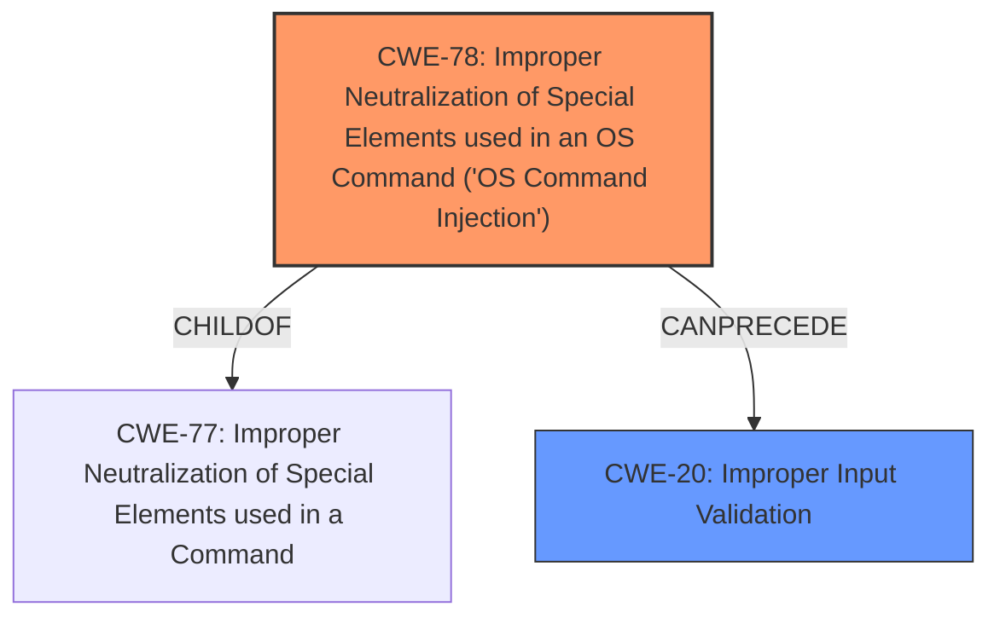

# Analysis Report for CVE-2022-45725

# Vulnerability Analysis Report: CVE-2022-45725

## Description


## Analysis (with Relationship Data)

# Summary
| CWE ID  | CWE Name  | Confidence | CWE Abstraction Level | CWE Vulnerability Mapping Label | CWE-Vulnerability Mapping Notes |
| ------------- | ------------- | ------------- | ------------- | ------------- | ------------- |
| CWE-78 | Improper Neutralization of Special Elements used in an OS Command ('OS Command Injection') | 1 | Base | Primary | Allowed |
| CWE-20 | Improper Input Validation | 0.7 | Class | Secondary | Discouraged |

## Evidence and Confidence

*   **Confidence Score:** 0.9
*   **Evidence Strength:** HIGH

## Relationship Analysis
The primary relationship is that CWE-78 [CWE-78: Improper Neutralization of Special Elements used in an OS Command ('OS Command Injection')] is a specific type of weakness that often results from a failure to perform adequate input validation, represented by CWE-20 [CWE-20: Improper Input Validation]. Thus, CWE-78 can be seen as a child of CWE-77, which is a parent of CWE-78.


## Vulnerability Chain
The vulnerability chain begins with **improper input validation** (CWE-20), which allows an attacker to inject special elements into an OS command, leading to **OS Command Injection** (CWE-78). The final impact is arbitrary code execution on the target system.

## Summary of Analysis
The initial assessment strongly points to CWE-78 [CWE-78: Improper Neutralization of Special Elements used in an OS Command ('OS Command Injection')] as the primary weakness. The vulnerability description clearly states that the router's web interface incorporates the `ifname` variable directly into a local command without sanitization, leading to command injection. The "CVE Reference Links Content Summary" explicitly supports this, stating that the primary weakness is the lack of validation of the `ifname` variable, allowing an attacker to inject arbitrary commands. This directly aligns with CWE-78's description of constructing an OS command using externally influenced input without proper neutralization of special elements.

The presence of **"Improper Input Validation"** as a key phrase, along with the "CVE Reference Links Content Summary" describing the lack of validation of the `ifname` variable, suggests CWE-20 [CWE-20: Improper Input Validation] as a potential secondary weakness. However, CWE-20 is a broad, high-level Class CWE that is often misused when more specific CWEs are applicable. Given that the **improper input validation** directly leads to command injection, CWE-78 is the more precise and appropriate classification.

Therefore, the assessment concludes that CWE-78 is the most accurate and specific representation of the vulnerability, and CWE-20 is a secondary consideration due to its broader nature. The final decision is based on the direct evidence of command injection resulting from **improper input validation**, as highlighted in the vulnerability description and supported by the "CVE Reference Links Content Summary". The selected CWEs are at the optimal level of specificity, with CWE-78 being a Base-level CWE that directly describes the command injection vulnerability.


## CWE Relationship Analysis

Current CWEs represent these abstraction levels: .


### Vulnerability Chain Analysis

**Chain starting from CWE-78:**
- 78 (Improper Neutralization of Special Elements used in an OS Command ('OS Command Injection')) - ROOT


**Chain starting from CWE-77:**
- 77 (Improper Neutralization of Special Elements used in a Command ('Command Injection')) - ROOT


### CWE Relationship Diagram

```mermaid
graph TD
    classDef primary fill:#f96,stroke:#333,stroke-width:2px
    classDef secondary fill:#69f,stroke:#333
    classDef tertiary fill:#9e9,stroke:#333
```


*Report generated on 2025-03-31 05:17:02*
