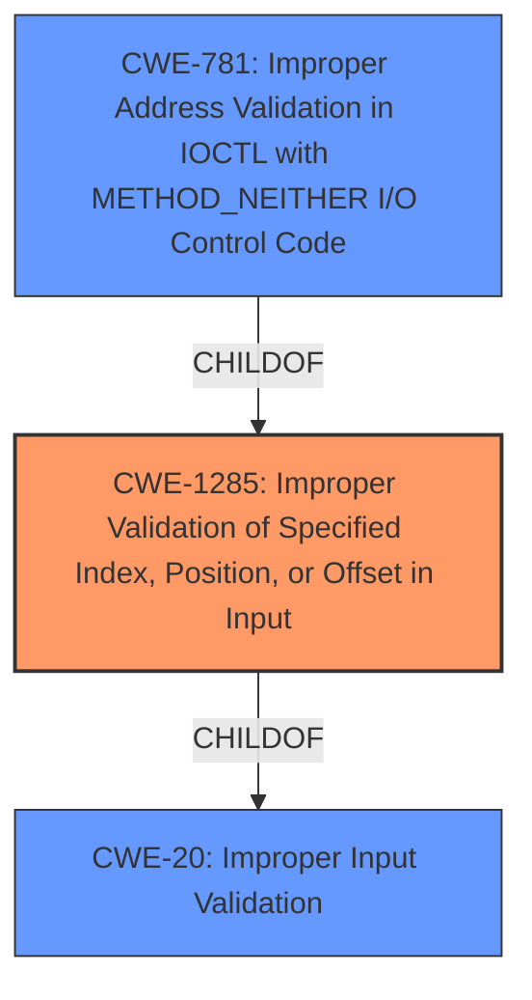

# Analysis Report for CVE-2022-45770

# Vulnerability Analysis Report: CVE-2022-45770

## Description


## Analysis (with Relationship Data)

# Summary
| CWE ID  | CWE Name                                                        | Confidence | CWE Abstraction Level | CWE Vulnerability Mapping Label | CWE-Vulnerability Mapping Notes |
| :-------- | :-------------------------------------------------------------- | :--------- | :-------------------- | :------------------------------ | :------------------------------ |
| CWE-1285  | Improper Validation of Specified Index, Position, or Offset in Input | 0.9        | Base                  | Allowed                       | Primary CWE                     |
| CWE-781   | Improper Address Validation in IOCTL with METHOD_NEITHER I/O Control Code | 0.7        | Variant               | Allowed                       | Secondary Candidate             |
| CWE-20    | Improper Input Validation                                         | 0.6        | Class                 | Discouraged                   | Secondary Candidate             |

## Evidence and Confidence

*   **Confidence Score:** 0.8
*   **Evidence Strength:** HIGH

## Relationship Analysis
The primary CWE is CWE-1285 (**Improper Validation of Specified Index, Position, or Offset in Input**), a base-level weakness which is child of the more general CWE-20 (**Improper Input Validation**). CWE-781 (**Improper Address Validation in IOCTL with METHOD_NEITHER I/O Control Code**) is a more specific variant related to IOCTLs and METHOD_NEITHER. The analysis suggests a progression from generic input validation issues (CWE-20) to specific issues with index/offset validation (CWE-1285) and further to IOCTL address validation (CWE-781).



## Vulnerability Chain
The vulnerability chain starts with **improper input validation** in the Adguard driver (adgnetworkwfpdrv.sys). This leads to arbitrary memory writes due to an exploitable linked list structure and incorrect index handling (CWE-1285). If METHOD_NEITHER is used by IOCTLs, this leads to CWE-781 (**Improper Address Validation in IOCTL with METHOD_NEITHER I/O Control Code**). Successful exploitation allows local privilege escalation, allowing malicious code injection into a privileged service process.

## Summary of Analysis
The initial analysis pointed to **improper input validation**. The key phrase from the vulnerability description is "**Improper input validation**". The CVE Reference Links Content Summary confirms this, stating "The vulnerability stems from a lack of proper input validation in the AdGuard driver (adgnetworkwfpdrv.sys)".

The retriever results also suggested CWE-20 (**Improper Input Validation**) as the top candidate. However, CWE-20 is a Class-level CWE and the description also mentions "incorrect index handling," which suggests a more specific vulnerability related to index validation.

CWE-1285 (**Improper Validation of Specified Index, Position, or Offset in Input**) is a Base-level CWE and a child of CWE-20. The description of CWE-1285 states, "The product receives input that is expected to specify an index, position, or offset... but it does not validate or incorrectly validates that the specified index/position/offset has the required properties." This aligns with the vulnerability description that mentions incorrect index handling.

The CVE Reference also describes the issue as allowing arbitrary memory writes due to an exploitable linked list structure and incorrect index handling. This provides more specific evidence for CWE-1285.

Additionally, The summary contains these rootcauses and weaknesses:
        "Insecure use of a linked list structure within the driver's memory pool leading to arbitrary memory writes."
		"Improper validation of the index used to access the linked list, which allows overwriting the next pointer and creating a write primitive."

Given this evidence, CWE-1285 is a more specific and accurate mapping than the general CWE-20.

The driver uses a custom implementation for exclusive access control based on the PID of the first process opening the driver. The weakness descriptions includes "Improper validation of the index used to access the linked list, which allows overwriting the next pointer and creating a write primitive." Since the driver allows access to all users and has an exploitable linked list structure that allows arbitrary memory writes. The IOCTLs with METHOD_NEITHER is being leveraged to overwrite the next pointer and create a write primitive. This could be an instance of CWE-781 (**Improper Address Validation in IOCTL with METHOD_NEITHER I/O Control Code**).

The selection of CWE-1285 is at the optimal level of specificity because it directly addresses the **improper validation** of the index used to access the linked list, leading to arbitrary memory writes, making it the primary root cause. While other CWEs like CWE-20 (**Improper Input Validation**) are relevant, they are too general.
CWE-781 is too specific to IOCTL and METHOD_NEITHER, which is only a potential attack vector.
Therefore CWE-1285 is the best representation of the vulnerability.

Relevant CWE Information:

# Enhanced Context (25 CWEs)

## CWE-1289: Improper Validation of Unsafe Equivalence in Input
**Abstraction Level**: Base
**Similarity Score**: 0.77
**Source**: dense

**Description**:
The product receives an input value that is used as a resource identifier or other type of reference, but it does not validate or incorrectly validates that the input is equivalent to a potentially-unsafe value.

**Mapping Guidance**:
- Usage: Allowed
- Rationale: This CWE entry is at the Base level of abstraction, which is a preferred level of abstraction for mapping to the root causes of vulnerabilities.

I considered this CWE but it doesn't match the vulnerability description as well as CWE-1285. It focuses on validating equivalence to unsafe values, which isn't the primary issue here.

## CWE-1173: Improper Use of Validation Framework
**Abstraction Level**: Base
**Similarity Score**: 0.77
**Source**: dense

**Description**:
The product does not use, or incorrectly uses, an input validation framework that is provided by the source language or an independent library.

**Mapping Guidance**:
- Usage: Allowed
- Rationale: This CWE entry is at the Base level of abstraction, which is a preferred level of abstraction for mapping to the root causes of vulnerabilities.

I considered this CWE, but the description focuses on not using a validation framework. While that could be a contributing factor, the core issue is the **improper validation** itself, making CWE-1285 a better fit.

## CWE-807: Reliance on Untrusted Inputs in a Security Decision
**Abstraction Level**: Base
**Similarity Score**: 0.74
**Source**: dense

**Description**:
The product uses a protection mechanism that relies on the existence or values of an input, but the input can be modified by an untrusted actor in a way that bypasses the protection mechanism.

**Mapping Guidance**:
- Usage: Allowed
- Rationale: This CWE entry is at the Base level of abstraction, which is a preferred level of abstraction for mapping to the root causes of vulnerabilities.

I considered this CWE, but it focuses on bypassing a protection mechanism. While the **improper validation** could lead to a bypass, the core issue is the **improper validation**, not the bypass itself.

## CWE-1288: Improper Validation of Consistency within Input
**Abstraction Level**: Base
**Similarity Score**: 0.74
**Source**: dense

**Description**:
The product receives a complex input with multiple elements or fields that must be consistent with each other, but it does not validate or incorrectly validates that the input is actually consistent.

**Mapping Guidance**:
- Usage: Allowed
- Rationale: This CWE entry is at the Base level of abstraction, which is a preferred level of abstraction for mapping to the root causes of vulnerabilities.

I considered this CWE, but the vulnerability doesn't clearly involve inconsistent input elements. The issue is more specifically about the **improper validation** of an index.

## CWE-274: Improper Handling of Insufficient Privileges
**Abstraction Level**: Base
**Similarity Score**: 0.74
**Source**: dense

**Description**:
The product does not handle or incorrectly handles when it has insufficient privileges to perform an operation, leading to resultant weaknesses.

**Mapping Guidance**:
- Usage: Discouraged
- Rationale: This CWE entry could be deprecated in a future version of CWE.

This CWE is about handling insufficient privileges, which is not the primary issue. The core issue is the **improper validation** of input.

## CWE-184: Incomplete List of Disallowed


## CWE Relationship Analysis

Current CWEs represent these abstraction levels: .


### Vulnerability Chain Analysis

**Chain starting from CWE-184:**
- 184 (Incomplete List of Disallowed Inputs) - ROOT


**Chain starting from CWE-807:**
- 807 (Reliance on Untrusted Inputs in a Security Decision) - ROOT


### CWE Relationship Diagram

```mermaid
graph TD
    classDef primary fill:#f96,stroke:#333,stroke-width:2px
    classDef secondary fill:#69f,stroke:#333
    classDef tertiary fill:#9e9,stroke:#333
```


*Report generated on 2025-03-31 12:55:10*
