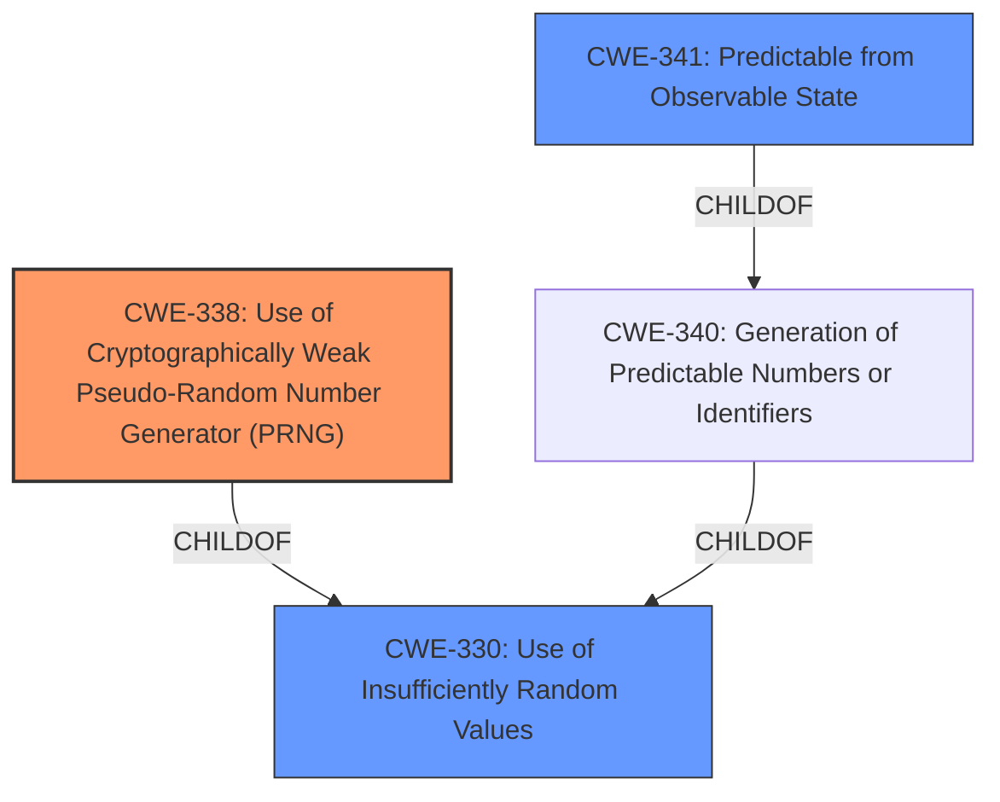

# Raw Analyzer Response for CVE-2022-45782

# Summary
| CWE ID | CWE Name | Confidence | CWE Abstraction Level | CWE Vulnerability Mapping Label | CWE-Vulnerability Mapping Notes |
|---|---|---|---|---|---|
| CWE-338 | Use of Cryptographically Weak Pseudo-Random Number Generator (PRNG) | 1.0 | Base | Allowed | Primary CWE. The vulnerability description and CVE reference links content summary clearly indicate the use of a cryptographically weak PRNG for password reset token generation. |
| CWE-330 | Use of Insufficiently Random Values | 0.7 | Class | Discouraged | Secondary CWE. While the primary issue is the use of a cryptographically weak PRNG, this CWE is a broader classification that encompasses the weakness of the random values generated. |
| CWE-341 | Predictable from Observable State | 0.6 | Base | Allowed | Secondary CWE. The tokens generated are predictable because of the weak PRNG, which is based on observable system state |

## Evidence and Confidence

*   **Confidence Score:** 1.0
*   **Evidence Strength:** HIGH

## Relationship Analysis
The primary CWE is CWE-338, which is a Base level CWE. This is related to CWE-330, which is a Class level CWE representing a more general category of weaknesses related to insufficiently random values. CWE-338 is a child of CWE-330. CWE-341 is a base level CWE and a child of CWE-340 Generation of Predictable Numbers or Identifiers which is a class level CWE and child of CWE-330.

## Vulnerability Chain
The vulnerability chain starts with the **cryptographically insecure random generation algorithm for password-reset token generation** (CWE-338), which leads to predictable password reset tokens. This predictability allows an attacker to potentially brute-force the password reset token and gain access to the admin account, resulting in account takeover.

## Summary of Analysis
The initial analysis identified CWE-338 as the primary weakness due to the use of a **cryptographically insecure random generation algorithm for password-reset token generation**, as stated in the vulnerability description. The CVE Reference Links Content Summary further supports this by stating that "The password reset token in dotCMS is generated using the `randomAlphanumeric()` method, which is not cryptographically secure."

CWE-330 was considered as a secondary weakness because it is a broader category encompassing the use of insufficiently random values. The description mentions that the PRNG is weak, making this a valid, albeit less specific, classification.

CWE-341 was considered as a secondary weakness because the tokens are predictable due to observable system state.

The selection of CWE-338 as the primary CWE is based on the evidence directly pointing to the use of a **cryptographically weak PRNG**. This is the most specific and accurate representation of the root cause.

Other CWEs Considered but Not Used:

*   CWE-335: Incorrect Usage of Seeds in Pseudo-Random Number Generator (PRNG) - While incorrect seed usage could contribute to a weak PRNG, the provided information focuses on the algorithm itself being weak, not necessarily the seed.
*   CWE-337: Predictable Seed in Pseudo-Random Number Generator (PRNG) - Similar to CWE-335, this is not the primary issue described. The core problem is the algorithm's cryptographic weakness, not just the seed.
*   CWE-1391: Use of Weak Credentials - This is too high-level. The vulnerability is more specific to the PRNG.
*   CWE-620: Unverified Password Change - The **cryptographically insecure random generation algorithm** is the issue not an unverified password change.
*   CWE-804: Guessable CAPTCHA - This is related to CAPTCHA implementations and not password resets.

The selection of CWE-338 is at the optimal level of specificity because it directly addresses the root cause, which is the use of a **cryptographically weak PRNG**. The evidence strongly supports this classification, and the CWE's description aligns perfectly with the vulnerability's details.