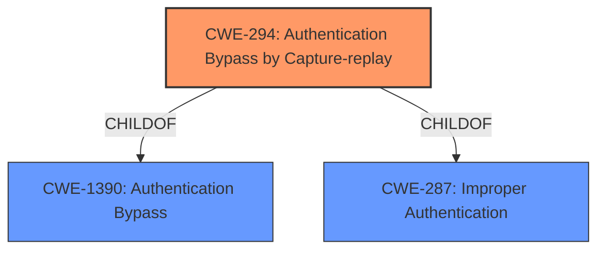

# Analysis Report for CVE-2022-45789

# Vulnerability Analysis Report: CVE-2022-45789

## Description


## Analysis (with Relationship Data)

# Summary
| CWE ID | CWE Name | Confidence | CWE Abstraction Level | CWE Vulnerability Mapping Label | CWE-Vulnerability Mapping Notes |
|---|---|---|---|---|---|
| CWE-294 | Authentication Bypass by Capture-replay | 1.0 | Base | Primary | Allowed |

## Evidence and Confidence

*   **Confidence Score:** 1.0
*   **Evidence Strength:** HIGH

## Relationship Analysis
The primary CWE, CWE-294, is a Base level CWE. It has parent relationships to CWE-1390 and CWE-287, which are Class level CWEs related to Authentication problems. The relationships confirm that the selected CWE is appropriately specific for the vulnerability.



## Vulnerability Chain
The vulnerability chain starts with the **CWE-294 Authentication Bypass by Capture-replay**. This leads to the impact of unauthorized execution of Modbus functions, potentially resulting in denial of service and loss of confidentiality and integrity.

## Summary of Analysis
The initial analysis strongly supports the selection of CWE-294 based on the vulnerability description and the CVE reference link content summary. The key phrase "Authentication Bypass by Capture-replay" directly matches the CWE name and description. The retriever results also list CWE-294 as the top combined result.

The vulnerability description states: "A **CWE-294 Authentication Bypass by Capture-replay** vulnerability exists that could cause execution of unauthorized Modbus functions on the controller when hijacking an authenticated Modbus session."

The CVE Reference Links Content Summary states: "Root cause of vulnerability: Authentication Bypass by Capture-replay", and "Weaknesses/vulnerabilities present: A capture-replay vulnerability allows the execution of unauthorized Modbus functions when an authenticated Modbus session is hijacked."

The selection of CWE-294 is appropriate because it accurately describes the root cause of the vulnerability, which is the possibility for a malicious user to sniff network traffic and bypass authentication by replaying it to the server. The selected CWE is at the optimal level of specificity (Base) as it directly reflects the weakness described in the vulnerability.

**CWEs Considered But Not Used:**

*   **CWE-290 Authentication Bypass by Spoofing:** While related to authentication bypass, this is more general than CWE-294, which specifically addresses capture-replay attacks.
*   **CWE-119 Improper Restriction of Operations within the Bounds of a Memory Buffer:** This is not relevant as the vulnerability is not related to memory buffer issues.
*   **CWE-200 Exposure of Sensitive Information to an Unauthorized Actor:** This is a consequence of the vulnerability, not the root cause. The root cause is the authentication bypass.
*   **CWE-522 Insufficiently Protected Credentials:** This is not relevant as the vulnerability is not directly related to credentials being insufficiently protected, but rather the ability to replay captured authentication data.
*   **CWE-291 Reliance on IP Address for Authentication:** This is a specific type of spoofing and not relevant to the capture-replay.
*   **CWE-311 Missing Encryption of Sensitive Data:** This is not relevant because the issue is not a lack of encryption, but a flaw in the authentication mechanism.
*   **CWE-916 Use of Password Hash With Insufficient Computational Effort:** This is not relevant as the vulnerability is not related to password hashing.
*   **CWE-345 Insufficient Verification of Data Authenticity:** While data authenticity is related, the core issue is the replay of captured traffic, making CWE-294 a more precise fit.


## CWE Relationship Analysis

Current CWEs represent these abstraction levels: .


### Vulnerability Chain Analysis

**Chain starting from CWE-916:**
- 916 (Use of Password Hash With Insufficient Computational Effort) - ROOT


**Chain starting from CWE-200:**
- 200 (Exposure of Sensitive Information to an Unauthorized Actor) - ROOT


### CWE Relationship Diagram

```mermaid
graph TD
    classDef primary fill:#f96,stroke:#333,stroke-width:2px
    classDef secondary fill:#69f,stroke:#333
    classDef tertiary fill:#9e9,stroke:#333
```


*Report generated on 2025-03-31 12:45:01*
