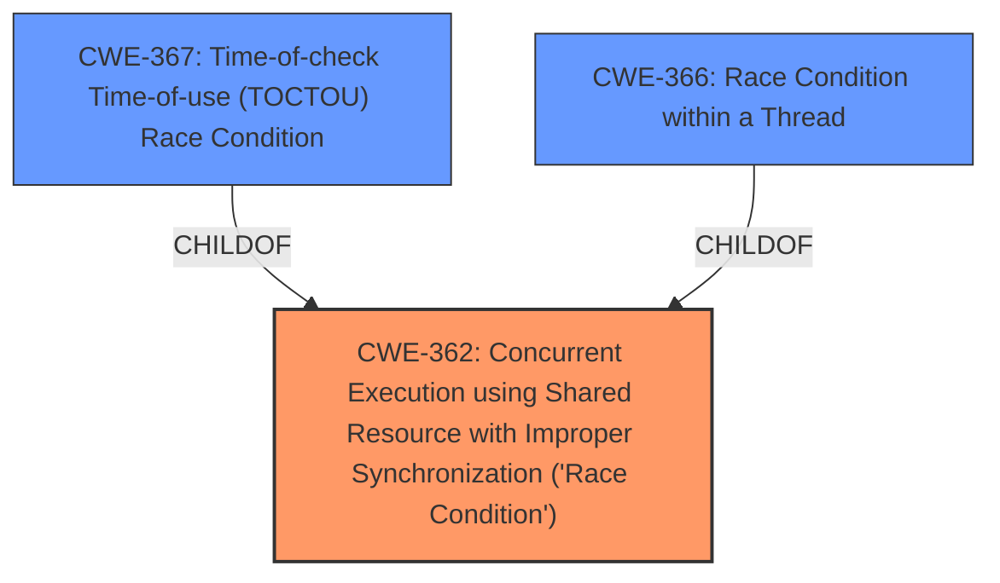

# Analysis Report for CVE-2022-45842

# Vulnerability Analysis Report: CVE-2022-45842

## Description


## Analysis (with Relationship Data)

# Summary
| CWE ID | CWE Name | Confidence | CWE Abstraction Level | CWE Vulnerability Mapping Label | CWE-Vulnerability Mapping Notes |
|---|---|---|---|---|---|
| CWE-362 | Concurrent Execution using Shared Resource with Improper Synchronization ('Race Condition') | 0.9 | Class | Allowed-with-Review | Primary CWE |
| CWE-367 | Time-of-check Time-of-use (TOCTOU) Race Condition | 0.6 | Base | Allowed | Secondary Candidate |
| CWE-366 | Race Condition within a Thread | 0.5 | Base | Allowed | Secondary Candidate |

## Evidence and Confidence

*   **Confidence Score:** 0.9
*   **Evidence Strength:** HIGH

## Relationship Analysis
The primary CWE selected is CWE-362, which is a Class-level CWE. While it would be preferable to select a Base-level CWE, the description of CWE-362 directly aligns with the vulnerability description. CWE-367 and CWE-366 are child CWEs of CWE-362, representing more specific types of race conditions. However, the provided information does not give enough detail to clearly determine whether the race condition is a TOCTOU race condition (CWE-367) or occurs within a thread (CWE-366).



## Vulnerability Chain
The vulnerability chain starts with the **race condition** (CWE-362), which allows attackers to increase/decrease rating scores. The **race condition** is the root cause, and the impact is the ability to manipulate rating scores.

## Summary of Analysis
The initial assessment identified a **race condition** as the root cause of the vulnerability. The retriever results strongly suggest CWE-362 as the primary candidate. The vulnerability description key phrases also directly mention "**race condition**".

The analysis is based on the provided evidence, particularly the vulnerability description and the CVE reference links content summary. The vulnerability description explicitly mentions a **race condition** in the WP ULike plugin that allows attackers to manipulate rating scores.

The graph relationships influenced the selection by highlighting the hierarchical structure of CWEs related to race conditions. While CWE-367 and CWE-366 are more specific, there isn't enough detail to confirm they are a better fit than the general CWE-362.

CWE-362 is selected as the optimal level of specificity because it directly addresses the core issue: a **race condition** due to improper synchronization in concurrent execution. The evidence supports this classification, and the lack of further detail prevents a more specific mapping.

Relevant CWE Information:

# Enhanced Context (25 CWEs)

## CWE-472: External Control of Assumed-Immutable Web Parameter
**Abstraction Level**: Base
**Similarity Score**: 0.77
**Source**: dense

**Description**:
The web application does not sufficiently verify inputs that are assumed to be immutable but are actually externally controllable, such as hidden form fields.

**Why it was not selected**: This CWE is not related to the race condition, which is the root cause of the vulnerability.

## CWE-367: Time-of-check Time-of-use (TOCTOU) Race Condition
**Abstraction Level**: Base
**Similarity Score**: 0.77
**Source**: dense

**Description**:
The product checks the state of a resource before using that resource, but the resource's state can change between the check and the use in a way that invalidates the results of the check. This can cause the product to perform invalid actions when the resource is in an unexpected state.

**Why it was considered**: This is a type of race condition.
**Why it was not selected**: While the description does contain a race condition, there is no evidence that the race condition is due to a time-of-check time-of-use issue.

## CWE-41: Improper Resolution of Path Equivalence
**Abstraction Level**: Base
**Similarity Score**: 0.76
**Source**: dense

**Description**:
The product is vulnerable to file system contents disclosure through path equivalence. Path equivalence involves the use of special characters in file and directory names. The associated manipulations are intended to generate multiple names for the same object.

**Why it was not selected**: This CWE is not related to the race condition, which is the root cause of the vulnerability.

## CWE-184: Incomplete List of Disallowed Inputs
**Abstraction Level**: Base
**Similarity Score**: 0.76
**Source**: dense

**Description**:
The product implements a protection mechanism that relies on a list of inputs (or properties of inputs) that are not allowed by policy or otherwise require other action to neutralize before additional processing takes place, but the list is incomplete.

**Why it was not selected**: This CWE is not related to the race condition, which is the root cause of the vulnerability.

## CWE-425: Direct Request ('Forced Browsing')
**Abstraction Level**: Base
**Similarity Score**: 0.76
**Source**: dense

**Description**:
The web application does not adequately enforce appropriate authorization on all restricted URLs, scripts, or files.

**Why it was not selected**: This CWE is not related to the race condition, which is the root cause of the vulnerability.

## CWE-799: Improper Control of Interaction Frequency
**Abstraction Level**: Class
**Similarity Score**: 0.75
**Source**: dense

**Description**:
The product does not properly limit the number or frequency of interactions that it has with an actor, such as the number of incoming requests.

**Why it was not selected**: This CWE is not related to the race condition, which is the root cause of the vulnerability.

## CWE-366: Race Condition within a Thread
**Abstraction Level**: Base
**Similarity Score**: 0.75
**Source**: dense

**Description**:
If two threads of execution use a resource simultaneously, there exists the possibility that resources may be used while invalid, in turn making the state of execution undefined.

**Why it was considered**: This is a type of race condition.
**Why it was not selected**: There is no evidence that the race condition occurs within a thread.

## CWE-1289: Improper Validation of Unsafe Equivalence in Input
**Abstraction Level**: Base
**Similarity Score**: 0.75
**Source**: dense

**Description**:
The product receives an input value that is used as a resource identifier or other type of reference, but it does not validate or incorrectly validates that the input is equivalent to a potentially-unsafe value.

**Why it was not selected**: This CWE is not related to the race condition, which is the root cause of the vulnerability.

## CWE-451: User Interface (UI) Misrepresentation of Critical Information
**Abstraction Level**: Class
**Similarity Score**: 0.75
**Source**: dense

**Description**:
The user interface (UI) does not properly represent critical information to the user, allowing the information - or its source - to be obscured or spoofed. This is often a component in phishing attacks.

**Why it was not selected**: This CWE is not related to the race condition, which is the root cause of the vulnerability.

## CWE-668: Exposure of Resource to Wrong Sphere
**Abstraction Level**: Class
**Similarity Score**: 0.75
**Source**: dense

**Description**:
The product exposes a resource to the wrong control sphere, providing unintended actors with inappropriate access to the resource.

**Why it was not selected**: This CWE is not related to the race condition, which is the root cause of the vulnerability.

## CWE-364: Signal Handler Race Condition
**Abstraction Level**: Base
**Similarity Score**: 8354.32
**Source**: sparse

**Description**:
The product uses a signal handler that introduces a race condition.

**Why it was not selected**: This CWE is not related to the race condition, which is the root cause of the vulnerability.

## CWE-79: Improper Neutralization of Input During Web Page Generation ('Cross-site Scripting')
**Abstraction Level**: Base
**Similarity Score**: 7752.39
**Source**: sparse

**Description**:
The product does not neutralize or incorrectly neutralizes user-controllable input before it is placed in output that is used as a web page that is served to other users.

**Why it was not selected**: This CWE is not related to the race condition, which is the root cause of the vulnerability.

## CWE-367: Time-of-check Time-of-use (TOCT


## CWE Relationship Analysis

Current CWEs represent these abstraction levels: .


### Vulnerability Chain Analysis

**Chain starting from CWE-425:**
- 425 (Direct Request ('Forced Browsing')) - ROOT


**Chain starting from CWE-472:**
- 472 (External Control of Assumed-Immutable Web Parameter) - ROOT


### CWE Relationship Diagram

```mermaid
graph TD
    classDef primary fill:#f96,stroke:#333,stroke-width:2px
    classDef secondary fill:#69f,stroke:#333
    classDef tertiary fill:#9e9,stroke:#333
```


*Report generated on 2025-03-30 12:55:55*
