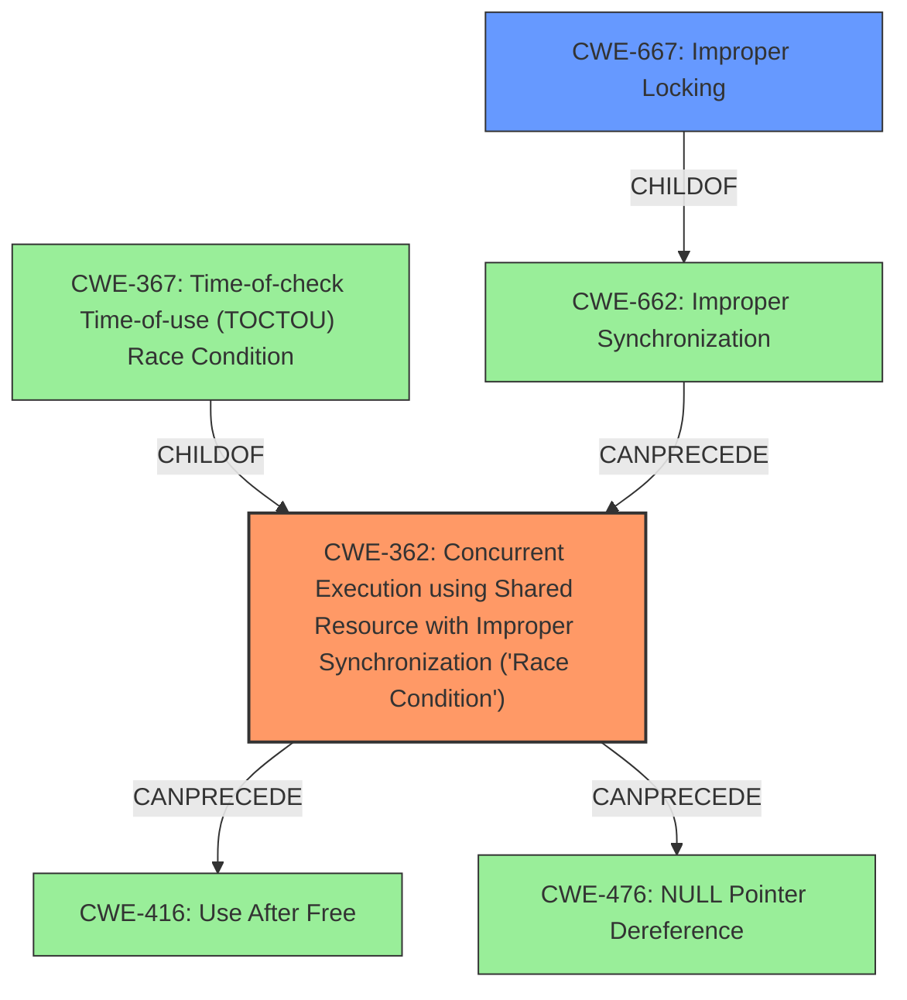

# Analysis for CVE-2022-45869

# Summary
| CWE ID | CWE Name | Confidence | CWE Abstraction Level | CWE Vulnerability Mapping Label | CWE-Vulnerability Mapping Notes |
|---|---|---|---|---|---|
| CWE-362 | Concurrent Execution using Shared Resource with Improper Synchronization ('Race Condition') | 1.0 | Class | Allowed-with-Review | Primary CWE |
| CWE-667 | Improper Locking | 0.7 | Class | Allowed-with-Review | Secondary Candidate |

## Evidence and Confidence

*   **Confidence Score:** 0.85
*   **Evidence Strength:** HIGH

## Relationship Analysis
The primary CWE identified is CWE-362, which is a Class-level CWE. It has child CWEs that could potentially provide more specific details, but the current evidence is not granular enough. CWE-362 can lead to CWE-416 (Use After Free) or CWE-476 (NULL Pointer Dereference) in certain scenarios. CWE-667 (Improper Locking) is also considered as a Class-level CWE and is a child of CWE-662, it could be related because the vulnerability description mentions a **race condition** due to **improper locking**.

## Vulnerability Chain
The vulnerability chain starts with a **race condition** due to **improper locking** within the KVM subsystem when handling direct page faults. This leads to incorrect zapping of shadow pages, which results in a kernel BUG and general protection fault, ultimately causing a denial of service or memory corruption.
- **Root Cause:** **Race condition** due to **improper locking**
- **Weakness:** Incorrect zapping of shadow pages
- **Impact:** Kernel BUG, general protection fault
- **Outcome:** Denial of Service (host OS crash) or host OS memory corruption

## Summary of Analysis
The initial analysis identified a **race condition** in the KVM subsystem of the Linux kernel. The primary factor that influenced the classification was the presence of a **race condition** due to **improper synchronization** when nested virtualization and the TDP MMU are enabled, as described in the vulnerability description. The CVE Reference Links Content Summary explicitly mentions a **race condition** due to **improper locking** when calling `make_mmu_pages_available()` without holding the `mmu_lock` for write.

The selection of CWE-362 as the primary CWE is based on the evidence of a **race condition** arising from concurrent execution and **improper synchronization**. The retriever results also list CWE-362 as the top combined result. The mapping guidance for CWE-362 suggests that it is a Class and might have Base-level children that would be more appropriate, however, the available information does not clearly point to a more specific Base-level CWE. Therefore, CWE-362 is selected as the most appropriate representation of the vulnerability at hand.

CWE-667 (Improper Locking) was considered because the summary also mentioned improper locking, but the primary issue is the race condition itself, making CWE-362 the more direct fit.

The confidence score is 0.85 because, while the evidence clearly points to a **race condition**, the exact nature of the **improper synchronization** could potentially be more specific if more details were available.

Relevant CWE Information:

# Enhanced Context (25 CWEs)
The following CWEs were identified as potentially relevant to this vulnerability:

## CWE-362: Concurrent Execution using Shared Resource with Improper Synchronization ('Race Condition')
**CWE-362** is selected as the Primary because:
- The vulnerability description explicitly mentions a **race condition**.
- The CVE Reference Links Content Summary states a **race condition** exists in the KVM module.
- The function `make_mmu_pages_available()` is called without holding the `mmu_lock` for write when TDP is in use, which can lead to a **race condition** because shadow pages might be zapped incorrectly.
- The retriever identified this CWE as the top candidate.

## CWE-367: Time-of-check Time-of-use (TOCTOU) Race Condition
**CWE-367** was considered because it is a specific type of **race condition**. However, the provided information does not indicate that the vulnerability involves a time-of-check time-of-use scenario. The root cause seems to be more related to general **improper synchronization** during concurrent access, rather than a specific timing issue between a check and a use of a resource. Therefore, CWE-367 is not selected.

## CWE-755: Improper Handling of Exceptional Conditions
**CWE-755** was considered but not selected because the vulnerability is primarily related to a **race condition** and **improper synchronization** rather than the handling of exceptional conditions.

## CWE-667: Improper Locking
**CWE-667** was considered because the CVE reference summary mentions **improper locking**. It's a class-level CWE, and a child of CWE-662. However, the core issue is the resulting race condition (CWE-362) from the improper locking rather than the locking issue itself.

## CWE-833: Deadlock
**CWE-833** was considered but not selected because the vulnerability does not explicitly describe a deadlock situation where multiple threads are blocked indefinitely waiting for each other. The primary issue is a **race condition** leading to memory corruption and denial of service.

## CWE-1342: Information Exposure through Microarchitectural State after Transient Execution
**CWE-1342** was considered but not selected because the vulnerability is not directly related to information exposure through microarchitectural state after transient execution. The issue is a **race condition** in the KVM subsystem.

## CWE-609: Double-Checked Locking
**CWE-609** was considered but not selected because the vulnerability does not explicitly describe double-checked locking. The issue is a **race condition** in the KVM subsystem.

## CWE-366: Race Condition within a Thread
**CWE-366** was considered but not selected as the primary CWE because, while the vulnerability does involve a **race condition**, the description does not specifically limit the issue to within a single thread. The problem arises from concurrent access in the KVM subsystem, which may involve multiple threads or processes. Therefore, the more general CWE-362 is more applicable.

## CWE-662: Improper Synchronization
**CWE-662** was considered but not selected as the primary CWE because it is a more general, Class-level CWE. While **improper synchronization** is a contributing factor, the more specific issue is the resulting **race condition**, which is better captured by CWE-362.

## CWE-364: Signal Handler Race Condition
**CWE-364** was considered but not selected because the vulnerability does not involve a signal handler. The issue is a **race condition** in the KVM subsystem related to memory management.