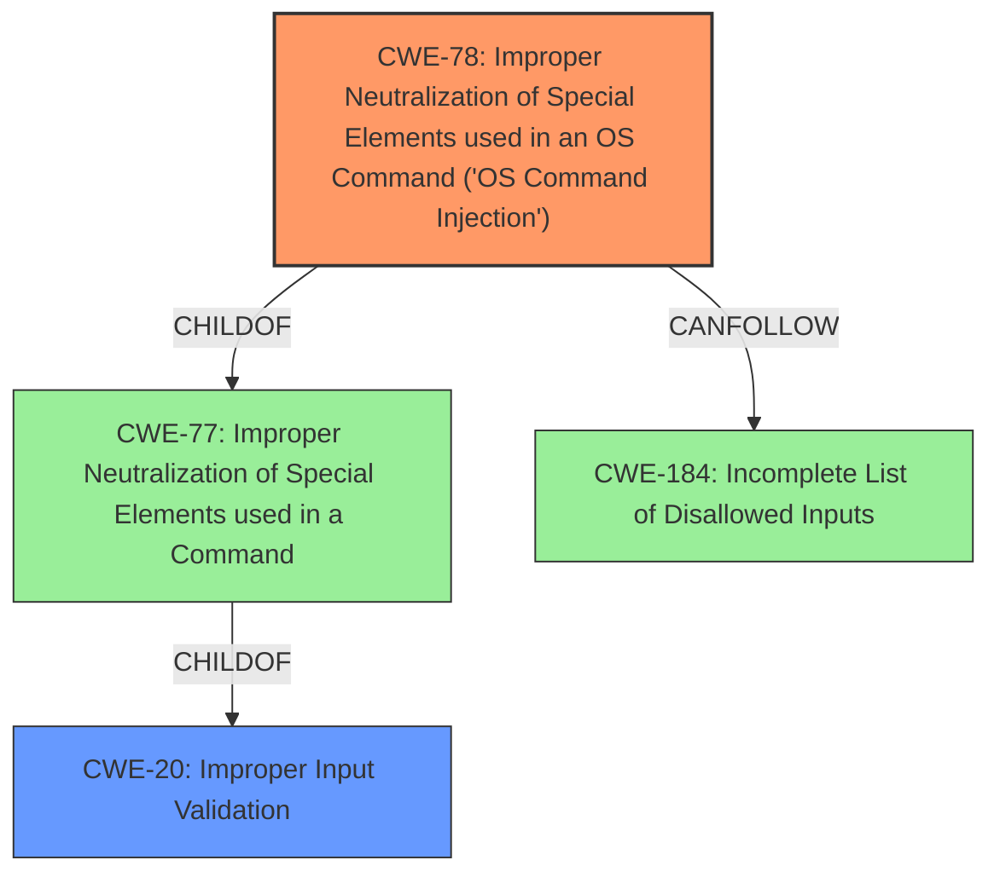

# Enhanced Analysis for CVE-2022-45875

# Summary
| CWE ID | CWE Name | Confidence | CWE Abstraction Level | CWE Vulnerability Mapping Label | CWE-Vulnerability Mapping Notes |
|---|---|---|---|---|---|
| CWE-78 | Improper Neutralization of Special Elements used in an OS Command ('OS Command Injection') | 0.9 | Base | Allowed | Primary CWE |
| CWE-20 | Improper Input Validation | 0.7 | Class | Discouraged | Secondary Candidate |

## Evidence and Confidence

*   **Confidence Score:** 0.8
*   **Evidence Strength:** HIGH

## Relationship Analysis
The primary relationship influencing the CWE selection is the parent-child relationship between CWE-77 (Improper Neutralization of Special Elements used in a Command) and CWE-78 (Improper Neutralization of Special Elements used in an OS Command ('OS Command Injection')). CWE-78 is more specific because the vulnerability leads to OS command execution. Additionally, CWE-78 can follow CWE-184 (Incomplete List of Disallowed Inputs), suggesting that an incomplete list of disallowed inputs could lead to command injection. CWE-20 (Improper Input Validation) is a parent of CWE-78 which highlights the general category of the root cause.



## Vulnerability Chain
The vulnerability chain starts with **improper validation of script alert plugin parameters**. This **root cause** leads to the ability to inject OS commands, resulting in remote command execution.

## Summary of Analysis
The initial analysis identified that the **improper validation** of script alert plugin parameters leads to remote command execution, suggesting a command injection vulnerability. The evidence from the "CVE Reference Links Content Summary" section confirms this, stating that the **root cause** is the **improper validation of script alert plugin parameters** leading to a remote command execution vulnerability.

The retriever results listed CWE-78 (Improper Neutralization of Special Elements used in an OS Command ('OS Command Injection')) with a high score, supporting the initial assessment. CWE-20 (Improper Input Validation) was also a high scoring result, but is too general.

The relationship analysis indicated that CWE-78 is a child of CWE-77 (Improper Neutralization of Special Elements used in a Command) and that CWE-78 can follow CWE-184 (Incomplete List of Disallowed Inputs), forming a potential vulnerability chain where an incomplete list of disallowed inputs allows the injection of OS commands.

Based on the evidence and relationship analysis, CWE-78 is the most appropriate and specific CWE.

Relevant CWE Information:

# Enhanced Context (25 CWEs)

## Vulnerability Description
**Improper validation of script alert plugin parameters** in Apache DolphinScheduler to avoid remote command execution vulnerability. This issue affects Apache DolphinScheduler version 3.0.1 and prior versions version 3.1.0 and prior versions. This attack can be performed only by authenticated users which can login to DS.

### Vulnerability Description Key Phrases
- **rootcause:** **Improper validation of script alert plugin parameters**
- **vector:** remote command execution
- **attacker:** authenticated users
- **product:** Apache DolphinScheduler
- **version:** 3.0.1 and prior versions and 3.1.0 and prior versions

## CVE Reference Links Content Summary
Based on the provided content, here's an analysis of CVE-2022-45875:

**Root Cause of Vulnerability:**

*   Improper validation of script alert plugin parameters in Apache DolphinScheduler.

**Weaknesses/Vulnerabilities Present:**

*   Remote command execution vulnerability. This indicates that an attacker can execute arbitrary commands on the server running the vulnerable application.

**Impact of Exploitation:**

*   Remote command execution leading to full control of the server.

**Attack Vectors:**

*   The vulnerability is located in the script alert plugin of Apache DolphinScheduler.

**Required Attacker Capabilities/Position:**

*   The attacker needs to be an authenticated user with the ability to login to DolphinScheduler.

**Additional Information:**

*   The vulnerability affects Apache DolphinScheduler versions 3.0.0 to 3.0.1 and 3.1.0 and prior versions.
*   The vulnerability was discovered by 4ra1n of Chaitin Tech.

## Retriever Results

### Top Combined Results

| Rank | CWE ID | Name | Abstraction | Usage  | Retrievers | Individual Scores |
|------|--------|------|-------------|-------|------------|-------------------|
| 1 | 116 | Improper Encoding or Escaping of Output | Class | Allowed-with-Review | sparse | 0.307 |
| 2 | 22 | Improper Limitation of a Pathname to a Restricted Directory ('Path Traversal') | Base | Allowed | sparse | 0.298 |
| 3 | 20 | Improper Input Validation | Class | Discouraged | sparse | 0.294 |
| 4 | 78 | Improper Neutralization of Special Elements used in an OS Command ('OS Command Injection') | Base | Allowed | sparse | 0.293 |
| 5 | 502 | Deserialization of Untrusted Data | Base | Allowed | sparse | 0.293 |
| 6 | 306 | Missing Authentication for Critical Function | Base | Allowed | dense | 0.504 |
| 7 | 73 | External Control of File Name or Path | Base | Allowed | graph | 0.003 |
| 8 | 472 | External Control of Assumed-Immutable Web Parameter | Base | Allowed | sparse | 0.291 |
| 9 | 79 | Improper Neutralization of Input During Web Page Generation ('Cross-site Scripting') | Base | Allowed | sparse | 0.289 |
| 10 | 287 | Improper Authentication | Class | Discouraged | sparse | 0.288 |

# Complete CWE Specifications

### CWE-78: Improper Neutralization of Special Elements used in an OS Command ('OS Command Injection')
The product constructs all or part of an OS command using externally-influenced input from an upstream component, but it does not neutralize or incorrectly neutralizes special elements that could modify the intended OS command when it is sent to a downstream component.

The vulnerability description states that there is **improper validation of script alert plugin parameters** leading to remote command execution. This aligns directly with CWE-78, where the product constructs an OS command using external input but fails to neutralize special elements. The security implication is that an attacker can execute arbitrary commands on the server.

### CWE-20: Improper Input Validation
The product receives input or data, but it does not validate or incorrectly validates that the input has the properties that are required to process the data safely and correctly.

The vulnerability stems from **improper validation**, which is a clear indicator for CWE-20. However, CWE-20 is a class-level CWE and is discouraged for use when more specific CWEs are available. While the **improper validation** is the root cause, the more precise consequence is OS command injection (CWE-78), so that is a better fit.

### Other CWEs Considered and Rejected:

*   CWE-116 (Improper Encoding or Escaping of Output): While encoding/escaping issues can sometimes lead to command injection, the primary weakness here is the **improper validation** of input, not the encoding of output.
*   CWE-22 (Improper Limitation of a Pathname to a Restricted Directory ('Path Traversal')): This CWE is not relevant because the vulnerability does not involve path traversal.
*   CWE-502 (Deserialization of Untrusted Data): This CWE is not relevant since the vulnerability does not involve deserialization.
*   CWE-306 (Missing Authentication for Critical Function): The vulnerability requires authenticated users, so it is not a missing authentication issue.
*   CWE-73 (External Control of File Name or Path): This CWE is not relevant because the vulnerability does not involve file name or path control.
*   CWE-472 (External Control of Assumed-Immutable Web Parameter): This CWE is not relevant because the vulnerability doesn't involve assumed-immutable web parameters.
*   CWE-79 (Improper Neutralization of Input During Web Page Generation ('Cross-site Scripting')): This CWE


## CWE Relationship Analysis

Current CWEs represent these abstraction levels: .


### Vulnerability Chain Analysis

**Chain starting from CWE-472:**
- 472 (External Control of Assumed-Immutable Web Parameter) - ROOT


**Chain starting from CWE-184:**
- 184 (Incomplete List of Disallowed Inputs) - ROOT


### CWE Relationship Diagram

```mermaid
graph TD
    classDef primary fill:#f96,stroke:#333,stroke-width:2px
    classDef secondary fill:#69f,stroke:#333
    classDef tertiary fill:#9e9,stroke:#333
```