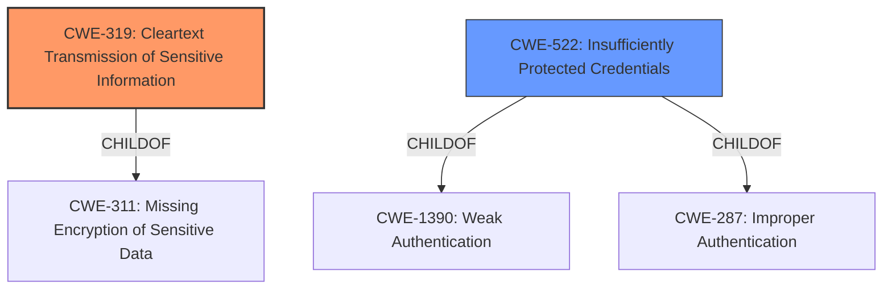

# Analysis Report for CVE-2022-45877

# Vulnerability Analysis Report: CVE-2022-45877

## Description


## Analysis (with Relationship Data)

# Summary
| CWE ID | CWE Name | Confidence | CWE Abstraction Level | CWE Vulnerability Mapping Label | CWE-Vulnerability Mapping Notes |
|---|---|---|---|---|---|
| CWE-319 | Cleartext Transmission of Sensitive Information | 1.0 | Base | Allowed | Primary CWE |
| CWE-522 | Insufficiently Protected Credentials | 0.7 | Class | Allowed-with-Review | Secondary Candidate |

## Evidence and Confidence

*   **Confidence Score:** 0.9
*   **Evidence Strength:** HIGH

## Relationship Analysis
The primary CWE selected is CWE-319, which is a Base level CWE. It is a child of CWE-311 (Missing Encryption of Sensitive Data). CWE-522 is a Class level CWE, and is related to CWE-1390 and CWE-287 both related to authentication issues. Since the specific issue is the transmission of the PIN in cleartext, CWE-319 is the more appropriate choice.



## Vulnerability Chain
The chain of events for this vulnerability:
1.  **Root Cause:** The **PIN code is transmitted to the peer device in plain text** during cross-device authentication. (CWE-319)
2.  **Impact:** Network attackers can bypass the authentication process, reducing the difficulty of man-in-the-middle attacks.

## Summary of Analysis
The vulnerability description clearly states that the **PIN code is transmitted to the peer device in plain text** during cross-device authentication, making it susceptible to man-in-the-middle attacks. The "CVE Reference Links Content Summary" section reinforces this by stating, "The vulnerability lies in the transmission of the PIN code in plaintext during cross-device authentication." This directly aligns with the description of CWE-319 (Cleartext Transmission of Sensitive Information).

CWE-319 is a Base level CWE, which is the preferred level of abstraction. The Mapping Guidance for CWE-319 states, "This CWE entry is at the Base level of abstraction, which is a preferred level of abstraction for mapping to the root causes of vulnerabilities." The usage is ALLOWED.

I considered CWE-522 (Insufficiently Protected Credentials) because the plaintext transmission exposes the credentials. However, the core issue is the transmission itself, not the storage or protection at rest. Therefore, CWE-319 is a more accurate and specific representation of the vulnerability.

Relevant CWE Information:
*   CWE-319: Cleartext Transmission of Sensitive Information
*   CWE-522: Insufficiently Protected Credentials


## CWE Relationship Analysis

Current CWEs represent these abstraction levels: .


### Vulnerability Chain Analysis

**Chain starting from CWE-319:**
- 319 (Cleartext Transmission of Sensitive Information) - ROOT


**Chain starting from CWE-522:**
- 522 (Insufficiently Protected Credentials) - ROOT


### CWE Relationship Diagram

```mermaid
graph TD
    classDef primary fill:#f96,stroke:#333,stroke-width:2px
    classDef secondary fill:#69f,stroke:#333
    classDef tertiary fill:#9e9,stroke:#333
```


*Report generated on 2025-03-30 12:35:37*
