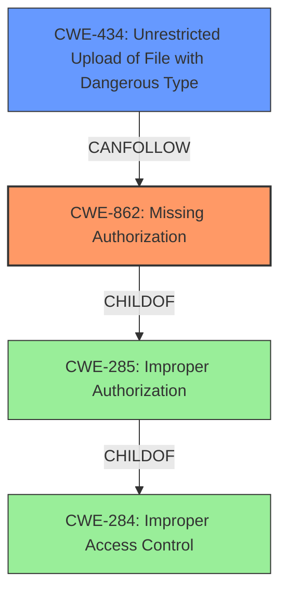

# Raw Analyzer Response for CVE-2022-45891

# Summary
| CWE ID | CWE Name | Confidence | CWE Abstraction Level | CWE Vulnerability Mapping Label | CWE-Vulnerability Mapping Notes |
|---|---|---|---|---|---|
| CWE-862 | Missing Authorization | 0.9 | Class | Primary | Allowed-with-Review |
| CWE-434 | Unrestricted Upload of File with Dangerous Type | 0.8 | Base | Secondary | Allowed |

## Evidence and Confidence

*   **Confidence Score:** 0.85
*   **Evidence Strength:** HIGH

## Relationship Analysis
The primary relationship that impacted the decision was the ChildOf relationship between CWE-862 **Missing Authorization** and CWE-285 **Improper Authorization**, and CWE-284 **Improper Access Control**.
CWE-862 is a more specific child of the more general CWE-285, which is in turn a child of CWE-284. Since the **authorization** check is **missing** entirely, CWE-862 is more appropriate than CWE-863 **Incorrect Authorization**, where an **authorization** check is performed, but is done incorrectly.
CWE-434 **Unrestricted Upload of File with Dangerous Type** can result from **missing authorization**.

## Vulnerability Chain
The chain of root cause and weaknesses is as follows:
1.  **Missing Authorization (CWE-862):** The application **fails to perform authorization** checks.
2.  **Unrestricted Upload of File with Dangerous Type (CWE-434):** As a consequence of the **missing authorization**, attackers can upload files without proper validation.
3.  Impact: Attackers can call restricted functions, perform unauthenticated uploads, and access content uploaded by other users.

## Summary of Analysis
The initial assessment identified **Missing Authorization (CWE-862)** as the primary weakness, allowing unauthenticated access to restricted functionalities and data. The key evidence supporting this classification is the statement, "Planet eStream before 6.72.10.07 allows attackers to call restricted functions, and perform unauthenticated uploads (Upload2.ashx) or access content uploaded by other users (View.aspx after Ajax.asmx/SaveGrantAccessList)." The CVE Reference Links Content Summary also mentions "Flaws in the **authorization** scheme of the web application" and "**Authorization bypass** vulnerability that allows an attacker to get access to restricted functions of the web application."
The retriever results listed CWE-863 **Incorrect Authorization**, CWE-862 **Missing Authorization**, CWE-285 **Improper Authorization**, CWE-425 **Direct Request ('Forced Browsing')**, CWE-284 **Improper Access Control**, CWE-434 **Unrestricted Upload of File with Dangerous Type**, CWE-183 **Permissive List of Allowed Inputs**, and CWE-639 **Authorization Bypass Through User-Controlled Key**.
CWE-862 is a Class-level CWE. The description for CWE-862 states: "The product does not perform an **authorization** check when an actor attempts to access a resource or perform an action." This aligns with the **missing authorization** in the vulnerability description allowing attackers to call restricted functions and upload files.
CWE-434 **Unrestricted Upload of File with Dangerous Type** is included because the vulnerability description mentions "unauthenticated uploads". CWE-434 is a base-level CWE. The description for CWE-434 states: "The product allows the upload or transfer of dangerous file types that are automatically processed within its environment." This aligns with the ability to perform unauthenticated uploads.
CWE-863 **Incorrect Authorization** was considered but not used because it describes scenarios where an **authorization** check is performed incorrectly, whereas the vulnerability description indicates that **authorization** checks are **missing** altogether.
CWE-285 **Improper Authorization** was considered but not used because it is a higher-level Class, and CWE-862 **Missing Authorization** is a more specific child of CWE-285. The mapping guidance for CWE-285 discourages its use and suggests mapping to CWE-862 instead.
CWE-284 **Improper Access Control** was considered but not used because it is a Pillar-level CWE, and CWE-862 **Missing Authorization** is a more specific descendant of CWE-284. The mapping guidance for CWE-284 discourages its use and suggests using more specific descendants.
CWE-425 **Direct Request ('Forced Browsing')** was considered but not used because the primary issue is the **lack of authorization** checks, rather than direct access to resources without proper navigation.
CWE-183 **Permissive List of Allowed Inputs** was considered but not used because there is no evidence that the application uses a permissive list of allowed inputs that is too permissive.
CWE-639 **Authorization Bypass Through User-Controlled Key** was considered but not used because there is no mention of a user-controlled key being used to bypass **authorization**.

The selected CWEs, CWE-862 **Missing Authorization** and CWE-434 **Unrestricted Upload of File with Dangerous Type**, are at the optimal level of specificity, representing the **root cause** and a direct consequence of the vulnerability, respectively. They are also base and class level which are preferred levels of abstraction.

Relevant CWE Information:

# Enhanced Context (25 CWEs)

## CWE-41: Improper Resolution of Path Equivalence
**Abstraction Level**: Base
**Similarity Score**: 0.78
**Source**: dense

**Description**:
The product is vulnerable to file system contents disclosure through path equivalence. Path equivalence involves the use of special characters in file and directory names. The associated manipulations are intended to generate multiple names for the same object.

**Mapping Guidance**:
- Usage: Allowed
- Rationale: This CWE entry is at the Base level of abstraction, which is a preferred level of abstraction for mapping to the root causes of vulnerabilities.

## CWE-23: Relative Path Traversal
**Abstraction Level**: Base
**Similarity Score**: 0.78
**Source**: dense

**Description**:
The product uses external input to construct a pathname that should be within a restricted directory, but it does not properly neutralize sequences such as ".." that can resolve to a location that is outside of that directory.

**Mapping Guidance**:
- Usage: Allowed
- Rationale: This CWE entry is at the Base level of abstraction, which is a preferred level of abstraction for mapping to the root causes of vulnerabilities.

## CWE-24: Path Traversal: '../filedir'
**Abstraction Level**: Variant
**Similarity Score**: 0.77
**Source**: dense

**Description**:
The product uses external input to construct a pathname that should be within a restricted directory, but it does not properly neutralize "../" sequences that can resolve to a location that is outside of that directory.

**Mapping Guidance**:
- Usage: Allowed
- Rationale: This CWE entry is at the Variant level of abstraction, which is a preferred level of abstraction for mapping to the root causes of vulnerabilities.

## CWE-36: Absolute Path Traversal
**Abstraction Level**: Base
**Similarity Score**: 0.77
**Source**: dense

**Description**:
The product uses external input to construct a pathname that should be within a restricted directory, but it does not properly neutralize absolute path sequences such as "/abs/path" that can resolve to a location that is outside of that directory.

**Mapping Guidance**:
- Usage: Allowed
- Rationale: This CWE entry is at the Base level of abstraction, which is a preferred level of abstraction for mapping to the root causes of vulnerabilities.

## CWE-73: External Control of File Name or Path
**Abstraction Level**: Base
**Similarity Score**: 0.76
**Source**: dense

**Description**:
The product allows user input to control or influence paths or file names that are used in filesystem operations.

**Mapping Guidance**:
- Usage: Allowed
- Rationale: This CWE entry is at the Base level of abstraction, which is a preferred level of abstraction for mapping to the root causes of vulnerabilities.

## CWE-552: Files or Directories Accessible to External Parties
**Abstraction Level**: Base
**Similarity Score**: 0.76
**Source**: dense

**Description**:
The product makes files or directories accessible to unauthorized actors, even