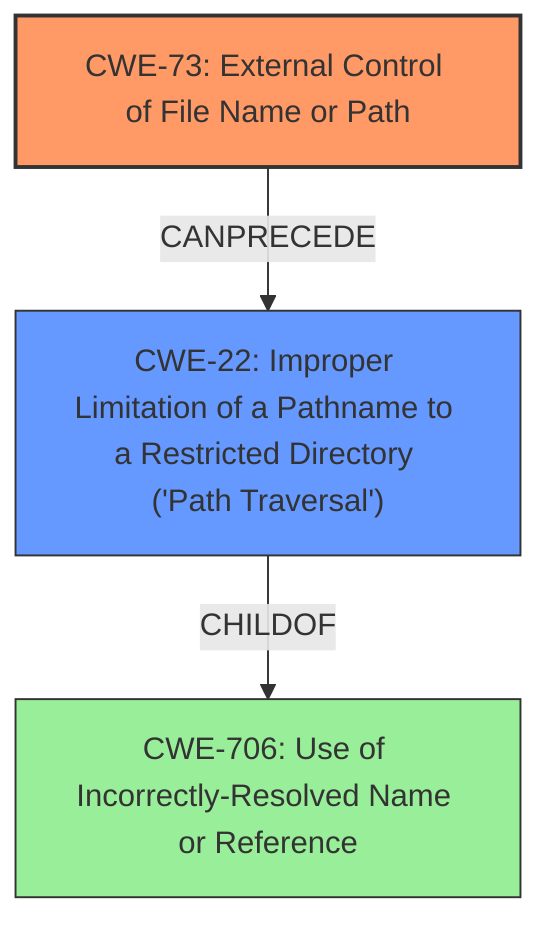

# Analysis for CVE-2022-45918

# Summary
| CWE ID | CWE Name | Confidence | CWE Abstraction Level | CWE Vulnerability Mapping Label | CWE-Vulnerability Mapping Notes |
|---|---|---|---|---|---|
| CWE-73 | External Control of File Name or Path | 1.0 | Base | Allowed | Primary CWE |
| CWE-22 | Improper Limitation of a Pathname to a Restricted Directory ('Path Traversal') | 0.8 | Base | Allowed | Secondary Candidate |

## Evidence and Confidence

*   **Confidence Score:** 0.9
*   **Evidence Strength:** HIGH

## Relationship Analysis
The primary CWE, CWE-73, represents the root cause of the vulnerability, where user input directly influences file paths. The secondary CWE, CWE-22, is a child of CWE-706 (Use of Incorrectly-Resolved Name or Reference) and represents a specific instance of path traversal, often resulting from inadequate restrictions on pathnames. CWE-73 can precede CWE-22 because external control over the file name or path sets the stage for potential path traversal if not properly validated. The choice of CWE-73 as the primary weakness reflects its direct involvement as the **root cause**, while CWE-22 describes a common consequence or attack vector.

## Vulnerability Chain
The vulnerability chain starts with external control of the file name or path (CWE-73). This is followed by the **improper** limitation of a pathname to a restricted directory, leading to path traversal (CWE-22). The final impact is the ability to access arbitrary files on the server.

## Summary of Analysis
The analysis is strongly based on the provided evidence, particularly the "CVE Reference Links Content Summary" section. The vulnerability description explicitly states "ILIAS before 7.16 allows External Control of File Name or Path." The CVE Reference Links Content Summary states, "The vulnerability stems from the SCORM editor's debugger in the ILIAS e-learning platform, which fails to properly validate the file path requested when accessing logs of previous sessions." This is direct evidence supporting CWE-73. The additional observation in the CVE Reference Links Content Summary that the debugger allows access to arbitrary files due to a lack of input validation on the "logFile" query parameter further supports the potential for path traversal (CWE-22) and the root cause is the **improper validation** of the file path.

The graph relationships confirm that external control of the file name or path can lead to path traversal. CWE-73 is at the optimal level of specificity because it accurately captures the **root cause**. While CWE-22 is a valid concern, it is a consequence of the **missing** input validation.

Relevant CWE Information:

# Enhanced Context (25 CWEs)
The following CWEs were identified as potentially relevant to this vulnerability:

## CWE-73: External Control of File Name or Path
**Abstraction Level**: Base
**Similarity Score**: 0.79
**Source**: dense

**Description**:
The product allows user input to control or influence paths or file names that are used in filesystem operations.

**Mapping Guidance**:
- Usage: Allowed
- Rationale: This CWE entry is at the Base level of abstraction, which is a preferred level of abstraction for mapping to the root causes of vulnerabilities.

## CWE-22: Improper Limitation of a Pathname to a Restricted Directory ('Path Traversal')
**Abstraction Level**: Base
**Similarity Score**: 7228.70
**Source**: sparse

**Description**:
The product uses external input to construct a pathname that is intended to identify a file or directory that is located underneath a restricted parent directory, but the product does not properly neutralize special elements within the pathname that can cause the pathname to resolve to a location that is outside of the restricted directory.

**Mapping Guidance**:
- Usage: Allowed
- Rationale: This CWE entry is at the Base level of abstraction, which is a preferred level of abstraction for mapping to the root causes of vulnerabilities.

## CWE-23: Relative Path Traversal
**Abstraction Level**: Base
**Similarity Score**: 0.77
**Source**: dense

**Description**:
The product uses external input to construct a pathname that should be within a restricted directory, but it does not properly neutralize sequences such as ".." that can resolve to a location that is outside of that directory.

**Mapping Guidance**:
- Usage: Allowed
- Rationale: This CWE entry is at the Base level of abstraction, which is a preferred level of abstraction for mapping to the root causes of vulnerabilities.

## CWE-209: Generation of Error Message Containing Sensitive Information
**Abstraction:** Base
**Status:** Draft

### Description
The product generates an error message that includes sensitive information about its environment, users, or associated data.

### Extended Description

The sensitive information may be valuable information on its own (such as a password), or it may be useful for launching other, more serious attacks. The error message may be created in different ways:

  - self-generated: the source code explicitly constructs the error message and delivers it

  - externally-generated: the external environment, such as a language interpreter, handles the error and constructs its own message, whose contents are not under direct control by the programmer

An attacker may use the contents of error messages to help launch another, more focused attack. For example, an attempt to exploit a path traversal weakness (CWE-22) might yield the full pathname of the installed application. In turn, this could be used to select the proper number of ".." sequences to navigate to the targeted file. An attack using SQL injection (CWE-89) might not initially succeed, but an error message could reveal the malformed query, which would expose query logic and possibly even passwords or other sensitive information used within the query.

## Other Considered CWEs:

*   **CWE-209 (Generation of Error Message Containing Sensitive Information):** While this could be a secondary impact if error messages reveal sensitive path information, it is not the primary weakness.
*   **CWE-23 (Relative Path Traversal):** This is a more specific form of CWE-22 but both depend on CWE-73 for exploitation in this case.
*   **CWE-639 (Authorization Bypass Through User-Controlled Key):** This is not applicable because the vulnerability is related to file path manipulation, not user authorization.
*   **CWE-45 (Path Equivalence: 'file...name' (Multiple Internal Dot)):** This is a specific type of path manipulation that is not explicitly mentioned in the vulnerability description.
*   **CWE-59 (Improper Link Resolution Before File Access ('Link Following')):** This is not applicable as the vulnerability does not involve symbolic links.
*   **CWE-642 (External Control of Critical State Data):** While related to external control, this is too broad and CWE-73 is a more specific fit.
*   **CWE-434 (Unrestricted Upload of File with Dangerous Type):** This is not applicable as the vulnerability does not involve file uploads.
*   **CWE-74 (Improper Neutralization of Special Elements in Output Used by a Downstream Component ('Injection')):** This is a class-level CWE, and more specific CWEs like CWE-73 are more appropriate.