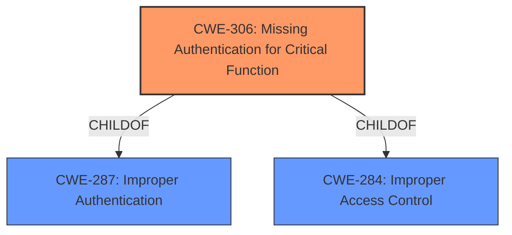

# Analysis for CVE-2022-45933

# Summary
| CWE ID | CWE Name | Confidence | CWE Abstraction Level | CWE Vulnerability Mapping Label | CWE-Vulnerability Mapping Notes |
|---|---|---|---|---|---|
| CWE-306 | Missing Authentication for Critical Function | 1.0 | Base | Allowed | Primary CWE |

## Evidence and Confidence

*   **Confidence Score:** 1.0
*   **Evidence Strength:** HIGH

## Relationship Analysis
The primary CWE is CWE-306, which is a Base level CWE. It is a child of CWE-287 (Improper Authentication) and CWE-284 (Improper Access Control). While CWE-287 and CWE-284 are related, CWE-306 is the most specific and accurate representation of the vulnerability.

## Vulnerability Chain
The vulnerability chain starts with the **lack of authentication** for a critical function, specifically the `/api/scrape/kube-system` endpoint. This **missing authentication** leads to the **exposure of sensitive information**, namely Kubernetes certificate files. Finally, this **exposure** allows an attacker to gain full control of the Kubernetes cluster.
  - **Root Cause:** CWE-306 (Missing Authentication for Critical Function)
  - **Impact:** Full Cluster Takeover

## Summary of Analysis
The initial analysis of the vulnerability description clearly points to CWE-306 (Missing Authentication for Critical Function) as the most appropriate CWE. The vulnerability description key phrases include "**rootcause:** **KubeView through 0.1.31 does not require authentication**" which directly aligns with the definition of CWE-306. The Retriever Results also list CWE-306 as the top candidate. The CVE Reference Links Content Summary confirms this by stating: "**Lack of Authentication:** The primary vulnerability is the absence of authentication on the API endpoint, which allows anyone to access the sensitive data."

Given the direct match between the vulnerability description and CWE-306, along with its Base level abstraction and the Allowed mapping guidance, CWE-306 is the optimal choice.

CWE-287 (Improper Authentication) was considered, but it is a more general Class-level CWE, and CWE-306 is a more specific and accurate representation of the **missing authentication** issue.

CWE-923 (Improper Restriction of Communication Channel to Intended Endpoints) was considered but this is not the primary issue, the primary issue is the **missing authentication** not the channel.

CWE-319 (Cleartext Transmission of Sensitive Information) was not selected because while sensitive information is exposed, the primary issue is the **lack of authentication** that allows the exposure to occur in the first place. The information is not being transmitted, but rather is made available.

CWE-285 (Improper Authorization) was not selected because authorization is not the issue; it is that no authentication is required at all to obtain sensitive data.

CWE-863 (Incorrect Authorization) was not selected because authorization is not the issue; it is that no authentication is required at all to obtain sensitive data.