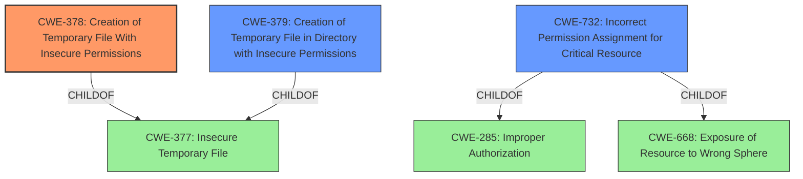

# Analysis Report for CVE-2022-45935

# Vulnerability Analysis Report: CVE-2022-45935

## Description


## Analysis (with Relationship Data)

# Summary
| CWE ID | CWE Name | Confidence | CWE Abstraction Level | CWE Vulnerability Mapping Label | CWE-Vulnerability Mapping Notes |
|---|---|---|---|---|---|
| CWE-378 | Creation of Temporary File With Insecure Permissions | 1.0 | Base | Allowed | Primary CWE |
| CWE-379 | Creation of Temporary File in Directory with Insecure Permissions | 0.7 | Base | Allowed | Secondary Candidate |
| CWE-732 | Incorrect Permission Assignment for Critical Resource | 0.6 | Class | Allowed-with-Review | Secondary Candidate |

## Evidence and Confidence

*   **Confidence Score:** 0.9
*   **Evidence Strength:** HIGH

## Relationship Analysis
The primary CWE, CWE-378, is a base-level CWE that describes the **creation of temporary files with insecure permissions**. It is a child of CWE-377, which is a class-level CWE for insecure temporary files. CWE-379, a secondary candidate, is also a child of CWE-377 and represents the creation of temporary files in directories with insecure permissions. CWE-732 represents incorrect permission assignment for a critical resource and is a child of both CWE-285 and CWE-668. The relationship between these CWEs helped to narrow down the selection to the most specific base-level CWE.



## Vulnerability Chain
The vulnerability chain starts with the **root cause**, which is the **usage of temporary files with insecure permissions**. This leads to the impact, which is that an attacker with local access can access private user data in transit.

## Summary of Analysis
The initial analysis focused on the **root cause** identified in the vulnerability description: "**Usage of temporary files with insecure permissions**". This directly aligns with CWE-378 (Creation of Temporary File With Insecure Permissions), which is a base-level CWE and thus preferred. The vulnerability description explicitly mentions insecure permissions on temporary files, making CWE-378 the most accurate representation of the weakness.

The choice of CWE-378 is based on the evidence: "**Usage of temporary files with insecure permissions** by the Apache James server allows an attacker with local access to access private user data in transit." This statement clearly indicates the **insecure permissions** on the temporary files are the **root cause** of the vulnerability.

Other CWEs considered included:

*   CWE-379 (Creation of Temporary File in Directory with Insecure Permissions): Considered because it's similar to CWE-378 but more specific about the directory. However, the description doesn't specify if the directory itself has insecure permissions, making CWE-378 a better fit.
*   CWE-732 (Incorrect Permission Assignment for Critical Resource): Considered because it relates to permission issues. However, it's a class-level CWE and less specific than CWE-378, which directly addresses the insecure temporary file issue.
*   CWE-377 (Insecure Temporary File): This is a class-level CWE and a parent of CWE-378. While relevant, CWE-378 provides a more specific description of the vulnerability.

The final selection of CWE-378 is justified by its direct match to the **root cause** described in the vulnerability, its base-level abstraction, and the MITRE mapping guidance that allows its usage.


## CWE Relationship Analysis

Current CWEs represent these abstraction levels: .


### Vulnerability Chain Analysis

**Chain starting from CWE-377:**
- 377 (Insecure Temporary File) - ROOT


**Chain starting from CWE-668:**
- 668 (Exposure of Resource to Wrong Sphere) - ROOT


### CWE Relationship Diagram

```mermaid
graph TD
    classDef primary fill:#f96,stroke:#333,stroke-width:2px
    classDef secondary fill:#69f,stroke:#333
    classDef tertiary fill:#9e9,stroke:#333
```


*Report generated on 2025-03-30 18:34:28*
