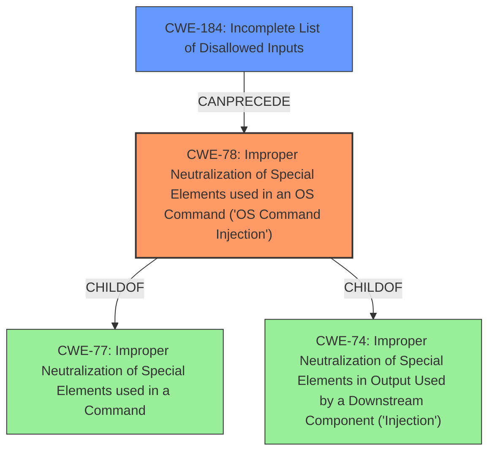

# Enhanced Analysis for CVE-2022-45942

# Summary
| CWE ID  | CWE Name                                                                                      | Confidence | CWE Abstraction Level | CWE Vulnerability Mapping Label | CWE-Vulnerability Mapping Notes |
| :-------- | :--------------------------------------------------------------------------------------------- | :---------- | :---------------------- | :------------------------------ | :------------------------------ |
| CWE-78  | Improper Neutralization of Special Elements used in an OS Command ('OS Command Injection') | 1         | Base                    | Primary CWE                    | Allowed                       |
| CWE-184 | Incomplete List of Disallowed Inputs                                                            | 0.7       | Base                    | Secondary CWE                    | Allowed                       |

## Evidence and Confidence

*   **Confidence Score:** 0.85
*   **Evidence Strength:** HIGH

## Relationship Analysis
The primary relationship is that CWE-78 **(Improper Neutralization of Special Elements used in an OS Command ('OS Command Injection'))** is often related to improper input validation. The CWE-184 **(Incomplete List of Disallowed Inputs)** can precede CWE-78, indicating a chain where an incomplete list of disallowed inputs leads to OS Command Injection. CWE-78 is a child of CWE-77 **(Improper Neutralization of Special Elements used in a Command)** and CWE-74 **(Improper Neutralization of Special Elements in Output Used by a Downstream Component ('Injection'))**, but CWE-78 is more specific and directly relevant.



## Vulnerability Chain
The vulnerability chain starts with **insufficient input sanitization** which can be categorized as **CWE-184 (Incomplete List of Disallowed Inputs)**. This leads to **CWE-78 (Improper Neutralization of Special Elements used in an OS Command ('OS Command Injection'))** due to the unsanitized input being used in the `system()` call, resulting in **Remote Code Execution (RCE)**.

## Summary of Analysis
Initially, the vulnerability description points towards a command injection issue due to the use of user-controlled input in the `system()` function call. The **root cause** is that the `$file_full_path` parameter, constructed with user-controlled input `$url`, is passed to `system()` without sufficient sanitization. This aligns directly with **CWE-78 (Improper Neutralization of Special Elements used in an OS Command ('OS Command Injection'))**. The evidence is found in the "CVE Reference Links Content Summary" section: "The vulnerability lies in the `system()` function call within the `file_save()` function in `includes/baijiacms/common.inc.php` (line 654). The `$file_full_path` parameter, which is partially user-controlled, is passed to the `system()` function without sufficient sanitization."

Additionally, the application's **failure** to adequately sanitize the filename extracted from the URL can be seen as **CWE-184 (Incomplete List of Disallowed Inputs)**, contributing to the command injection. The `pathinfo()` function extracts the file extension, which is then directly used in constructing the file path passed to `system()`.

The hierarchical relationships and chain patterns support the selection of CWE-78 as the primary CWE due to its direct relevance to the command injection vulnerability. CWE-184 is included as a secondary CWE because the **incomplete sanitization** of user-provided input is a contributing factor.

The selected CWEs are at the optimal level of specificity, with CWE-78 being a Base level CWE and directly describing the **OS command injection** and CWE-184 describing the **incomplete sanitization**.

Relevant CWE Information:
- CWE-78: Improper Neutralization of Special Elements used in an OS Command ('OS Command Injection')
- CWE-184: Incomplete List of Disallowed Inputs


## CWE Relationship Analysis

Current CWEs represent these abstraction levels: .


### Vulnerability Chain Analysis

**Chain starting from CWE-78:**
- 78 (Improper Neutralization of Special Elements used in an OS Command ('OS Command Injection')) - ROOT


**Chain starting from CWE-77:**
- 77 (Improper Neutralization of Special Elements used in a Command ('Command Injection')) - ROOT


### CWE Relationship Diagram

```mermaid
graph TD
    classDef primary fill:#f96,stroke:#333,stroke-width:2px
    classDef secondary fill:#69f,stroke:#333
    classDef tertiary fill:#9e9,stroke:#333
```