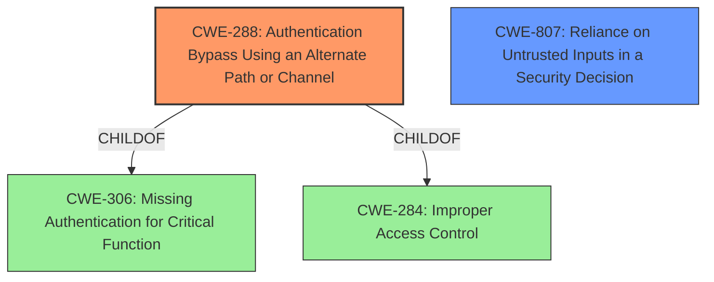

# Analysis for CVE-2022-46076

# Summary
| CWE ID | CWE Name | Confidence | CWE Abstraction Level | CWE Vulnerability Mapping Label | CWE-Vulnerability Mapping Notes |
|---|---|---|---|---|---|
| CWE-288 | Authentication Bypass Using an Alternate Path or Channel | 0.9 | Base | Allowed | Primary CWE |
| CWE-807 | Reliance on Untrusted Inputs in a Security Decision | 0.7 | Base | Allowed | Secondary CWE Candidate |

## Evidence and Confidence

*   **Confidence Score:** 0.8
*   **Evidence Strength:** HIGH

## Relationship Analysis
The primary CWE is CWE-288 (Authentication Bypass Using an Alternate Path or Channel). This is a base-level CWE, indicating a specific type of weakness. Several other CWEs were considered, particularly those related to authentication and credential management (e.g., CWE-259, CWE-798, CWE-1392), but CWE-288 best captures the core issue of bypassing authentication through an alternate path. CWE-807 is a base level CWE which indicates the reliance on untrusted inputs in making a security decision.

## Vulnerability Chain
The vulnerability chain starts with **Improper Input Validation** in the `phpcgi` component, leading to **Authentication Bypass**, and ultimately resulting in access to router credentials and potential for further exploitation.

## Summary of Analysis
The analysis is heavily based on the provided evidence, particularly the "CVE Reference Links Content Summary" section. The description clearly states that the `phpcgi` component has a flaw in how it validates requests, allowing attackers to bypass authorization.

>   **Root Cause of Vulnerability:**
>
>   *   The vulnerability lies in the `phpcgi` component of the D-Link DIR-869 router firmware. This component is responsible for processing requests to `.php`, `.asp`, and `.txt` files. It also handles user authorization checks. The core issue is a flaw in how `phpcgi` validates requests, which allows an attacker to bypass the authorization process.
>
>   **Weaknesses/Vulnerabilities Present:**
>
>   *   **Authentication Bypass:** The primary vulnerability is an authentication bypass. An attacker can craft a specific request that circumvents the normal authorization checks performed by `phpcgi`.
>   *   **Improper Input Validation:** The `phpcgi` component does not properly validate incoming requests, allowing specially crafted requests to bypass authentication.

CWE-288 (Authentication Bypass Using an Alternate Path or Channel) is the most appropriate because it directly addresses the **authentication bypass** achieved through a flaw in the request validation process. The `phpcgi` component effectively provides an alternate path that circumvents the intended authentication mechanism.

CWE-807 (Reliance on Untrusted Inputs in a Security Decision) is a secondary consideration because the **authentication bypass** is a direct consequence of trusting and improperly validating input.

Other CWEs considered but deemed less suitable:

*   CWE-259 (Use of Hard-coded Password), CWE-798 (Use of Hard-coded Credentials), CWE-1392 (Use of Default Credentials): These are related to credential management but not the primary issue, which is bypassing authentication altogether.
*   CWE-78 (Improper Neutralization of Special Elements used in an OS Command ('OS Command Injection')): While the attacker can execute scripts, the root cause is not command injection but rather the initial authentication bypass.
*   CWE-306 (Missing Authentication for Critical Function): While related, CWE-288 is more specific, as it involves an alternate path rather than a complete lack of authentication.

The selected CWEs are at the optimal level of specificity because they directly represent the **root cause** of the vulnerability (CWE-288) and a contributing factor (CWE-807) without being overly generic or abstract.

Relevant CWE Information:

# Enhanced Context (25 CWEs)
The following CWEs were identified as potentially relevant to this vulnerability:

## CWE-1391: Use of Weak Credentials
**Abstraction Level**: Class
**Similarity Score**: 0.77
**Source**: dense

**Description**:
The product uses weak credentials (such as a default key or hard-coded password) that can be calculated, derived, reused, or guessed by an attacker.

**Mapping Guidance**:
- Usage: Allowed-with-Review
- Rationale: This CWE entry is a Class and might have Base-level children that would be more appropriate

## CWE-288: Authentication Bypass Using an Alternate Path or Channel
**Abstraction Level**: Base
**Similarity Score**: 0.76
**Source**: dense

**Description**:
The product requires authentication, but the product has an alternate path or channel that does not require authentication.

**Mapping Guidance**:
- Usage: Allowed
- Rationale: This CWE entry is at the Base level of abstraction, which is a preferred level of abstraction for mapping to the root causes of vulnerabilities.

## CWE-807: Reliance on Untrusted Inputs in a Security Decision
**Abstraction Level**: Base
**Similarity Score**: 0.75
**Source**: dense

**Description**:
The product uses a protection mechanism that relies on the existence or values of an input, but the input can be modified by an untrusted actor in a way that bypasses the protection mechanism.

**Mapping Guidance**:
- Usage: Allowed
- Rationale: This CWE entry is at the Base level of abstraction, which is a preferred level of abstraction for mapping to the root causes of vulnerabilities.

## CWE-798: Use of Hard-coded Credentials
**Abstraction Level**: Base
**Similarity Score**: 0.75
**Source**: dense

**Description**:
The product contains hard-coded credentials, such as a password or cryptographic key.

**Mapping Guidance**:
- Usage: Allowed
- Rationale: This CWE entry is at the Base level of abstraction, which is a preferred level of abstraction for mapping to the root causes of vulnerabilities.

## CWE-74: Improper Neutralization of Special Elements in Output Used by a Downstream Component ('Injection')
**Abstraction Level**: Class
**Similarity Score**: 0.75
**Source**: dense

**Description**:
The product constructs all or part of a command, data structure, or record using externally-influenced input from an upstream component, but it does not neutralize or incorrectly neutralizes special elements that could modify how it is parsed or interpreted when it is sent to a downstream component.

**Mapping Guidance**:
- Usage: Discouraged
- Rationale: CWE-74 is high-level and often misused when lower-level weaknesses are more appropriate.

## CWE-1188: Initialization of a Resource with an Insecure Default
**Abstraction Level**: Base
**Similarity Score**: 0.75
**Source**: dense

**Description**:
The product initializes or sets a resource with a default that is intended to be changed by the administrator, but the default is not secure.

**Mapping Guidance**:
- Usage: Allowed
- Rationale: This CWE entry is at the Base level of abstraction, which is a preferred level of abstraction for mapping to the root causes of vulnerabilities.

## CWE-1390: Weak Authentication
**Abstraction Level**: Class
**Similarity Score**: 0.75
**Source**: dense

**Description**:
The product uses an authentication mechanism to restrict access to specific users or identities, but the mechanism does not sufficiently prove that the claimed identity is correct.

**Mapping Guidance**:
- Usage: Allowed-with-Review
- Rationale: This CWE entry is a Class and might have Base-level children that would be more appropriate

## CWE-1392: Use of Default Credentials
**Abstraction Level**: Base
**Similarity Score**: 0.75
**Source**: dense

**Description**:
The product uses default credentials (such as passwords or cryptographic keys) for potentially critical functionality.

**Mapping Guidance**:
- Usage: Allowed
- Rationale: This CWE entry is at the Base level of abstraction, which is a preferred level of abstraction for mapping to the root causes of vulnerabilities.

## CWE-303: Incorrect Implementation of Authentication Algorithm
**Abstraction Level**: Base
**Similarity Score**: 0.75
**Source**: dense

**Description**:
The requirements for the product dictate the use of an established authentication algorithm, but the implementation of the algorithm is incorrect.

**Mapping Guidance**:
- Usage: Allowed
- Rationale: This CWE