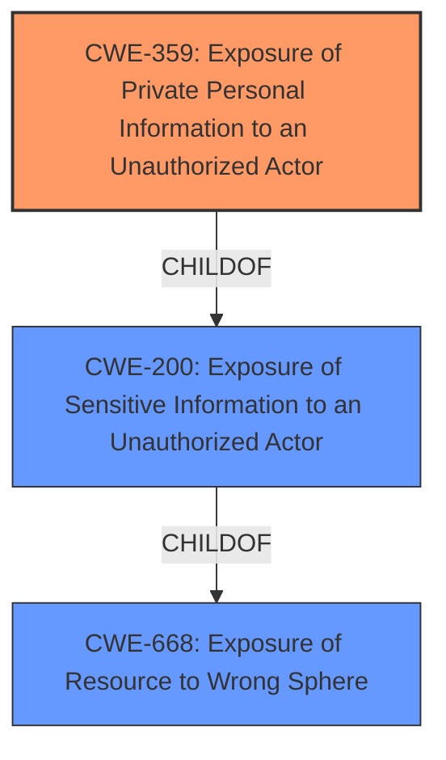

# Enhanced Analysis for CVE-2022-46081

# Summary
| CWE ID | CWE Name | Confidence | CWE Abstraction Level | CWE Vulnerability Mapping Label | CWE-Vulnerability Mapping Notes |
|---|---|---|---|---|---|
| CWE-359 | Exposure of Private Personal Information to an Unauthorized Actor | 0.8 | Base | Allowed | Primary CWE |
| CWE-668 | Exposure of Resource to Wrong Sphere | 0.5 | Class | Discouraged | Secondary CWE |
| CWE-200 | Exposure of Sensitive Information to an Unauthorized Actor | 0.5 | Class | Discouraged | Secondary CWE |

## Evidence and Confidence

*   **Confidence Score:** 0.8
*   **Evidence Strength:** MEDIUM

## Relationship Analysis
The primary CWE is CWE-359, which is a base-level CWE and a child of CWE-200. CWE-200 and CWE-668 are class-level CWEs that are higher abstraction. Since CWE-359 is a more specific child of CWE-200 and the vulnerability description is about exposing personal information, CWE-359 is more appropriate.



## Vulnerability Chain
The **weakness** is that terminating a LiveTrack session does not prevent the LiveTrack API from continued exposure of private personal information.
The **impact** is continued exposure of private personal information even after a user terminates a session.

## Summary of Analysis
The initial assessment was based on the vulnerability description which highlights the exposure of private personal information even after terminating a session. This aligns well with CWE-359, which specifically addresses the **exposure of private personal information to an unauthorized actor**. The retriever results also listed CWE-359 as the top combined result.

The vulnerability description key phrases include:
- **impact:** exposure of private personal information
- **vector:** terminating LiveTrack session
- **product:** Garmin Connect
- **version:** 4.61

The analysis considered the retriever results and the complete CWE specifications. The graph relationships show that CWE-359 is a child of CWE-200, which is a child of CWE-668. The selection of CWE-359 is at the optimal level of specificity because it directly addresses the exposure of private personal information, unlike its parent classes which are more generic.

Relevant CWE Information:

# Enhanced Context (25 CWEs)
The following CWEs were identified as potentially relevant to this vulnerability:

## CWE-359: Exposure of Private Personal Information to an Unauthorized Actor
**Abstraction:** Base
**Status:** Incomplete

### Description
The product does not properly prevent a person's private, personal information from being accessed by actors who either (1) are not explicitly authorized to access the information or (2) do not have the implicit consent of the person about whom the information is collected.

**Technical Explanation:**
The vulnerability's details match the CWE's characteristics because terminating a LiveTrack session should have prevented the exposure of private personal information, but it did not. This indicates a failure to properly prevent unauthorized access to sensitive information.
**Security Implications:**
The security implication is that a user's private personal information can be exposed even after they have taken steps to terminate the session during which that information was being shared. This could lead to privacy violations and potential harm to the user.
**Relationships:**
CWE-359 is a child of CWE-200, making it a more specific type of information exposure.
**Mapping Guidance Influence:**
The official MITRE mapping guidance recommends using the Base level of abstraction when possible, and CWE-359 fits the vulnerability description well.

## CWE-668: Exposure of Resource to Wrong Sphere
**Abstraction:** Class
**Status:** Draft

### Description
The product exposes a resource to the wrong control sphere, providing unintended actors with inappropriate access to the resource.

**Technical Explanation:**
This CWE could be considered because the LiveTrack API continued to expose information even after the session was terminated, effectively exposing the resource (personal information) to the wrong control sphere.
**Security Implications:**
The security implication is that unintended actors could access personal information that should have been protected after the LiveTrack session ended.
**Relationships:**
CWE-668 is a parent of CWE-200, making it a higher-level classification.
**Mapping Guidance Influence:**
The official MITRE mapping guidance discourages the use of CWE-668 when lower-level CWEs are applicable.

## CWE-200: Exposure of Sensitive Information to an Unauthorized Actor
**Abstraction:** Class
**Status:** Draft

### Description
The product exposes sensitive information to an actor that is not explicitly authorized to have access to that information.

**Technical Explanation:**
This CWE could be considered because the vulnerability results in the exposure of sensitive information (private personal information) to an unauthorized actor (anyone with access to the LiveTrack API).
**Security Implications:**
The security implication is that unauthorized actors could gain access to sensitive information, leading to potential harm or privacy violations.
**Relationships:**
CWE-200 is a parent of CWE-359, making it a higher-level classification.
**Mapping Guidance Influence:**
The official MITRE mapping guidance discourages the use of CWE-200 when more specific CWEs are available.

**CWEs Considered But Not Used:**

*   **CWE-532: Insertion of Sensitive Information into Log File:** This CWE was not used because the vulnerability is not specifically about logging sensitive information.
*   **CWE-639: Authorization Bypass Through User-Controlled Key:** This CWE was not used because the vulnerability does not involve bypassing authorization through a user-controlled key.
*   **CWE-499: Serializable Class Containing Sensitive Data:** This CWE was not used because the vulnerability is not related to serialization of sensitive data.
*   **CWE-863: Incorrect Authorization:** This CWE was not used because the core issue isn't an authorization check that is performed incorrectly but the continued exposure of information after a session is terminated.
*   **CWE-201: Insertion of Sensitive Information Into Sent Data:** While this could be loosely related, the primary issue isn't about inserting sensitive data into sent data but about the failure to stop sending it after a session ends.
*   **CWE-295: Improper Certificate Validation:** This CWE is not related to the vulnerability.
*   **CWE-941: Incorrectly Specified Destination in a Communication Channel:** This CWE is not related to the vulnerability.


## CWE Relationship Analysis

Current CWEs represent these abstraction levels: .


### Vulnerability Chain Analysis

**Chain starting from CWE-201:**
- 201 (Insertion of Sensitive Information Into Sent Data) - ROOT


**Chain starting from CWE-200:**
- 200 (Exposure of Sensitive Information to an Unauthorized Actor) - ROOT


### CWE Relationship Diagram

```mermaid
graph TD
    classDef primary fill:#f96,stroke:#333,stroke-width:2px
    classDef secondary fill:#69f,stroke:#333
    classDef tertiary fill:#9e9,stroke:#333
```