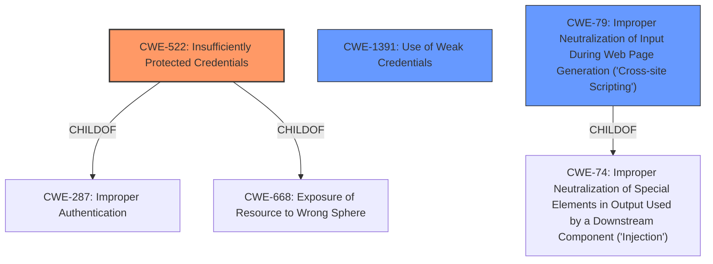

# Raw Analyzer Response for CVE-2022-4612

# Summary
| CWE ID | CWE Name | Confidence | CWE Abstraction Level | CWE Vulnerability Mapping Label | CWE-Vulnerability Mapping Notes |
|---|---|---|---|---|---|
| CWE-522 | Insufficiently Protected Credentials | 0.8 | Class | Primary | Allowed-with-Review |
| CWE-1391 | Use of Weak Credentials | 0.7 | Class | Secondary | Allowed-with-Review |
| CWE-79 | Improper Neutralization of Input During Web Page Generation ('Cross-site Scripting') | 0.6 | Base | Secondary | Allowed |

## Evidence and Confidence

*   **Confidence Score:** 0.8
*   **Evidence Strength:** HIGH

## Relationship Analysis
The primary CWE is CWE-522, a Class-level weakness, which focuses on the **insufficient protection of credentials**. CWE-1391 is a related Class-level weakness, dealing with the **use of weak credentials**, such as hardcoded passwords. CWE-79, a Base-level weakness, addresses the improper neutralization of input in web page generation.

## Vulnerability Chain
1.  **Insufficiently Protected Credentials (CWE-522):** The root cause is the lack of adequate protection for sensitive credentials, leading to their vulnerability.
2.  **Use of Weak Credentials (CWE-1391):** Contributes to the vulnerability when weak or easily compromised credentials are used.
3.  **Improper Neutralization of Input During Web Page Generation ('Cross-site Scripting') (CWE-79):** Insecure handling of user input in web page generation could lead to XSS attacks, potentially compromising credentials.

## Summary of Analysis
The initial assessment focused on the **insufficiently protected credentials**. The primary focus is on how credentials are stored and transmitted.

The evidence from the "CVE Reference Links Content Summary" confirms multiple weaknesses, including:

*   **Weak Encryption:** Server-side symmetric encryption with an extractable key.
*   **Hardcoded Key:** Use of a hardcoded XOR key for token generation.
*   **Lack of Token Invalidation:** Tokens were not invalidated when passwords changed, or compromised.
*   **Cleartext Storage/Transmission:** Passwords were transmitted and stored with weak encryption, and transmitted in cleartext over the API.

The final decision favors CWE-522 as the primary weakness because the core issue revolves around the inadequate protection of credentials.

Relevant CWE Information:

# Enhanced Context (25 CWEs)

## CWE-522: Insufficiently Protected Credentials
**Technical Explanation:**
The vulnerability description explicitly states that the manipulation leads to **insufficiently protected credentials**. This aligns directly with CWE-522, which focuses on the insecure storage and transmission of authentication credentials. The CVE reference links content summary further supports this by detailing instances of weak encryption, hardcoded keys, lack of token invalidation, and cleartext storage/transmission.

**Security Implications:**
This weakness can lead to unauthorized access, privilege escalation, and complete system compromise. Attackers can intercept or retrieve the credentials, gaining access to sensitive data and functionality.

**Relationship Analysis:**
CWE-522 is a Class-level CWE. Its children include more specific weaknesses related to credential management, such as storing passwords in plaintext or using weak encryption algorithms. It is also related to CWE-287 (Improper Authentication) and CWE-668 (Exposure of Resource to Wrong Sphere).

**Mapping Guidance Analysis:**
The mapping guidance for CWE-522 suggests reviewing its children for a better fit. However, given the multiple facets of **insufficient protection** described in the CVE reference, the Class-level CWE-522 provides a suitable high-level categorization of the vulnerability. The Usage is "Allowed-with-Review", which indicates that it is acceptable but requires careful consideration of more specific options.

**Confidence:** 0.8

## CWE-1391: Use of Weak Credentials
**Technical Explanation:**
The CVE reference links content summary mentions "Hardcoded emergency credentials for API access." While the primary weakness is the *insufficient protection* of credentials, the *use of weak credentials* further exacerbates the issue.

**Security Implications:**
Using weak credentials makes it easier for attackers to compromise accounts and systems, bypassing authentication mechanisms.

**Relationship Analysis:**
CWE-1391 is a Class-level CWE. It indicates the use of credentials that are easily guessed or derived.

**Mapping Guidance Analysis:**
The mapping guidance for CWE-1391 suggests reviewing its children for a better fit. The Usage is "Allowed-with-Review".

**Confidence:** 0.7

## CWE-79: Improper Neutralization of Input During Web Page Generation ('Cross-site Scripting')
**Technical Explanation:**
The CVE reference links content summary mentions stored cross-site scripting via insecure link validation, which is a form of CWE-79.

**Security Implications:**
XSS can lead to session hijacking, account takeover, and other malicious activities.

**Relationship Analysis:**
CWE-79 is a Base-level CWE, and a child of CWE-74 (Improper Neutralization of Special Elements in Output Used by a Downstream Component ('Injection')).

**Mapping Guidance Analysis:**
The mapping guidance for CWE-79 is "Allowed".

**Confidence:** 0.6