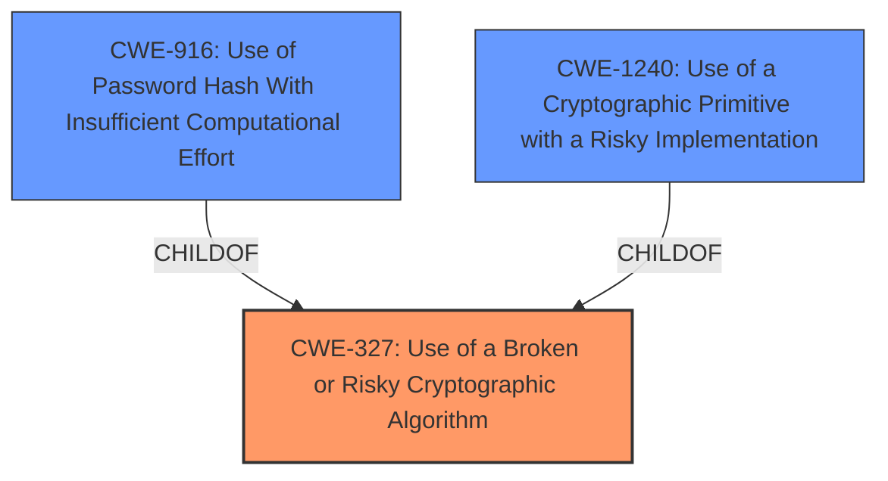

# Raw Analyzer Response for CVE-2022-46140

# Summary
| CWE ID | CWE Name | Confidence | CWE Abstraction Level | CWE Vulnerability Mapping Label | CWE-Vulnerability Mapping Notes |
|---|---|---|---|---|---|
| CWE-327 | Use of a Broken or Risky Cryptographic Algorithm | 1.0 | Class | Allowed-with-Review | Primary CWE |

## Evidence and Confidence

*   **Confidence Score:** 1.0
*   **Evidence Strength:** HIGH

## Relationship Analysis
The primary CWE selected is CWE-327, which is a Class-level CWE. Although it is preferred to map to Base or Variant level CWEs, in this case, the description is general, and more specific CWEs like CWE-321 (Use of Hard-coded Cryptographic Key) are not applicable. The relationship between CWE-327 and its potential children (CWE-916 and CWE-1240) was considered. CWE-327 is a parent of CWE-916 and CWE-1240.

## Vulnerability Chain
The vulnerability chain starts with the **use of a weak encryption scheme** (CWE-327) which leads to the ability for an authenticated attacker to **decrypt the contents of the debug zip file and retrieve debug information**.

## Summary of Analysis
The initial analysis focused on identifying the root cause of the vulnerability, which is the **weak encryption scheme**. The vulnerability description and CVE reference links content summary clearly indicate this. The Retriever Results also highlighted CWE-327 as a top candidate.

The choice of CWE-327 is well-supported by the evidence provided, especially the following excerpts:
*   "Affected devices use a **weak encryption scheme** to encrypt the debug zip file."
*   "**Root cause of vulnerability:** Affected devices use a weak encryption scheme to encrypt the debug zip file."
*   "**Weaknesses/vulnerabilities present:** Usage of a broken or risky cryptographic algorithm (CWE-327)."

CWE-327 is the most appropriate choice because the description states a **weak encryption scheme** is used. This could mean a number of things including an algorithm that is known to be broken or risky. Other CWEs such as CWE-321 (Use of Hard-coded Cryptographic Key) or CWE-916 (Use of Password Hash With Insufficient Computational Effort) are too specific and do not fit the general nature of the description. The mapping guidance for CWE-327 allows for its use with review. The abstraction level is Class, and the guidance recommends checking for a better fit among the child CWEs. However, given the broad nature of the description, CWE-327 remains the best fit.