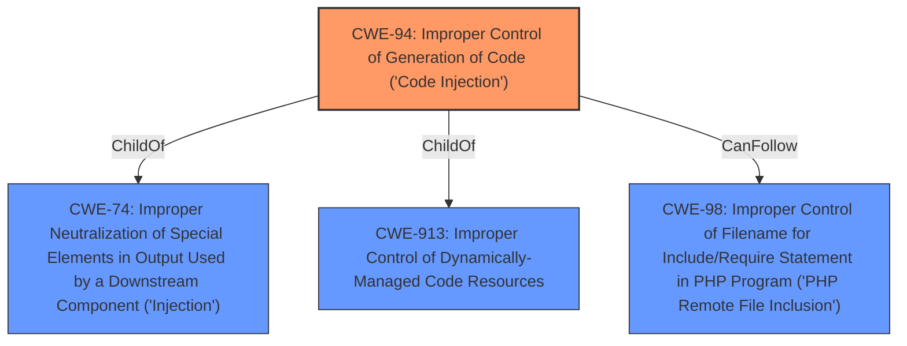

# Analysis Report for CVE-2022-46157

# Vulnerability Analysis Report: CVE-2022-46157

## Description


## Analysis (with Relationship Data)

# Summary
| CWE ID | CWE Name | Confidence | CWE Abstraction Level | CWE Vulnerability Mapping Label | CWE-Vulnerability Mapping Notes |
|---|---|---|---|---|---|
| CWE-94 | Improper Control of Generation of Code ('Code Injection') | 1.0 | Base | Allowed-with-Review | Primary CWE.  |
| CWE-494 | Download of Code Without Integrity Check | 0.5 | Base | Allowed | Secondary CWE.  |
| CWE-79 | Improper Neutralization of Input During Web Page Generation ('Cross-site Scripting') | 0.4 | Base | Allowed | Secondary CWE. |

## Evidence and Confidence

*   **Confidence Score:** 0.8
*   **Evidence Strength:** HIGH

## Relationship Analysis
The primary CWE is CWE-94, which indicates that the application constructs code using external input without proper neutralization. This can lead to the execution of unintended code. CWE-94 is a base-level CWE, providing a specific description of the vulnerability. The relationship between CWE-94 and other CWEs are as follows:
*   CWE-94 is a ChildOf CWE-74 (Improper Neutralization of Special Elements in Output Used by a Downstream Component ('Injection')).
*   CWE-94 is a ChildOf CWE-913 (Improper Control of Dynamically-Managed Code Resources)
*   CWE-94 CanFollow CWE-98 (Improper Control of Filename for Include/Require Statement in PHP Program ('PHP Remote File Inclusion'))



## Vulnerability Chain
The vulnerability chain starts with the **improper** Apache HTTP server configuration, which allows for the execution of arbitrary PHP code by uploading a crafted image. The chain progresses as follows:
1.  **Improper** Apache HTTP server configuration (`<FilesMatch \\.php$>`).
2.  Upload of a crafted image containing malicious PHP code.
3.  The server executes the malicious PHP code due to the misconfiguration, leading to remote code execution.

## Summary of Analysis
The initial assessment focused on identifying the root cause of the vulnerability and selecting the most appropriate CWE. The primary CWE is CWE-94, as the vulnerability allows for the injection and execution of arbitrary code.
The vulnerability description states that "Akeneo PIM Community Edition versions before v5.0.119 and v6.0.53 allows remote authenticated users to **execute arbitrary PHP code** on the server by uploading a **crafted image**." The CVE Reference Links Content Summary confirms that "The vulnerability arises from the Apache HTTP server configuration, specifically the use of `<FilesMatch \\.php$>` which allowed for the **execution of arbitrary PHP code** by **uploading a crafted image**."

The graph relationships influenced the selection by providing context on the parent-child and peer relationships between different CWEs. This helped to ensure that the selected CWE was at the optimal level of specificity and accurately represented the vulnerability.

The selected CWEs are at the optimal level of specificity because they directly address the root cause of the vulnerability, which is the **improper control of code generation**. While other CWEs, such as CWE-79, may be related, they do not fully capture the essence of the vulnerability, which is the ability to inject and execute arbitrary code.

**CWE Considerations:**
*   CWE-79 (Improper Neutralization of Input During Web Page Generation ('Cross-site Scripting')): Considered because the crafted image could be seen as a form of input that is not properly neutralized. However, this is more about code execution than XSS.
*   CWE-494 (Download of Code Without Integrity Check): Considered because the image upload mechanism doesn't validate the code's integrity before execution. This is marked as a secondary CWE.
*   CWE-201 (Insertion of Sensitive Information Into Sent Data): Not applicable, as the vulnerability is not about leaking sensitive information.
*   CWE-732 (Incorrect Permission Assignment for Critical Resource): Not applicable because the issue is not about incorrect permission assignments.
*   CWE-90 (Improper Neutralization of Special Elements used in an LDAP Query ('LDAP Injection')): Not applicable, as the vulnerability is not related to LDAP injection.
*   CWE-863 (Incorrect Authorization): Not applicable because the issue is not primarily related to authorization.
*   CWE-1272 (Sensitive Information Uncleared Before Debug/Power State Transition): Not applicable as this is not related to power state transitions.
*   CWE-287 (Improper Authentication): Not applicable as the vulnerability is not related to authentication.
*   CWE-306 (Missing Authentication for Critical Function): Not applicable as the vulnerability is not related to missing authentication.
*   CWE-1336 (Improper Neutralization of Special Elements Used in a Template Engine): Not applicable, while template injection is possible, the configuration issue is a more direct cause.


## CWE Relationship Analysis

Current CWEs represent these abstraction levels: .


### Vulnerability Chain Analysis

**Chain starting from CWE-201:**
- 201 (Insertion of Sensitive Information Into Sent Data) - ROOT


**Chain starting from CWE-98:**
- 98 (Improper Control of Filename for Include/Require Statement in PHP Program ('PHP Remote File Inclusion')) - ROOT


### CWE Relationship Diagram

```mermaid
graph TD
    classDef primary fill:#f96,stroke:#333,stroke-width:2px
    classDef secondary fill:#69f,stroke:#333
    classDef tertiary fill:#9e9,stroke:#333
```


*Report generated on 2025-03-31 09:09:11*
