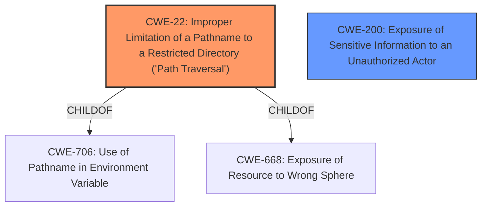

# Raw Analyzer Response for CVE-2022-46158

# Summary
| CWE ID | CWE Name | Confidence | CWE Abstraction Level | CWE Vulnerability Mapping Label | CWE-Vulnerability Mapping Notes |
|---|---|---|---|---|---|
| CWE-22 | Improper Limitation of a Pathname to a Restricted Directory ('Path Traversal') | 0.9 | Base | Allowed | Primary CWE |
| CWE-200 | Exposure of Sensitive Information to an Unauthorized Actor | 0.7 | Class | Discouraged | Secondary Candidate |

## Evidence and Confidence

*   **Confidence Score:** 0.9
*   **Evidence Strength:** HIGH

## Relationship Analysis
The primary CWE selected is CWE-22, which is a Base level CWE describing **improper limitation of a pathname to a restricted directory** which directly relates to the vulnerability where users were able to view the contents of the upload directory without appropriate permissions. CWE-22 is a child of CWE-706 and CWE-668. The secondary candidate is CWE-200, which is a Class level CWE for **exposure of sensitive information to an unauthorized actor**, which is a high level description of the impact of this vulnerability.

## Vulnerability Chain
The vulnerability chain starts with the **lack of access control** on the `/upload` directory, leading to **improper limitation of a pathname to a restricted directory** (CWE-22), and finally resulting in **exposure of sensitive information** (CWE-200).

## Summary of Analysis
The initial analysis identified CWE-22 as the primary weakness because the core issue is that the application **does not properly neutralize special elements within the pathname that can cause the pathname to resolve to a location that is outside of the restricted directory.** The vulnerability description and the fix confirm this. The fix involves ensuring that requests to the `/upload` directory are routed through the PrestaShop application, allowing for access control to be enforced.

The evidence for this decision is found in the "CVE Reference Links Content Summary":
*   "The vulnerability stems from a **lack of access control** on the `/upload` directory"
*   "The primary vulnerability is the **exposure of files stored in the `/upload` directory**."
*   "The absence of proper access controls on the `/upload` directory allowed unauthenticated users to view the contents of the directory and download files."
*   "In essence, these changes ensure that requests to the `/upload` directory are routed through the PrestaShop application, allowing for access control to be enforced, and ensure that files are not directly accessible."

CWE-200 was considered because it describes the **impact** of the vulnerability which is the **exposure of sensitive information**. However, CWE-200 is a Class level CWE and its usage is Discouraged. The root cause is more accurately described by CWE-22.

The selected CWEs are at the optimal level of specificity because CWE-22 is a Base level CWE that accurately describes the **improper limitation of a pathname to a restricted directory**.