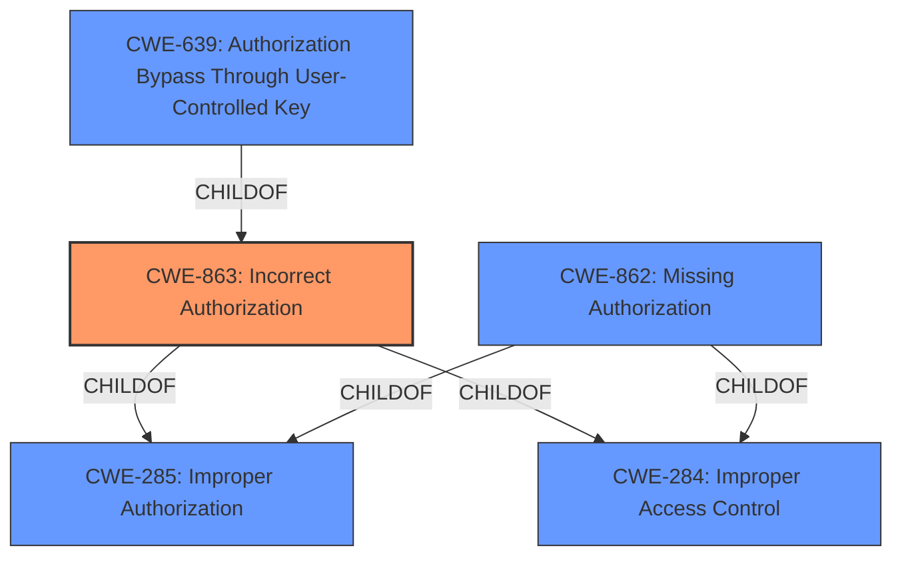

# Raw Analyzer Response for CVE-2022-46160

# Summary
| CWE ID | CWE Name | Confidence | CWE Abstraction Level | CWE Vulnerability Mapping Label | CWE-Vulnerability Mapping Notes |
|---|---|---|---|---|---|
| **CWE-863** | **Incorrect Authorization** | 0.9 | Class | Primary | Allowed-with-Review |
| CWE-285 | Improper Authorization | 0.7 | Class | Secondary Candidate | Discouraged |
| CWE-862 | Missing Authorization | 0.6 | Class | Secondary Candidate | Allowed-with-Review |
| CWE-639 | Authorization Bypass Through User-Controlled Key | 0.5 | Base | Secondary Candidate | Allowed |

## Evidence and Confidence

*   **Confidence Score:** 0.9
*   **Evidence Strength:** HIGH

## Relationship Analysis
The primary CWE selected is CWE-863, Incorrect Authorization. This is a Class-level CWE, and while it has potential Base-level children, the provided information does not give enough detail to select a more specific child. CWE-863 is a child of CWE-285 (Improper Authorization) and CWE-284 (Improper Access Control). CWE-862 (Missing Authorization) is a sibling of CWE-863, representing a related but distinct type of authorization failure. The choice between them hinges on whether an authorization check was attempted but performed incorrectly (CWE-863) or if no check was performed at all (CWE-862). In this case, the description indicates that project level authorizations were **not properly verified**, implying that a check was attempted but **failed**. CWE-639 Authorization Bypass Through User-Controlled Key is a child of CWE-863, but is not specific enough to be selected as the primary candidate.

## Vulnerability Chain
The chain of events in this vulnerability is as follows:
1.  **Root Cause:** **Project level authorizations are not properly verified** (Incorrect Authorization).
2.  **Weakness:** Users not authorized to access a project
3.  **Impact:** are able to get information provided by the widgets (e.g. number of members, content of the Notes widget...).

## Summary of Analysis
The initial assessment, based on the vulnerability description and supporting evidence, points strongly to an authorization issue. The key phrase "**project level authorizations are not properly verified**" clearly indicates that the system attempts to perform authorization but does so incorrectly.

The vulnerability description states: "project level authorizations are **not properly verified** when accessing the project homepage/dashboards. Users not authorized to access a project may still be able to get some information provided by the widgets". The CVE Reference Links Content Summary confirms this, stating: "**Improper Authorization (CWE-285)**: Project level authorizations are **not correctly checked** when displaying project dashboards/homepage. This allows users without proper access to potentially view information they shouldn't have access to."

CWE-863 (Incorrect Authorization) is the most appropriate choice because the system attempts to perform authorization, but the check is performed incorrectly. This contrasts with CWE-862 (Missing Authorization), where no authorization check is performed at all.

CWE-285 is a parent Class of CWE-863 and is not as specific. CWE-284 is a Pillar and therefore too general. CWE-639 is related, but depends on a modifiable key being user controlled. The vulnerability description did not contain such details so is not specific enough.

Therefore, CWE-863 is the most accurate and specific representation of the vulnerability, and it is at the optimal level of specificity based on the information provided.