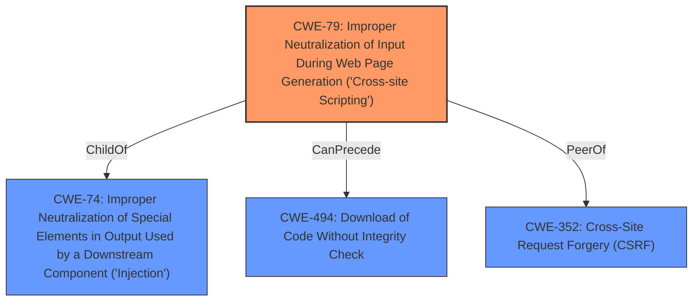

# Analysis for CVE-2022-46162

# Summary
| CWE ID | CWE Name | Confidence | CWE Abstraction Level | CWE Vulnerability Mapping Label | CWE-Vulnerability Mapping Notes |
|---|---|---|---|---|---|
| CWE-79 | Improper Neutralization of Input During Web Page Generation ('Cross-site Scripting') | 1.0 | Base | Allowed | Primary CWE. The **CSS injection** vulnerability, caused by **insufficient sanitization**, allows the injection of malicious CSS code, which aligns with the CWE's description of failing to neutralize user-controllable input before it is placed in output used as a web page. |

## Evidence and Confidence

*   **Confidence Score:** 1.0
*   **Evidence Strength:** HIGH

## Relationship Analysis
The primary CWE is CWE-79, which is a Base level CWE. Several other CWEs were considered based on retriever results, but ultimately, CWE-79 best fits the **CSS Injection** scenario. The relationships of CWE-79 include:
  - ParentOf -> CWE-87, CWE-86, CWE-85, CWE-84, CWE-83
  - CanPrecede -> CWE-494
  - PeerOf -> CWE-352

## Vulnerability Chain
The chain of events in this vulnerability is as follows:
  1. **Root Cause:** **Insufficient Sanitization** of user-provided input in the `discourse-bbcode` plugin, specifically within the `font-family` attribute of BBCode tags.
  2. **Weakness:** **CSS Injection** due to the lack of proper validation of the `font-family` attribute.
  3. **Impact:** Potential for UI manipulation (phishing, defacement), data exfiltration (via CSS selectors and background images), and denial of service (resource exhaustion).

## Summary of Analysis
Initially, the analysis focused on identifying the root cause of the vulnerability: the **insufficient sanitization** of user-provided input. The CVE description clearly states that the vulnerability stems from a lack of validation for the `font-family` attribute within BBCode tags, leading to **CSS injection**. The "CVE Reference Links Content Summary" section provides strong evidence, stating, "The vulnerability stems from **insufficient sanitization** of user-provided input when rendering content with the `discourse-bbcode` plugin. Specifically, the `font-family` style attribute within BBCode tags was not properly validated, allowing for arbitrary **CSS injection**."

The retriever results highlighted CWE-79 as the top candidate, with a high similarity score and a Base abstraction level, which aligns with the goal of identifying the most specific weakness. Other CWEs, such as CWE-96 and CWE-1336, were considered but deemed less relevant as they focus on code injection in static code or template engines, whereas this vulnerability is directly related to **CSS injection** within a web page.

The final decision to classify this vulnerability as CWE-79 is strongly supported by the evidence provided in the CVE description and the retriever results. The **insufficient sanitization** of user input, leading to **CSS injection** and potential XSS-related impacts, directly aligns with the characteristics and description of CWE-79. The selection is further justified by the mapping guidance, which allows for the use of CWE-79 at the Base level of abstraction.

Relevant CWE Information: