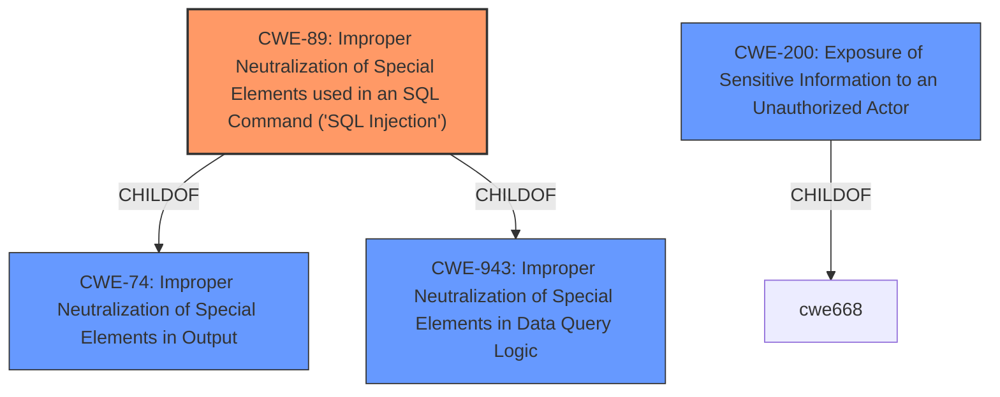

# Raw Analyzer Response for CVE-2022-46163

# Summary
| CWE ID  | CWE Name                                                                         | Confidence | CWE Abstraction Level | CWE Vulnerability Mapping Label | CWE-Vulnerability Mapping Notes |
| :-------- | :------------------------------------------------------------------------------- | :--------- | :---------------------- | :------------------------------ | :------------------------------ |
| CWE-89 | Improper Neutralization of Special Elements used in an SQL Command ('SQL Injection') | 0.95   | Base   | Primary   | Allowed |
| CWE-200 | Exposure of Sensitive Information to an Unauthorized Actor | 0.75   | Class   | Secondary   | Discouraged |

## Evidence and Confidence

*   **Confidence Score:** 0.85
*   **Evidence Strength:** HIGH

## Relationship Analysis
The primary relationship influencing the CWE selection is that of ChildOf. CWE-89 is a child of CWE-74 (Improper Neutralization of Special Elements in Output) and CWE-943 (Improper Neutralization of Special Elements in Data Query Logic). While CWE-200 (Exposure of Sensitive Information) is a Class-level CWE, the more specific CWE-89 at the Base level is more appropriate.

## Vulnerability Chain
The vulnerability chain starts with the **query injection** vulnerability, which allows an attacker to craft malicious queries. This leads to the extraction and exposure of sensitive user data, such as bank account details and password hashes.

## Summary of Analysis
The initial assessment identified **query injection** as the primary **weakness**, leading to data exfiltration. The vulnerability description and CVE Reference Links Content Summary provide substantial evidence supporting the selection of CWE-89 (Improper Neutralization of Special Elements used in an SQL Command ('SQL Injection')). The description states that "Sensitive user data (bank account details, password Hash) can be extracted via Ransack **query injection**." The "CVE Reference Links Content Summary" states "The primary vulnerability is the ability to inject malicious queries via the Ransack search functionality" and "The application allows for the extraction of sensitive information like bank account details and password hashes through crafted Ransack queries."

CWE-200 (Exposure of Sensitive Information to an Unauthorized Actor) was considered, but it is a high-level Class that represents a technical impact rather than the root cause. The MITRE mapping guidance discourages its use in favor of more specific CWEs.

The selection of CWE-89 is at the optimal level of specificity because it directly addresses the **root cause** of the vulnerability which is the improper handling of special elements in SQL commands.

Relevant CWE Information:

# Enhanced Context (25 CWEs)

## CWE-538: Insertion of Sensitive Information into Externally-Accessible File or Directory
**Abstraction Level**: Base
**Similarity Score**: 0.79
**Source**: dense

**Description**:
The product places sensitive information into files or directories that are accessible to actors who are allowed to have access to the files, but not to the sensitive information.

**Mapping Guidance**:
- Usage: Allowed
- Rationale: This CWE entry is at the Base level of abstraction, which is a preferred level of abstraction for mapping to the root causes of vulnerabilities.

**Why it was not selected:** The vulnerability is not about placing sensitive information into externally accessible files or directories but about extracting it via **query injection**.

## CWE-226: Sensitive Information in Resource Not Removed Before Reuse
**Abstraction Level**: Base
**Similarity Score**: 0.78
**Source**: dense

**Description**:
The product releases a resource such as memory or a file so that it can be made available for reuse, but it does not clear or "zeroize" the information contained in the resource before the product performs a critical state transition or makes the resource available for reuse by other entities.

**Mapping Guidance**:
- Usage: Allowed
- Rationale: This CWE entry is at the Base level of abstraction, which is a preferred level of abstraction for mapping to the root causes of vulnerabilities.

**Why it was not selected:** This CWE is not relevant as the vulnerability does not involve the reuse of resources without proper removal of sensitive information.

## CWE-212: Improper Removal of Sensitive Information Before Storage or Transfer
**Abstraction Level**: Base
**Similarity Score**: 0.77
**Source**: dense

**Description**:
The product stores, transfers, or shares a resource that contains sensitive information, but it does not properly remove that information before the product makes the resource available to unauthorized actors.

**Mapping Guidance**:
- Usage: Allowed
- Rationale: This CWE entry is at the Base level of abstraction, which is a preferred level of abstraction for mapping to the root causes of vulnerabilities.

**Why it was not selected:** This CWE is not relevant because the vulnerability is about data extraction via **query injection**, not about improper removal before storage or transfer.

## CWE-319: Cleartext Transmission of Sensitive Information
**Abstraction Level**: Base
**Similarity Score**: 0.77
**Source**: dense

**Description**:
The product transmits sensitive or security-critical data in cleartext in a communication channel that can be sniffed by unauthorized actors.

**Mapping Guidance**:
- Usage: Allowed
- Rationale: This CWE entry is at the Base level of abstraction, which is a preferred level of abstraction for mapping to the root causes of vulnerabilities.

**Why it was not selected:** The vulnerability is not about transmitting sensitive data in cleartext but about extracting it via **query injection**.

## CWE-200: Exposure of Sensitive Information to an Unauthorized Actor
**Abstraction Level**: Class
**Similarity Score**: 0.77
**Source**: dense

**Description**:
The product exposes sensitive information to an actor that is not explicitly authorized to have access to that information.

**Mapping Guidance**:
- Usage: Discouraged
- Rationale: CWE-200 is commonly misused to represent the loss of confidentiality in a vulnerability, but confidentiality loss is a technical impact - not a root cause error. As of CWE 4.9, over 400 CWE entries can lead to a loss of confidentiality. Other options are often available. [REF-1287].

**Why it was selected as a secondary CWE:** While the primary weakness is the **query injection**, the impact is the exposure of sensitive information. However, CWE-200 is a high-level class and the guidance discourages its use when more specific CWEs are available.

## CWE-497: Exposure of Sensitive System Information to an Unauthorized Control Sphere
**Abstraction Level**: Base
**Similarity Score**: 0.77
**Source**: dense

**Description**:
The product does not properly prevent sensitive system-level information from being accessed by unauthorized actors who do not have the same level of access to the underlying system as the product does.

**Mapping Guidance**:
- Usage: Allowed
- Rationale: This CWE entry is at the Base level of abstraction, which is a preferred level of abstraction for mapping to the root causes of vulnerabilities.

**Why it was not selected:** The vulnerability is not about system-level information exposure but about user data exposure via **query injection**.

## CWE-668: Exposure of Resource to Wrong Sphere
**Abstraction Level**: Class
**Similarity Score**: 0.76
**Source**: dense

**Description**:
The product exposes a resource to the wrong control sphere, providing unintended actors with inappropriate access to the resource.

**Mapping Guidance**:
- Usage: Discouraged
- Rationale: CWE-668 is high-level and is often misused as a catch-all when lower-level CWE IDs might be applicable. It is sometimes used for low-information vulnerability reports [REF-1287]. It is a level-1 Class (i.e., a child of a Pillar). It is not useful for trend analysis.

**Why it was not selected:** This CWE is too high-level and does not accurately represent the vulnerability.

## CWE-639: Authorization Bypass Through User-Controlled Key
**Abstraction Level**: Base
**Similarity Score**: 0.76
**Source**: dense

**Description**:
The system's authorization functionality does not prevent one user from gaining access to another user's data or record by modifying the key value identifying the data.

**Mapping Guidance**:
- Usage: Allowed
- Rationale: This CWE entry is at the Base level of abstraction, which is a preferred level of abstraction for mapping to the root causes of vulnerabilities.

**Why it was not selected:** The vulnerability is not about authorization bypass via