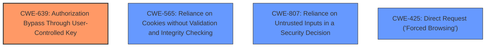

# Raw Analyzer Response for CVE-2022-46170

# Summary

| CWE ID | CWE Name | Confidence | CWE Abstraction Level | CWE Vulnerability Mapping Label | CWE-Vulnerability Mapping Notes |
|---|---|---|---|---|---|
| **CWE-639** | Authorization Bypass Through User-Controlled Key | 0.9 | Base | Primary CWE | Allowed |
| CWE-565 | Reliance on Cookies without Validation and Integrity Checking | 0.7 | Base | Secondary Candidate | Allowed |
| CWE-807 | Reliance on Untrusted Inputs in a Security Decision | 0.6 | Base | Secondary Candidate | Allowed |
| CWE-425 | Direct Request ('Forced Browsing') | 0.5 | Base | Secondary Candidate | Allowed |

## Evidence and Confidence

*   **Confidence Score:** 0.9
*   **Evidence Strength:** HIGH

## Relationship Analysis

The primary relationship influencing the decision is the hierarchical structure, particularly in finding a Base level CWE that represents the root cause.

## Vulnerability Chain

The vulnerability chain starts with the **improper** handling of multiple session cookies, leading to the possibility of an attacker gaining unauthorized access.

1.  **Root Cause:** **Multiple session cookies** are not properly isolated.
2.  **Weakness:** The application **fails to properly** validate or isolate the session IDs associated with different cookies.
3.  **Impact:** An attacker with one session cookie can **access pages that require another session cookie**, leading to authorization bypass.

## Summary of Analysis

Initially, several CWEs were considered based on the retriever results, including CWE-1390, CWE-614, and CWE-1004. However, a closer examination of the vulnerability description and the associated CVE reference content revealed that the core issue is an authorization bypass achieved through user-controlled keys (the session cookies).

The vulnerability description states: "When an application uses (1) **multiple session cookies** (e.g., one for user pages and one for admin pages) and (2) a session handler is set to `DatabaseHandler`, `MemcachedHandler`, or `RedisHandler`, then if an attacker gets one session cookie (e.g., one for user pages), they may be able to **access pages that require another session cookie** (e.g., for admin pages)." The CVE Reference Links Content Summary further clarifies this by stating: "The vulnerability stems from how session handlers manage session IDs when multiple session cookies are used... This allowed an attacker with knowledge of one valid session ID to potentially access other sessions."

Based on this evidence, CWE-639 is the most appropriate mapping because it directly addresses the **authorization bypass** via a **user-controlled key** (the session cookie). The session ID is not being properly namespaced or prefixed with the session cookie name.

CWE-565, CWE-807, and CWE-425 were considered as secondary CWEs. They capture the essence of relying on cookies without proper validation and making direct requests to protected resources, but they are not as precise as CWE-639 in describing the core weakness.

The selected CWE is at the optimal level of specificity (Base) as it represents the underlying coding error that leads to the vulnerability.

Relevant CWE Information:

# Enhanced Context (25 CWEs)

## CWE-639: Authorization Bypass Through User-Controlled Key
**Abstraction Level**: Base
**Similarity Score**: 0.76
**Source**: dense

**Description**:
The system's authorization functionality does not prevent one user from gaining access to another user's data or record by modifying the key value identifying the data.

**Mapping Guidance**:
- Usage: Allowed
- Rationale: This CWE entry is at the Base level of abstraction, which is a preferred level of abstraction for mapping to the root causes of vulnerabilities.