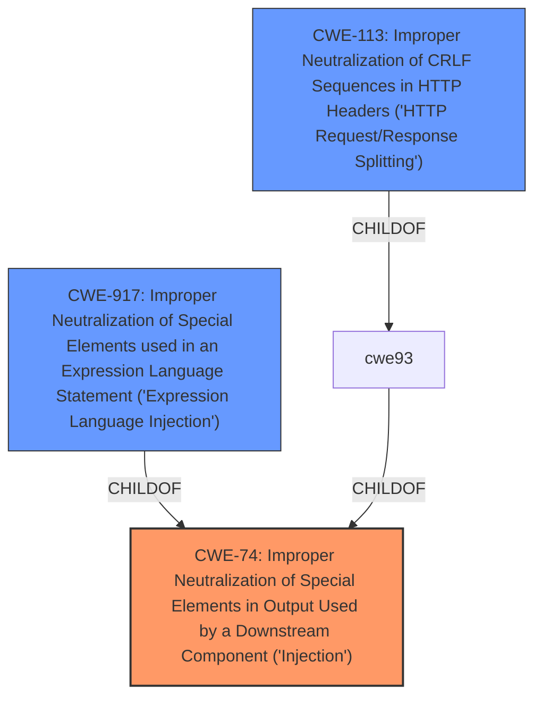

# Raw Analyzer Response for CVE-2022-46265

# Summary
| CWE ID | CWE Name | Confidence | CWE Abstraction Level | CWE Vulnerability Mapping Label | CWE-Vulnerability Mapping Notes |
|---|---|---|---|---|---|
| CWE-74 | Improper Neutralization of Special Elements in Output Used by a Downstream Component ('Injection') | 0.9 | Class | Primary | The **Host header injection** vulnerability allows an attacker to spoof the Host header and redirect users to malicious websites, indicating **improper neutralization** of special elements in output used by a downstream component. Usage: Discouraged, but applicable as a high-level classification. |
| CWE-917 | Improper Neutralization of Special Elements used in an Expression Language Statement ('Expression Language Injection') | 0.6 | Base | Secondary | The vulnerability involves the injection of a malicious hostname, potentially leading to the execution of unintended expressions if the hostname is used in an expression language statement. |
| CWE-113 | Improper Neutralization of CRLF Sequences in HTTP Headers ('HTTP Request/Response Splitting') | 0.5 | Variant | Secondary | This CWE is related as HTTP headers are being manipulated. |

## Evidence and Confidence

*   **Confidence Score:** 0.8
*   **Evidence Strength:** MEDIUM

## Relationship Analysis
The analysis considered the following CWE relationships:
  - Parent-child hierarchical relationships: CWE-74 is a parent of CWE-93 (Improper Neutralization of CRLF Sequences) and CWE-94 (Improper Control of Generation of Code).
  - Chain relationships showing progression of vulnerability: The **Host header injection** can lead to redirection of users to malicious websites, which can further lead to phishing attacks or session hijacking.
  - Peer relationships that offered alternative classifications: CWE-20 (Improper Input Validation) was considered but deemed less specific than CWE-74.
  - How abstraction levels influenced your selection: CWE-74 was chosen as a Class-level CWE, providing a broader categorization of the injection vulnerability, while also considering more specific Base-level CWEs like CWE-917.

## Vulnerability Chain
The chain of root cause and weaknesses for the Vulnerability Description is:
  - **Root Cause:** **Host header injection** due to misconfiguration in Apache HTTP Server (`RedirectMatch` directive).
  - Weakness: **Improper neutralization** of special elements in output (CWE-74).
  - Impact: Redirection of users to malicious websites, potentially leading to phishing attacks or session hijacking.

## Summary of Analysis
The initial analysis focused on identifying the root cause of the vulnerability, which is the **Host header injection**. The "CVE Reference Links Content Summary" indicates that the root cause is a misconfiguration in the default Apache HTTP Server configuration of Polarion ALM, where the `RedirectMatch` directive is not properly configured, allowing an attacker to inject a malicious hostname.

The primary CWE chosen is CWE-74 because it broadly covers the **improper neutralization** of special elements in output that are used by a downstream component. The vulnerability description explicitly states that the **Host header injection** allows an attacker to spoof the Host header information and redirect users to malicious websites. This aligns well with the description of CWE-74, which states that the product constructs a command or data structure using externally influenced input but does not neutralize special elements that could modify how it is parsed or interpreted.

CWE-917 was considered as a secondary CWE because it refers to **improper neutralization** of special elements used in an expression language statement. If the injected hostname is used in an expression language statement, this CWE would be relevant.

CWE-113 was also considered because the Host header is part of HTTP headers, and **improper neutralization** of CRLF sequences in HTTP headers could lead to HTTP request/response splitting.

CWE-20 (Improper Input Validation) was considered but deemed less specific because the core issue is the **improper neutralization** of special elements rather than a general lack of input validation.

The final selection of CWE-74 as the primary CWE is justified because it directly addresses the **improper neutralization** of special elements in the Host header, leading to the redirection of users to malicious websites. It is at the optimal level of specificity, providing a broad categorization of the injection vulnerability while also being supported by the evidence in the vulnerability description.

Relevant CWE Information:
- The evidence for selecting CWE-74 comes from the vulnerability description: "The affected application contains a **Host header injection** vulnerability that could allow an attacker to spoof a Host header information and redirect users to malicious websites."
- The evidence for the root cause comes from the "CVE Reference Links Content Summary": "A misconfiguration in the default Apache HTTP Server configuration of Polarion ALM. Specifically, the `RedirectMatch` directive is not properly configured to include the hostname, allowing an attacker to inject a malicious hostname."